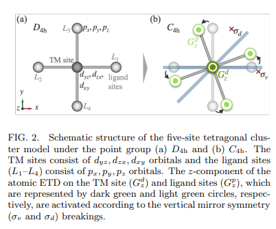
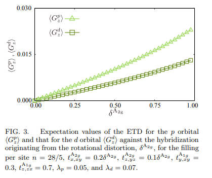

# Emergent cross-product-type spin-orbit coupling under ferroaxial ordering

著者 : Akane Inda and Satoru Hayami

## アブストの翻訳
時間反転対称性を持つ軸ベクトルの強誘電的な配列は、フェロアキシャル秩序状態と呼ばれ、格子構造が自発的に回転歪みを起こすことで垂直鏡面対称性を破ります。我々は、遷移金属酸化物を念頭に置き、フェロアキシャル秩序が発生した際に電子構造に何が起こるのかを、四方晶d-pクラスター模型を解析することにより理論的に調査します。対称性に適合した多重極表現を採用することで、原子スピン軌道相互作用とd-p混成の相互作用によって生じるスピン軌道相互作用の交差積形式が、垂直鏡面対称性の破れに伴い出現することを解明しました。これはフェロアキシャル秩序の電子的秩序パラメータに対応します。

## 研究背景・問題意識
- **フェロアキシャル秩序** 遷移金属サイトを取り囲む配位子サイトの回転構造歪みによって生じる。主軸に平行な鏡面対称性を破るが、空間反転や時間反転対称性は破らない。これらは非従来型の光学応答を示す場合がある。

- **回転応答** x方向への入力場が、y方向に出力として共役物理量を誘起する。

- フェロアキシャル秩序相は時間反転で偶対称な軸ベクトルの強誘電的配列として微視的に記述され、秩序パラメータは複数の電気双極子からなる渦として定義される。

- ただしこの量は、周期性のある結晶構造でクラスタの原点をどこに取るかがあいまいになることがあり、適切な定義にならない場合もある。

- そこで角運動量を導入し
$$
G(a) = l \times \sigma
GG
でフェロアキシャル秩序のオーダーパラメータを導入する。

- 電気トロイダル双極子(ETD)の微視的な起源を解明したい。

## モデル

- d-pモデルを用いる。遷移金属サイトには3つのd軌道、リガンドサイトには3つのp軌道が存在する。モデルハミルトニアンは
$$
H = H_{\text{CEF}} + H_{\text{SOC}} + H_{dp}.
$$

$$
H_{\text{SOC}} = \lambda_p \sum_k \mathbf{l}^p_k \cdot \mathbf{s}^p_k + \lambda_d \mathbf{l}_d \cdot \mathbf{s}_d.
$$

$$
H_{dp} = \sum_{k=L1}^{L4} \sum_{\alpha \beta \sigma} t^{A1g}_{\alpha \beta} c_{\alpha \sigma}^\dagger c_{\beta \sigma} + (\text{h.c.}).
$$

のように書ける。第1項はCEFハミルトニアン、第2項はSOC, 第3項はTMサイトとリガンドサイトの間のd-p混成項。

- 回転ひずみにより誘発されるd-p混成の変調に着目すれば、ETDの有限の期待値がわかる。

## 数値計算の結果
- 混成パラメータ$t^{A2g}_{z, zy}$及び$t^{A2g}_{z, yz}$が変化したときの挙動は以下のようになる。

ETD演算子の期待値は
$$
G^p_z = \sum_k (\mathbf{l}^p_k \times \boldsymbol{\sigma}^p_k)_z
$$

及び

$$
G^d_z = (\mathbf{l}_d \times \boldsymbol{\sigma}_d)_z
$$

で与えている。

- 垂直鏡面対称性の破れに従って交差積型SOCが表れることが示される。p軌道におけるスピン軌道相互作用の結合定数$\lambda_p$のとき$
\langle G^d_z \rangle$は消滅し、$\lambda_d$ = 0の時$
\langle G^p_z \rangle$が消滅する。しかし\langle G^p_z \rangle$は$\lambda_p$に対してそこまで敏感ではない。

- 摂動解析を行う。そのために簡略化したハミルトニアンを
$$
H_{\text{tot}} = H_0 + H_{dp},
$$

$$
H_0 = \Delta \sum_{\alpha, \sigma} c_{\alpha \sigma}^\dagger c_{\alpha \sigma} + \lambda_p \sum_k \mathbf{l}^p_k \cdot \mathbf{s}^p_k.
$$

で導入する。摂動波動関数を用いると、L1サイトに沿ったd軌道に対するETDと結びつく有効な混成経路は

$$
\text{Tr}[H^{(2)}_{L1} G^d_z] = \frac{4\lambda_p (t^{A1g}_{z,zx} t^{A2g}_{x,xy} - t^{A1g}_{y,xy} t^{A2g}_{z,yz})}{(\Delta - \lambda_p)(\lambda_p + 2\Delta)},
$$

で与えられる。ここで$H^{(2)}_{L1}$は$H_{dp}$に対する2次摂動で得られる友情ハミルトニアンのL1サイトからの寄与で、

$$
H^{(2)} = \eta - E^{(2)}_{\alpha} \mathbf{1},
$$

$$
\eta_{\alpha \sigma; \alpha' \sigma'} = \sum_{\beta \sigma''} \frac{\langle d^{(0)}_{\alpha, \sigma} | H_{dp} | p^{(0)}_{\beta, \sigma''} \rangle \langle p^{(0)}_{\beta, \sigma''} | H_{dp} | d^{(0)}_{\alpha', \sigma'} \rangle}{E^{(0)}_{\alpha} - E^{(0)}_{\beta, \sigma''}}.
$$
で与えられる。

- エネルギーが大きい極限では
$$
\text{Tr}[H^{(2)}_{L1} G^d_z]  \propto \lambda_p \sin 4\theta \left( \sqrt{3} V_{pd\sigma} - 2 V_{pd\pi} \right) V_{pd\pi}.
$$
となる。

- x軸から測定される回転角$\theta$が$\pi/4$の整数倍の時に有効な混成が消失する。これはこの角度で垂直鏡面対称性が回復する、すなわちx方向がy方向と等価になるため。

- ゼーマン結合で外部磁場を考慮し、磁気応答を見ると、3次の横磁化が$H_{y}^3$の時数で誘起されることが分かった。

## まとめ
- 回転構造歪を伴うフェロアキシャル秩序の下でETDに対応する新たな交差積型SOCが出現することが提案された。

## 感想・メモ
- フェロアキシャル秩序のパラメータとETD演算子の期待値は等価なのか。
- 電気トロイダル双極子の話が唐突に出てきた気がするがフェロアキシャル秩序のパラメータとはどう結びついているのか？
- 交差積としてのパラメータはRashbaとは違うのか？
- よくわからないが、ゼーマン結合をモデルに組み込んだ時点で3次の横磁化が出るのは明らかではないのか？
- 平均はどうやってとっているのだろう。