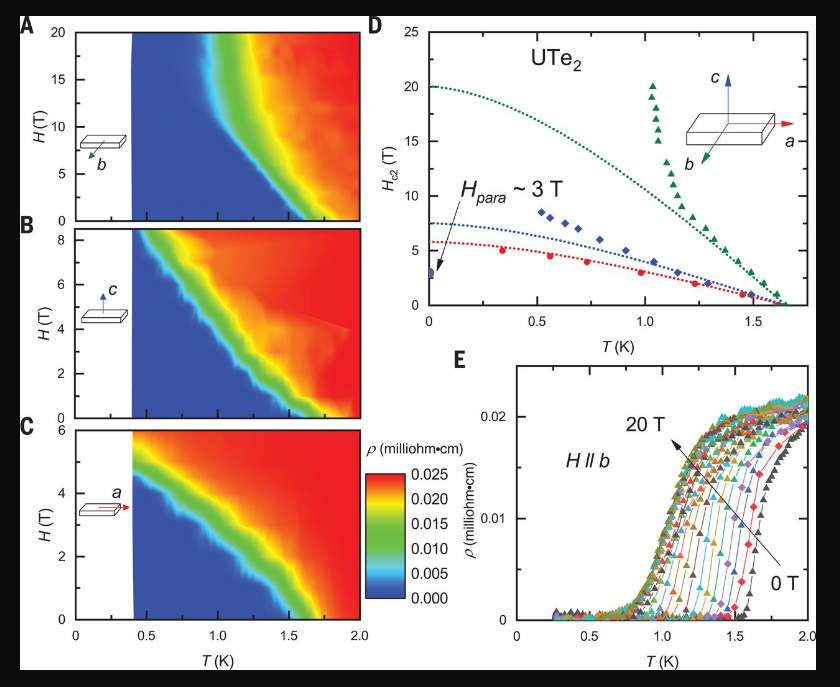
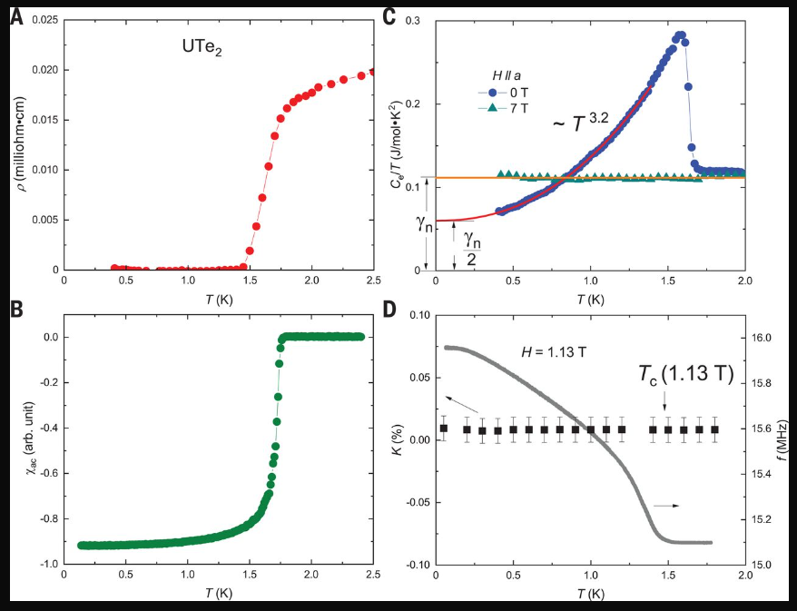

# Nearly ferromagnetic spin-triplet superconductivity

## アブストの翻訳
スピン三重項超伝導体は、量子情報処理にとって興味深いトポロジカル励起を持つ可能性があります。我々はUTe2においてスピン三重項超伝導性を発見し、転移温度が1.6ケルビンであり、非常に大きく異方的な上部臨界磁場が40テスラを超えることを報告します。この超伝導相の安定性は、UTe2がUGe2、URhGe、UCoGeといった強磁性超伝導体と関連していることを示唆しています。しかし、UTe2は磁気秩序を持たず、量子臨界スケーリングが観察されているため、強磁性超伝導体シリーズの中で常磁性の端に位置しています。また、0ケルビンにおける大きな未ギャップフェルミオンの内部的な供給は、非常に非凡なタイプの超伝導対形成を示しています。

## 研究背景・問題意識
- トポロジカル超伝導が応用の観点からも大きな関心を集めている。特にトリプレット超伝導が、トポロジカル超伝導、マヨラナフェルミオンの有望なプラットフォームになっている。

- スピントリプレット超伝導体自体、その候補物質が限られている。

- UTe2における新たなスピントリプレット超伝導状態の発見。

## UTe2の特徴
- 上部臨界磁場は強い異方性を持つ。特にb軸方向の上部臨界磁場が大きい。そして上部臨界磁場はb軸に沿った磁場の配向に非常に敏感。

- 通常のシングレット超伝導体の上部臨界磁場には制限があるが、UTe2のそれは制限を超えて非常に大きい。

- ゾンマーフェルト係数の残留値が大きい。

- 磁気容易軸に垂直な方向で軌道限界を超えていることは、強磁性超伝導体の挙動と一致している。超伝導対は強磁性スピン揺らぎにより媒介されている可能性がある。なお常伝導状態で磁気秩序はない。

- NMR測定によれば、125TeナイトシフトKの値が超伝導転移温度を下回っても一定のままで、スピントリプレットの超伝導対であることが示される。またヘーベルスリクターピークも見られない。

- UTe2の超伝導対はノンユニタリ、つまり2成分の超伝導秩序パラメータが異なる2つのエネルギーギャップを持ちうる状態かもしれないが、強いスピン軌道結合を持つ常磁性の直交晶系では予測されず、UTe2にも同様に適用される。

## 感想・メモ
UTe2に関する様々なことが分かった現在からこの論文を見ると感慨深いものがある。