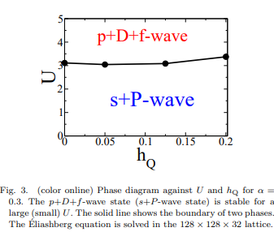
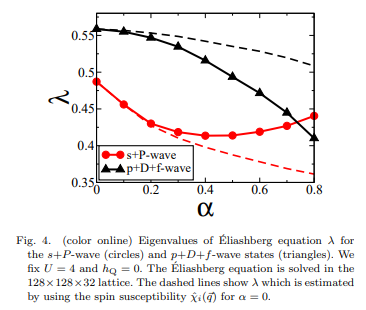
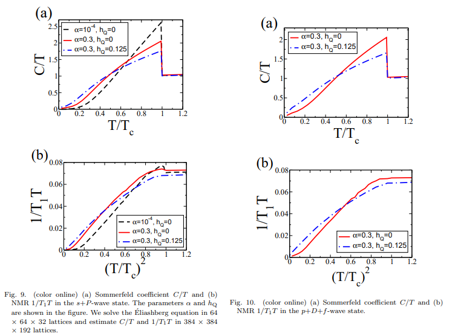
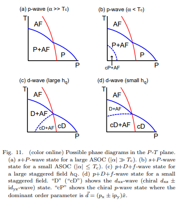

# Superconductivity and Magnetism in Non-centrosymmetric System: Application to CePt3Si

著者 : Youichi Yanase, and Manfred Sigrist

# アブストの翻訳
重いフェルミオン化合物 CePt
3
3
​
 Si および関連材料における超伝導と磁性を理論的に調査しました。拡張ハバードモデルを用い、ランダム位相近似（RPA）分析に基づいて、ラシュバ型の反対称スピン軌道相互作用によって誘起される螺旋スピン揺らぎを記述し、主要な p 波対称性（s+P 波）または d 波対称性（p+D+f 波）を持つ2つの安定な超伝導相を特定しました。共存する反強磁性秩序の影響について、これらの状態の両方において検討しました。

超伝導秩序パラメータ、準粒子状態密度、NMR 1/T
1
1
​
 T、比熱、臨界磁場 H
𝑐
2
c2
​
  の異方性、さらに複数の相転移の可能性について詳細に議論しました。実験結果との比較から、s+P 波超伝導状態が CePt
3
3
​
 Si において実現している可能性が高いと示唆されます。

## 問題意識
- 空間反転対称性を持たない超伝導体の研究に際して、クーパー対形成状態の分類スキームを対称性に基づいて行うことが出来なくなる。超伝導状態は異なるパリティを持つ対形成状態の混合とみなされる。特にスピン一重項とスピン三十項の混合は反対称スピン軌道相互作用ASOCにより引き起こされる。

## 研究目的
- 磁気揺らぎに起因する対形成状態を詳細に調査したい。また、反強磁性秩序が超伝導相に与える影響も調査したい（現在知られている非中心対称の重いフェルミオン超伝導体はすべて磁性と共存している。）

-  CePt3Siは常圧で超伝導になるので、非常によく研究がなされている。具体的な物質への応用として、この物質を採用する。

## 研究手法
- ASOCとAFMを含むハバードモデルに基づいてRPA理論を定式化する。

$$
\begin{align*}
H &= \sum_{\mathbf{k},s}
\\ \epsilon(\mathbf{k}) c_{\mathbf{k},s}^\dagger c_{\mathbf{k},s} 
\\ + \alpha \sum_{\mathbf{k}} \mathbf{g}(\mathbf{k}) \cdot \mathbf{S}(\mathbf{k}) 
\\ - \sum_{\mathbf{k}} \mathbf{h}_Q \cdot \mathbf{S}_Q(\mathbf{k}) 
\\ + U \sum_{i} n_{i,\uparrow} n_{i,\downarrow},
\end{align*}
$$

$$
\begin{align*}
\mathbf{S}(\mathbf{k}) &= \sum_{s,s'} \boldsymbol{\sigma}_{s,s'} c_{\mathbf{k},s}^\dagger c_{\mathbf{k},s'}, \\
\mathbf{S}_Q(\mathbf{k}) &= \sum_{s,s'} \boldsymbol{\sigma}_{s,s'} c_{\mathbf{k}+\mathbf{Q},s}^\dagger c_{\mathbf{k},s'}.
\end{align*}
$$

- 正方晶格子を仮定する。この分散関係は実験で報告された$\beta$バンドをよく再現する。

$$
\begin{align*}
\epsilon(\mathbf{k}) = &\ 2t_1 (\cos k_x + \cos k_y) + 4t_2 \cos k_x \cos k_y + 2t_3 (\cos 2k_x + \cos 2k_y) \\
&+ \left[2t_4 + 4t_5 (\cos k_x + \cos k_y) + 4t_6 (\cos 2k_x + \cos 2k_y)\right] \cos k_z \\
&+ 2t_7 \cos 2k_z - \mu.
\end{align*}
$$

- 第2項はASOCを記述する。ASOCの微視的導出は付録に記載されている。

- スタッガード磁場を通じてAFM秩序を導入する。圧力下の相図から、AFM秩序はCeの4f電子によって生じていて、超伝導準粒子とは異なる性質を持つと推測される。

- 相互作用がない場合のグリーン関数は
$$
\begin{align*}
\hat{G}(\mathbf{k}, i\omega_n) &= (i\omega_n \hat{1} - \hat{H}(\mathbf{k}))^{-1}, \\
\hat{G}(\mathbf{k}, i\omega_n) &=
\begin{pmatrix}
\hat{G}^1(\mathbf{k}, i\omega_n) & \hat{G}^2(\mathbf{k} + \mathbf{Q}, i\omega_n) \\
\hat{G}^2(\mathbf{k}, i\omega_n) & \hat{G}^1(\mathbf{k} + \mathbf{Q}, i\omega_n)
\end{pmatrix},
\end{align*}
$$

$$
\hat{H}(\mathbf{k}) =
\begin{pmatrix}
\hat{e}(\mathbf{k}) & -h_Q \hat{\sigma}^{(x)} \\
-h_Q \hat{\sigma}^{(x)} & \hat{e}(\mathbf{k} + \mathbf{Q})
\end{pmatrix},
$$

$$
\hat{e}(\mathbf{k}) = \epsilon(\mathbf{k}) \hat{\sigma}^{(0)} + \alpha \mathbf{g}(\mathbf{k}) \cdot \boldsymbol{\sigma}, \quad \mathbf{k}^+ = \mathbf{k} + \mathbf{Q}.
$$

エリアシュベルグ方程式は
$$
\begin{align*}
\lambda \Delta_{p,s_1,s_2}(\mathbf{k}) &= 
- \sum_{\mathbf{k}',q,s_3,s_4} V_{p,q,s_1,s_2,s_3,s_4}(\mathbf{k}, \mathbf{k}') \psi_{q,s_3,s_4}(\mathbf{k}'), \\
\psi_{p,s_1,s_2}(\mathbf{k}) &= 
\sum_{i,j,s_3,s_4} \phi_{p,i,j,s_1,s_3,s_2,s_4}(\mathbf{k}) \Delta_{q,s_3,s_4}(\mathbf{k}''),
\end{align*}
$$
で与えられる。ここで感受率は

$$
\begin{align*}
\begin{pmatrix}
\hat{\chi}_1(\mathbf{q}) \\
\hat{\chi}_2(\mathbf{q} + \mathbf{Q})
\end{pmatrix}
=
\begin{pmatrix}
\hat{1} - \hat{\chi}_1^{(0)}(\mathbf{q}) \hat{U} & -\hat{\chi}_2^{(0)}(\mathbf{q} + \mathbf{Q}) \hat{U} \\
-\hat{\chi}_2^{(0)}(\mathbf{q}) \hat{U} & \hat{1} - \hat{\chi}_1^{(0)}(\mathbf{q} + \mathbf{Q}) \hat{U}
\end{pmatrix}^{-1}
\begin{pmatrix}
\hat{\chi}_1^{(0)}(\mathbf{q}) \\
\hat{\chi}_2^{(0)}(\mathbf{q} + \mathbf{Q})
\end{pmatrix},
\end{align*}
$$

である。スピン添え字は

$$
\hat{A} =
\begin{pmatrix}
A_{\uparrow\uparrow\uparrow\uparrow} & A_{\uparrow\uparrow\uparrow\downarrow} & A_{\uparrow\uparrow\downarrow\uparrow} & A_{\uparrow\uparrow\downarrow\downarrow} \\
A_{\uparrow\downarrow\uparrow\uparrow} & A_{\uparrow\downarrow\uparrow\downarrow} & A_{\uparrow\downarrow\downarrow\uparrow} & A_{\uparrow\downarrow\downarrow\downarrow} \\
A_{\downarrow\uparrow\uparrow\uparrow} & A_{\downarrow\uparrow\uparrow\downarrow} & A_{\downarrow\uparrow\downarrow\uparrow} & A_{\downarrow\uparrow\downarrow\downarrow} \\
A_{\downarrow\downarrow\uparrow\uparrow} & A_{\downarrow\downarrow\uparrow\downarrow} & A_{\downarrow\downarrow\downarrow\uparrow} & A_{\downarrow\downarrow\downarrow\downarrow}
\end{pmatrix}.
$$

として与えられる。

感受率はそれぞれ
$$
\begin{align*}
\chi_{1,s_1,s_2,s_3,s_4}^{(0)}(\mathbf{q}) &=
-T \sum_{\mathbf{k},\omega_n} \Big[
G_{1,s_4,s_1}(\mathbf{k} + \mathbf{q}, i\omega_n)
G_{1,s_2,s_3}(\mathbf{k}, i\omega_n) \\
&\quad + G_{2,s_4,s_1}(\mathbf{k} + \mathbf{q}, i\omega_n)
G_{2,s_2,s_3}(\mathbf{k} + \mathbf{Q}, i\omega_n)
\Big], \\
\chi_{2,s_1,s_2,s_3,s_4}^{(0)}(\mathbf{q}) &=
-T \sum_{\mathbf{k},\omega_n} \Big[
G_{1,s_4,s_1}(\mathbf{k} + \mathbf{q}, i\omega_n)
G_{2,s_2,s_3}(\mathbf{k}, i\omega_n) \\
&\quad + G_{2,s_4,s_1}(\mathbf{k} + \mathbf{q}, i\omega_n)
G_{1,s_2,s_3}(\mathbf{k} + \mathbf{Q}, i\omega_n)
\Big].
\end{align*}
$$

として与えられる。ここで有効相互作用は
$$
\hat{U} =
\begin{pmatrix}
0 & 0 & 0 & -U \\
0 & 0 & U & 0 \\
0 & U & 0 & 0 \\
-U & 0 & 0 & 0
\end{pmatrix}.
$$
である。同様に、

$$
\begin{align*}
V_{1,1,s_1,s_2,s_3,s_4}(\mathbf{k}, \mathbf{k}') &= 
V_{2,2,s_1,s_2,s_3,s_4}(\mathbf{k}, \mathbf{k}') =
- \left[\hat{U}^0 \hat{\chi}_1(\mathbf{k}' - \mathbf{k}) \hat{U}^0 \right]_{s_3,s_1,s_4,s_2} + \hat{U}_{s_1,s_2,s_3,s_4}, \\
V_{1,2,s_1,s_2,s_3,s_4}(\mathbf{k}, \mathbf{k}') &= 
V_{2,1,s_1,s_2,s_3,s_4}(\mathbf{k}, \mathbf{k}') =
- \left[\hat{U}^0 \hat{\chi}_2(\mathbf{k}' - \mathbf{k}) \hat{U}^0 \right]_{s_3,s_1,s_4,s_2},
\end{align*}
$$

$$
\hat{U}^0 =
\begin{pmatrix}
0 & 0 & 0 & -U \\
0 & U & 0 & 0 \\
0 & 0 & U & 0 \\
-U & 0 & 0 & 0
\end{pmatrix}.
$$

である。

## スピン揺らぎについて
- ASOCがない場合スピン感受率は等方的で、$q = (0,0,\pi)$にピークを持つ。これは$\beta$ - バンドのバンド構造に起因する。

- ASOCがある場合、スピン感受率が異方性を持つようになり、ピークが分裂して4つのピークを持つようになる。これは$\alpha$を有限にしたときに現れる単一のピークとは対照的である。

- ところで$\alpha$の高次項はヘリカルスピン構造を歪ませる。ヘリカル磁気構造は原子の$L-S構造によって抑制されるものの、ASOCの効果はL-S結合が存在する場合でも質的には同様であると期待される。

## 超伝導
- エリアシュベルグ方程式を解くと、s波対称性が混ざったp波対称性を持つ対形成状態(s+P)、p波とf波の両方が混じったd波対称性を持つ状態(p+f+D)の2つが安定解として現れることが確認された。

- Uの小さいところではスピン揺らぎが二次元的な性質を持ち、平面間のAFM結合が無視されてs+P波超伝導が誘起される。一方で大きなUの場合は、平面間のAFM結合によってスピン揺らぎが三次元的な性質を持つようになる。

- 上の図はAFMスタッガード磁場$h_Q$に対する相図を示している。

- ASOCが導入された場合、エリアシュベルグ方程式の固有値はASOCの結合定数に対して以下のように変化する。

ASOCには2つの効果がある。
1. バンドのスピン分裂
2. 対形成相互作用への影響

1つめの効果が重要で、$d$ベクトルと$g$ベクトルが平衡であるスピントリプレットの対形成状態ではこの効果が軽微だが、ほかのトリプレットに対しては不安定化してしまう。つまりs+P波状態の中でも$d(k) \sim (-sin k_y), \beta sin k_x, 0$を持つ状態が特に安定化される。ただし、「軽微」といっているように完全に効果がなくなるわけではない。
図では$\alpha$の増加に伴い$s+P$状態の$\lambda$が急激に減少することが示される。

2つめの効果はスピン揺らぎの修正に聞いてくる。$p+D+f$波超伝導の固有値は単調に減少していく。ところで$s+P$における固有値は$\alpha = 0.4$を超えると増加に転じる。したがって、ASOCが対形成相互作用に与える効果はp+D+fよりもs+P波状態を支持する。

- ヘリカルスピン揺らぎの異方性は$s+P$波状態を強化することを示している。

- AFM秩序があると固有値は抑制される。これは準粒子の状態密度の現象によるものだが、相対的にはAFM秩序による影響をほとんど受けなくなる。

- 準二次元的なフェルミ面を仮定すると、A型AFM秩序に対する相関d波状態の安定性が主張されるが、本研究では当てはまらない。

## 超伝導ギャップ
- p+D+f波状態では、対称性によって守られた水平線ノードが存在する。これはCwPt3Siにおける実験結果と一致する。
- DOSの線傾向の係数はAFM状態で増加する。

- s+P状態には偶然ノードがある。これらは
1. 線ノードはs波秩序パラメータとの混成
2. dベクトルとgベクトルの不一致という気候で誘起される。

まず1のs波秩序パラメータとの混成は、NMRなどに対して寄与があるとみられる。2のdベクトルとgベクトルの不一致でも、dベクトルとgベクトルが垂直になる部分でギャップがゼロになる。

3. ブリルアンゾーンのおりたたみでもラインノードが発生する。

4. p波秩序パラメータの中でも混合がある可能性がある。

## 比熱とNMR $1/T_1T$
- まず、準粒子の励起エネルギーとギャップ振幅を求め、エントロピーを計算することができる。ここから比熱がわかる。またNMR$1/(T_1T)$は
$$
\begin{align*}
\frac{1}{T_1 T} &= \lim_{\Omega \to 0} \frac{\text{Im} \chi_L(\Omega)}{\Omega}, \\
\chi_L(i\Omega_n) &= - \sum_{\mathbf{k},\mathbf{k}',\omega_n} \sum_{i=1}^{2} 
\Big[
G_{i,\uparrow\uparrow}(\mathbf{k}', i\omega_n + i\Omega_n) G_{i,\downarrow\downarrow}(\mathbf{k}, i\omega_n) \\
&\quad - F_{i,\downarrow\uparrow}^\dagger(\mathbf{k}', i\omega_n + i\Omega_n) F_{i,\downarrow\uparrow}(\mathbf{k}, i\omega_n)
\Big].
\end{align*}
$$
で得られる。

- 弱いASOCがあり、AFM秩序が存在しない場合に、低温でのぞんまーフェルト係数とNME 1/(T_1 T)は線ノードを持つ超伝導体で期待される値よりも大幅に小さくなる。一方でASOCとAFM秩序が存在する場合、線ノード特性が明確に観察される。ぞんまーフェルト係数は低温で$T$に線形に依存する。NMR$1/(T_1T)$は$T^2$に依存する。

- またスタッガード磁場を減少すると低エネルギーでの励起が抑制される。常磁性状態では、ぞんまーフェルト係数は$T-linear$則から外れる。

## 多重相転移

- ASOCが小さい場合は低温かつ低圧でカイラルp波状態が安定になるが、これはCePt3Siにはあてはまらない可能性が高い。つまりs+P波では単純な相図になると予想される。

- p+D+f波状態の場合は、カイラルd波状態からd_{xz}波状態への相転移が発生する必要がある。p+D+F状態では圧力による低エネルギーDOSの増加が二次相転移を伴う。これはs+P状態と対照的である。CePt3Siでは二次超伝導転移が観測されている。

## 上部臨界磁場の異方性
- 上部臨界磁場も計算できる。臨界温度近傍での{H_c2}は$H_{c2}^a = \frac{\Psi_0}{2\pi\xi_b\xi_c}$,  $H_{c2}^b = \frac{\Psi_0}{2\pi\xi_a\xi_c}$で表すことができる。ここで

$$
(\xi_{a,b,c}^0)^2 \propto \sum_{\gamma, \mathbf{k}} v_{\gamma,a,b,c}^2(\mathbf{k}) |\Psi_{\gamma}(\mathbf{k})|^2 \frac{f''(e_{\gamma}(\mathbf{k}))}{8e_{\gamma}(\mathbf{k})},
$$

である。

- 上図はs+P波状態における面内異方性を示している。AFM秩序が存在する場合は異方性が明確に表れる。

- p+D+f波状態における面内異方性は、s+P状態のそれとは大きく異なる。常磁性状態になるときの変化が不連続であることである。これらは磁場冷却で観測できる可能性がある。

## 感想・メモ
- RPA, エリアシュベルグだけでなく、比熱,NMR $1/T_1T$, 上部臨界磁場異方性など、多岐にわたる計算がなされており非常に勉強になった。