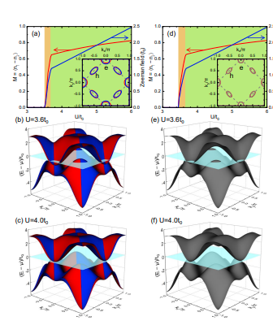
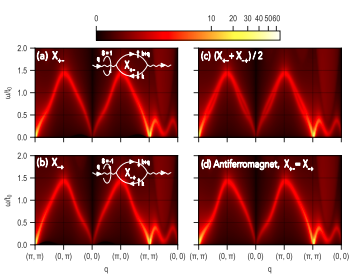
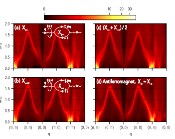

# Weak-Coupling Theory of Neutron Scattering as a Probe of Altermagnetism

著者: Thomas A. Maier1 and Satoshi Okamoto (Computational Sciences and Engineering Division,
Oak Ridge National Laboratory, Oak Ridge, Tennessee 37831, USA)

## アブスト
非弾性中性子散乱は、量子磁性体の磁気励起を調査する強力な手段です。アルターマグネットは、反強磁性体に特徴的な正味磁化が消失する性質と、強磁性体に典型的なスピン分裂した電子構造を持つ新しい磁性体のクラスとして最近登場しました。ここでは、交替磁性を研究する枠組みとして、2サブラティス直交異方性を持つミニマルなハバードモデルを導入します。非制限ハートリーフォック計算を使用して、このモデルが金属状態から絶縁状態へと進化する交替磁性状態を見つけました。この後、動的スピン感受率$\chi''(q, \omega)$のランダム位相近似計算を用いて、これらの状態における非弾性中性子散乱応答を調査します。逆空間の特定の方向に沿った q に対して、磁気励起スペクトルがキラリティに依存することを発見しました。この観測結果は、非弾性中性子散乱実験において、アルターマグネティズムを調査する手段として利用できる可能性があります。

## 研究の背景・問題意識
- 扱うのは反強磁性体だがPT対称性を破る交替磁性体。バンドにスピン分裂がみられる。例えばRuO_2がそう。
- RuO2は弱相関の遍歴系である。弱結合理論を出発点としていろいろ解析できないか？

## 研究目的
- 弱結合理論を用いて交替磁性体におけるスピンダイナミクスを検討する。そのために非弾性中性子散乱によって従来の反強磁性状態と交代磁性状態を区別する方法を探る。

## モデルと手法
- 2次元ハバードから始めるが、副格子の自由度A, Bを持つ。

$$
H_0 = \sum_{k,\sigma} \psi^\dagger_{k\sigma} h(k) \psi_{k\sigma}
$$

$$
h(k) = \frac{1}{2} [\epsilon_{AA}(k) + \epsilon_{BB}(k)] \tau_0 + \epsilon_{AB}(k) \tau_1 + \frac{1}{2} [\epsilon_{AA}(k) - \epsilon_{BB}(k)] \tau_3 - \mu \tau_0 
$$
$$
\epsilon_{AA}(k) = -2t_1 \cos 2k_x - 2t_2 \cos 2k_y, 
$$
$$
\epsilon_{BB}(k) = -2t_2 \cos 2k_x - 2t_1 \cos 2k_y, 
$$
$$
\epsilon_{AB}(k) = -2t_0 (\cos k_x + \cos k_y). 
$$

やることは以下の2つ。
- 非制限ハートリーフォック近似を用いて相図を決定する。
- スピン感受率を計算して磁気応答を見る。

## 結果

- 相図は図の通り。altermagnetではU/t_0が3.5 から 3.6のところでは金属状態が、それより大きくなると絶縁状態となる。かなり反強磁性状態の場合と振る舞いが似ている。バンドを見ると、スピン分裂の出現により交代磁性状態であることがわかる。

- 金属状態のスピン感受率。大事なのは$\chi_{+-}$と$\chi_{-+}$に違いが現れることで、これは反強磁性にはない特徴である。

- 絶縁状態の場合はより顕著。

## 結論
- 非制限HF近似で相図を作成し、Uの小→大の変化とともに金属状態から絶縁状態に変化するような交替磁性状態を見出した。
- 非弾性中性子散乱の応答を見ると$\chi_{+-} != \chi_{-+}$となる。これは実験でAFMとの違いを検出するのに使えるかもしれない。

## 感想・メモ
- 相図が書けるようになりたいが、結構みんなすらすら書いているように見える。どうやって相図を決定しているんだろう？
- 正直できる人は3日くらいでできそうな論文で、学生の習作くらいの位置づけか。