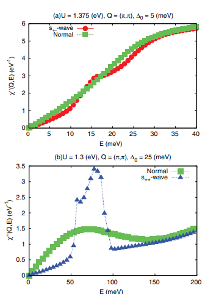

# Determination of the pairing state in iron-based superconductors through neutron scattering

著者: Yuki Nagai and Kazuhiko Kuroki

## アブスト
我々は、鉄系ニクタイドにおける有効な5軌道モデルを用い、準粒子減衰を考慮して、s±およびs++超伝導状態におけるスピン感受率を計算した。実験的に評価された準粒子減衰と超伝導ギャップの大きさに対して、波数ベクトル≃ (π, 0)における結果は、s±状態が中性子散乱実験とより一致することを示した。一方で、より大きな準粒子減衰と超伝導ギャップの場合、s++状態がより一致する可能性がある。波数ベクトル≃ (π, 0)において実験を再現する二つのケースを区別するために、波数ベクトル≃ (π, π)を実験的に調査することを提案する。

## 研究の背景・問題意識
- 鉄系超伝導体のギャップがs++かs+-かは議論が分かれるところ。
- 核磁気緩和速度がT_c以下でコヒーレンスピークを欠いていることや、STMでの準粒子干渉の検出は、ギャップの符号反転があること、つまりフェルミ面の差し渡しで符号が変わるs+-状態を示唆している。一方で、不純物によるT_cの抑制がs+-にしては弱すぎるという主張もある。
- 非弾性中性子散乱の結果は議論が分かれるところで、ピーク構造はスピン共鳴由来か、非弾性準粒子減衰かが問題となっている。符号反転由来のピークならs+-だが、s++でもピークが出うる。結局どっち？

## 研究目的
- 先行研究(Onari)を再考し、準粒子減衰とギャップの大きさをもう少し実験に近い値にする。メッシュをたくさんとってみる。

## モデルと手法
- 先行研究(Onari)とほぼ同じモデル、手法。パラメータの取り方が異なり、現実的な値を考慮して約10meVのギャップや減衰を取り入れている。(Onariのほうはもっと大きい)

## 結果
- メッシュを細かくすると、$Q = (\pi, \pi/16)$ではs+-のピークのほうが実験結果と一致する。そしてより大きい値をとればOnariの先行研究を再現する。
- $(Q = \pi, \pi)$の値は、どちらも符号反転がないが、実は注目すべきである。準粒子減衰が小さいと強化されないが、減衰の増大に従いピークが大きくなる。

## 結論
- ギャップと減衰により現実的な値を考慮すると、先行研究の主張を見直す必要が出てくる。つまりs+-のほうが現実的かもしれない。また$Q = (\pi,\pi)$の値を非弾性中性子散乱で見ると、準粒子減衰の効果がどれだけ効いているか確認することができる。

## 感想・メモ
- この論文を読む前にまずOnariの論文を読んだほうがいい。あとパラメータだけ変えて先行研究と同じことをするのは一見稚拙ともとられかねないが、新しい提案ができているのはよかったと思った。