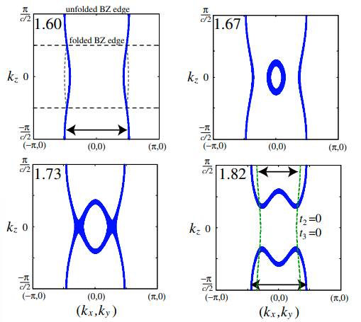
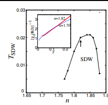
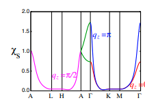
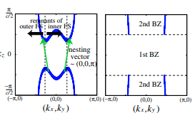
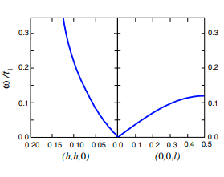

# Unified Origin for the 3D Magnetism and Superconductivity in NaxCoO2

著者 : Kazuhiko Kuroki, Shuhei Ohkubo, Takumi Nojima, Ryotaro Arita, Seiichiro Onari and Yukio Tanaka

## アブスト
非水和のナトリウムリッチなNaxCoO2において観測される三次元（3D）磁性の起源を、遍歴スピンの図式を用いて3Dハバードモデルで解析します。この起源は、a1gバンドのΓ-A線における局所的な最小構造によって生じるフェルミ面の内側部分と外側部分の間の3Dネスティングにあると特定されました。計算されたスピン波の分散は、中性子散乱の結果と非常によく一致します。我々は、この3D磁性と、水和された系で超伝導を引き起こすスピンゆらぎが本質的に同じ起源を持つと主張します。

## 背景
- ナトリウム水和物NaxCoO2・yH2Oにおける超伝導が注目を集めていた。実験事実としては次のようなものがある。
1. ARPESにより、第一原理計算で得られたegホールポケットが存在しない。つまりa1gバンドが超伝導に関連するバンドである。
2. 二層水和物の超伝導資料では、低温でCoサイト、Oサイトにおける(T1T)^(-1)の増加がみられる。つまりBZの橋から離れた位置にスピン揺らぎが存在することが示される。
3. (1/T1)におけるコヒーレンスピークの不存在から、非従来型の超伝導ギャップが示唆される。

- 理論では、異なるフェルミ面同士を差し渡してスピン揺らぎを誘発する、非従来型の「拡張S波」が提案されている。二つのFSで符号が変わるが、各FS内では変わらないようなギャップである。

## 本研究の目的
- 今回は非水和のナトリウムリッチ系で観測される3Dスピン密度波の金属磁性との関係を調査する。

## モデルと手法
- 三角格子状のハバードモデル
$$H = \sum_{i,j} t_{ij} c_i^\dagger c_j + U \sum_i n_{i\uparrow} n_{i\downarrow}
$$
を用いて解析する。スピン感受率はFLEX近似で計算する。スピン波の分散は$1-Uχ_0 = 0$となる$\omega$を見る。

## 結果
1. フェルミ面について

フェルミ面はバンド充填率（ナトリウム含有量に対応する）の増加とともに変化する。バンド充填率が小さい場合は2D状のフェルミ面が形成されるが、増加に伴い内部に3DFSが現れたりして3次元性を持つようになる。

2. スピン感受率について

温度依存性はキュリーワイス的な挙動を示す。n が1.75付近で消滅することは、xが0.75付近になると磁気秩序が観測されなくなるという実験事実と整合する。

3. ネスティングについて

充填率nが1.8の付近では、$(0,0,\pi)$の秩序ベクトルが発生する。nが1.9くらいになると、c方向に非整合になる。

4. 自発磁化について

スピン密度波状態の磁化も平均場で計算すると、大体$\mu SR$の結果と一致する。

5. スピン波分散について

$\omega(0.1,0.1,0)/\omega(0,0,0.5)$が大体2:1になるが、これは$x = 0.82$で得られた中性子散乱の結果と一致している。

## まとめ
- 非水和系ではバンド充填率が低いとスピン揺らぎが弱くなる。水和によって系が2次元性を強めることで、内側・外側のFS間のネスティングが強化され、超伝導も増強される。

## 感想・メモ
- ネスティングに「a1gバンドの局所的な最小構造」に由来しているというキーワードが多々見受けられるが、これは文献[19]を精読すればわかるのだろうか。