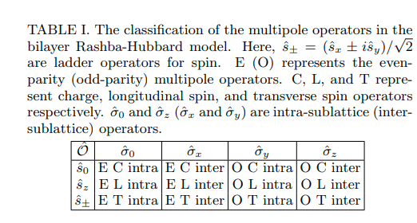
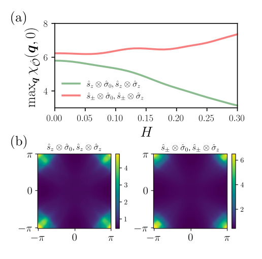
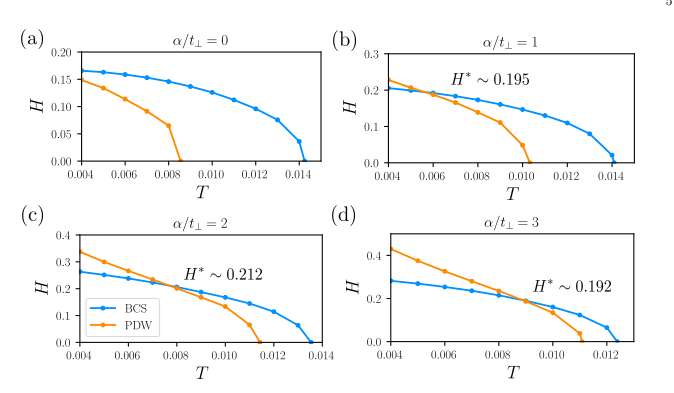

# Even-odd parity transition in strongly correlated locally noncentrosymmetric superconductors : An application to CeRh2As2

著者 : Kosuke Nogaki, Youichi Yanase

## アブスト
CeRh₂As₂の複数のH-T相図の発見は、トポロジカル超伝導体の設計に新たな道を開いた。弱結合理論は実験的な相図を定性的に説明しているが、それらの理論との定量的な不一致が結論的な解釈を妨げていた。本研究では、クーロン相互作用と、局所的に反転対称性を欠く超伝導体の相図について徹底的に研究を行った。強相関超伝導体における偶奇パリティ転移とパリティ転移磁場の増強を明らかにし、CeRh₂As₂に関する問題を解決した。

## 研究背景・問題意識
- 局所的に反転対称性を欠いた超伝導が注目されている。例えば副格子自由度について反対称のクーパーペアが許され、スピントリプレットではない奇パリティ超伝導状態が生じる。このとき高磁場ではPDWが安定とみられている。
- CeRh2As2の温度-磁場相図における二つの超伝導相はSC内部でのパリティ転移に基づいて解釈される。

以下の謎がある。
1. CeRh2As2の超伝導の微視的なメカニズムはよくわかっていない。
2. 弱結合理論で予測されるCeRh2As2のパウリリミットを実験値は優に超えている。

## 研究目的
- 局所反転対称性を欠く超伝導相図を検証したい。

## モデルと手法
- 使うのはCeのf軌道、クーロン斥力、SOCを考慮したbilayerのRashba-Hubbardモデルで
$$
\hat{H} = \sum_k \varphi^{\dagger}(k) H_0(k) \varphi(k) + U \sum_{i, \sigma} n_{i \uparrow \sigma} n_{i \downarrow \sigma}
$$
で表される。$H_0(k)$は
$$
H_0(k) = \epsilon(k) s_0 \otimes \sigma_0 + \alpha g(k) \cdot s \otimes \sigma_z - \mu_B H s_z \otimes \sigma_0 + \tilde{t}_\perp(k) s_0 \otimes \sigma_+ + \tilde{t}_\perp(-k) s_0 \otimes \sigma_-
$$
である。

$$
\varphi(k) = \begin{pmatrix} 
    c_{k \uparrow A} \\ 
    c_{k \downarrow A} \\ 
    c_{k \uparrow B} \\ 
    c_{k \downarrow B}
\end{pmatrix}
$$
であり、
$$
\epsilon(k) = -2t(\cos k_x + \cos k_y) + 4t' \cos k_x \cos k_y - \mu
$$
である。kは運動量、スピンはs, $\sigma$が副格子自由度を表す。

$$
g(k) = \left( -\frac{\partial \epsilon(k)}{\partial k_y}, \frac{\partial \epsilon(k)}{\partial k_x}, 0 \right)
$$

であり、層間ホッピングは

$$
\tilde{t}_\perp(k) = t_\perp (1 + e^{-ik_x})(1 + e^{-ik_y})
$$
で与えられる。設定値は

$$
t = 1, \quad t' = 0.3, \quad t_\perp = 0.1, \quad \mu_B = 1, \quad U = 3.9, \quad n = 0.85.
$$
である。

## 結果
### Multipole susceptibility
量子臨界多極子揺らぎを
$$
\chi_{\hat{O}}(q, i\nu_n) = \sum_{\xi_1 \xi_2 \xi_3 \xi_4} \hat{O}_{\xi_1 \xi_2} \, \chi_{\xi_2 \xi_1 \xi_3 \xi_4}(q, i\nu_n) \, \hat{O}_{\xi_3 \xi_4},
$$
で導入する。多極子は表のように定められている。

横磁化、縦磁化感受率を計算し、その磁場依存性を見ると、
1. 横感受率は磁場により増強される
2. 縦感受率は磁場により抑制される

ことがわかる。
奇パリティの多極子のほうがわずかに優勢であることもわかる。

時事揺らぎはNMRによる観測結果と一致する。

### 超伝導
- CeRh2As2の結晶空間群から、点群がD4hであることはわかるが、磁場印加により対称性はC4hに落ちる。
- ギャップは以下のようである。
$$
\Delta_{\sigma \sigma'}(k) = \left\{ \psi_{\sigma \sigma'}(k) + d_{\sigma \sigma'}(k) \cdot s \right\} i s_y,
$$
- 線形化エリアシュベルグ方程式の固有値を見ると、Bg及びBu表現が支配的であることがわかる。これらの状態はどちらも$d_{x^2-y^2}$波が支配的なペアリングと、p波対称性を持つスピントリプレットの副次的なペアリングを含んでいることがわかる。
磁場に対して大きな変化は見られない。

- BgとBu表現は副格子構造によりはっきり区別される。
Bgでは$\phi_{AA}(k) = \phi_{BB}(k)$だが、$d_{AA}(k) = -d_{BB}(k)$である。一方Buでは$\phi_{AA}(k) = -\phi_{BB}(k)$, $d_{AA}(k) = d_{BB}(k)$である。それぞれBCS状態、PDW状態に対応する。

- エリアシュベルグ方程式の固有値はパウリ対破壊効果のために、磁場によって弱められるが、BuはBgに比べてより安定する。つまり$H = 0.24$で偶パリティから奇パリティへの転移が生じることになる。

## 相図

- 局所的な反転対称性の欠如を制御するパラメータとして$\alpha / t_{\perp}$を定める。この変化に対して$H^{*}/T_C \sim 15$のままロバストである。この値は弱結合理論から予測される値よりも実験と整合する。
なおパリティ混合のパラメータは$\alpha / t_{\perp}$に強く依存する。

- CeRh2As2が持つような大きなパリティ転移磁場は、量子臨界的AFM揺らぎから生じる内部磁場であると結論付けられる。

## 感想
- ハミルトニアンに磁場、SOCが入っており、徹底して磁場印加のもとでの超伝導相を議論していた。自分のやりたいこととかなり方向性が似ている。
このミニマルモデルで輸送係数はどのように計算されるのだろうか。