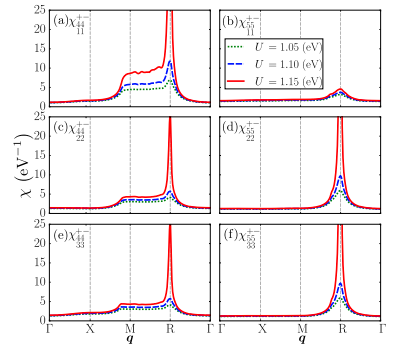
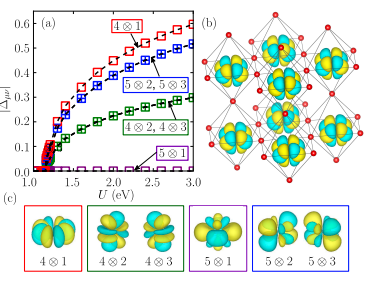
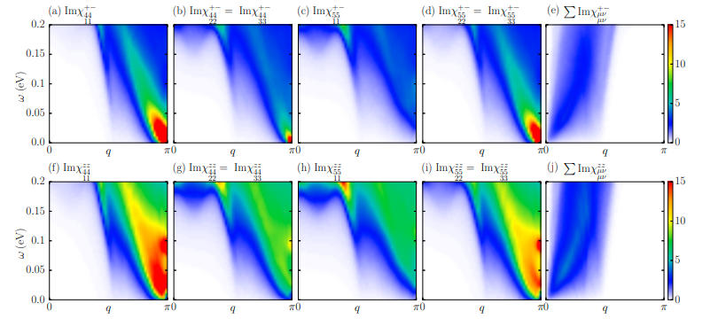

# Low-Energy Excitation Spectra in the Excitonic Phase of Cobalt Oxides

著者 : Tomoki Yamaguchi, Koudai Sugimoto, and Yukinori Ohta

## アブスト
ペロブスカイト型コバルト酸化物の励起相と低エネルギー励起スペクトルを研究した。Pr₀.₅Ca₀.₅CoO₃の3dバンドに対して三次元立方格子上で定義される5軌道ハバードモデルを構築し、ランダム位相近似（RPA）に基づいて通常状態での励起子感受率を計算し、励起子凝縮に向けた不安定性の存在を示した。磁気多極子を持つ励起子基底状態に基づき、RPAで励起子相の動的感受率を計算し、スピン横モード（ゴールドストーンモード）においてギャップのない集団励起、スピン縦モード（ヒッグスモード）においてギャップのある集団励起が現れることを確認した。結果の実験的な関連性についても議論した。

## 研究背景・問題意識
- Exitonic Phase(EP)相はボーズ・アインシュタイン凝縮の一例である。価電子帯のホールと伝導体の電子がクーロン相互作用による引力のために自発的に対を作る。
- ペロブスカイト型コバルト酸化物Pr₀.₅Ca₀.₅CoO₃ (PCCO)は、異なる軌道間で、価電子帯の正孔と伝導体の電子がスピントリプレットの対を形成する。PCCOは以下のような性質を持つ。
1. 金属絶縁体転移が80K付近で観測される。
2. 抵抗率の温度依存性がほとんどなく、バンドは完全にギャップしていない可能性がある。
3. Pr4+のクラマース二重項の交換分裂が発生しているのに局所的な磁気モーメントは観測されていないので、hidden orderとも呼ばれる。
4. X線吸収ではスピン状態転移の明確な兆候は観測されていない。

- 先行研究によれば、PCCOの異常な現象はEP転移に起因しているとされている。

## モデルと手法
- 第一原理計算でバンド分散を得る。
- 多軌道ハバードモデル
$$
H_0 = \sum_{i, \mu, \sigma} \epsilon_{\mu} c_{i, \mu, \sigma}^{\dagger} c_{i, \mu, \sigma} + \sum_{i,j} \sum_{\mu, \nu} \sum_{\sigma} t_{ij, \mu \nu} c_{i, \mu, \sigma}^{\dagger} c_{j, \nu, \sigma}
$$

$$
H_{\text{int}} = \frac{U}{2} \sum_{i, \mu, \sigma} c_{i\mu\sigma}^{\dagger} c_{i\mu\sigma} c_{i\mu-\sigma}^{\dagger} c_{i\mu-\sigma} 
+ \frac{U'}{2} \sum_{i, \sigma, \sigma'} \sum_{\mu \neq \nu} c_{i\mu\sigma}^{\dagger} c_{i\mu\sigma} c_{i\nu\sigma'}^{\dagger} c_{i\nu\sigma'} 
- \frac{J}{2} \sum_{i, \sigma, \sigma'} \sum_{\mu \neq \nu} c_{i\mu\sigma}^{\dagger} c_{i\mu\sigma'} c_{i\nu\sigma'}^{\dagger} c_{i\nu\sigma} 
+ \frac{J'}{2} \sum_{i, \sigma} \sum_{\mu \neq \nu} c_{i\mu\sigma}^{\dagger} c_{i\nu\sigma} c_{i\mu-\sigma}^{\dagger} c_{i\nu-\sigma}
$$

を構築する。

- 平均場近似で、スピン三重項の励起子秩序を仮定して、オーダーパラメータを計算する。
平均場のハミルトニアンは
$$
H_{\text{MF}} = \sum_{k', \epsilon, \sigma} E_{k', \epsilon, \sigma} \eta_{k', \epsilon, \sigma}^{\dagger} \eta_{k', \epsilon, \sigma}
$$
となる。なお秩序によってユニットセルが拡大するため、波数ベクトルを$k' = k+mQ$と書く。mは整数である。

- 動的感受率を計算する。
$$
\chi_{ss'}^{\mu\nu\lambda\kappa}(q, q', \omega) = \frac{i}{N} \sum_{k,k'} \int_0^\infty dt \, e^{i\omega t} \langle [c_{k,\mu,\sigma_1}^{\dagger}(t) c_{k+q,\nu,\sigma_2}(t), c_{k',\lambda,\sigma_1'}^{\dagger} c_{k'+q',\kappa,\sigma_2'}] \rangle
$$
ベアの感受率は
$$
\chi_{ss'}^{0,\mu\nu\lambda\kappa}(q, q + lQ, \omega) = -\frac{1}{N} \sum_{p',m,n,\epsilon,\epsilon'} \frac{f(E_{p'+q,\epsilon,\sigma_1}) - f(E_{p',\epsilon',\sigma_2})}{E_{p'+q,\epsilon,\sigma_1} - E_{p',\epsilon',\sigma_2} - (\omega + i\delta)}
\left( C_{\mu,m,\epsilon}(p' + q, \sigma_1) C_{\nu,m+n+l,\epsilon}(p' + q, \sigma_2') C_{\lambda,m,\epsilon'}(p', \sigma_2) C_{\kappa,m+n,\epsilon'}(p', \sigma_1') \right)
$$
である。

- 多軌道系の感受率は
$$
\begin{pmatrix}
\chi_{+}^{\mu\nu} \\
\chi_{\uparrow\uparrow}^{\mu\nu} \\
\chi_{\uparrow\downarrow}^{\mu\nu}
\end{pmatrix}
=
\begin{pmatrix}
\chi_{+}^{0,\mu\nu} \\
\chi_{\uparrow\uparrow}^{0,\mu\nu} \\
\chi_{\uparrow\downarrow}^{0,\mu\nu}
\end{pmatrix}
+
\begin{pmatrix}
\chi_{+}^{0,\mu\nu} & 0 & 0 & 0 \\
0 & \chi_{\uparrow\uparrow}^{0,\mu\nu} & 0 & V_{\uparrow\uparrow} & 0 \\
0 & 0 & V_{\uparrow\downarrow} & \chi_{\uparrow\downarrow}^{0,\mu\nu} \\
0 & V_{\downarrow\uparrow} & 0 & \chi_{\downarrow\downarrow}^{0,\mu\nu}
\end{pmatrix}
\begin{pmatrix}
\chi_{+}^{\mu\nu} \\
\chi_{\uparrow\uparrow}^{\mu\nu} \\
\chi_{\uparrow\downarrow}^{\mu\nu}
\end{pmatrix}
$$
のように計算される。

## 結果
- 通常相におけるスピントリプレット励起子の揺らぎを議論する。

staticなスピン横モードのq依存性を見ると、$q = (\pi,\pi,\pi)$で$U ~ 1.15$eVで揺らぎが発散する。これはegバンドの電子ポケットとt2gバンドの正孔ポケットの間のフェルミ面のネスティングにより引き起こされる。秩序ベクトル$Q = (\pi, \pi, \pi)$を持つEP転移がU = 1.15eVで発生する。

- 平均場で励起子秩序パラメータも計算できる。秩序パラメータはU > 1.15を超えることで有限になる。フィリングの変化に対しても変化はない。

- スピン横感受率を見ると、すべてのオーダーパラメータに対して$q = (\pi,\pi,\pi)$でギャップレスゴールドストンモードが観測される。またスピン縦感受率に対してもヒッグスモードが観測される。

- これらは非弾性中性子散乱で観測可能だが、観測されるのは軌道対角成分のみで、非対角成分の実験的検知は難しい。非弾性散乱過程で軌道を変える能力を持つビームを照射する必要がある。