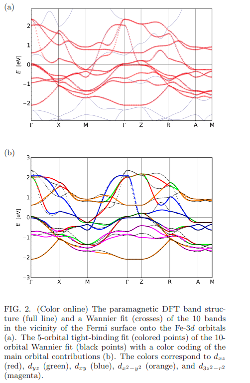
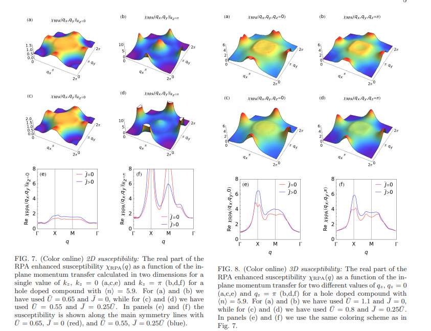
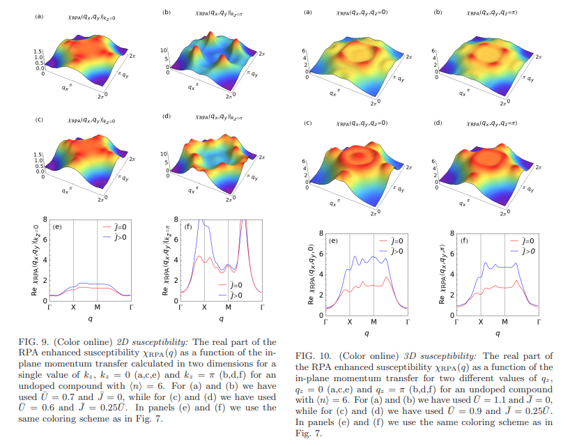
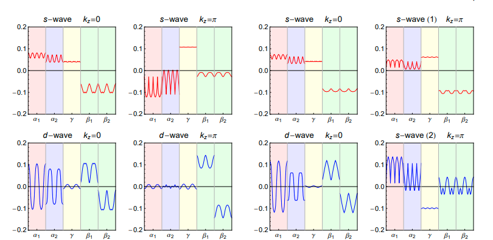

# Spin fluctuations and superconductivity in a 3D tight-binding model for BaFe2As2

著者 : S. Graser
, A. F. Kemper
, T. A. Maier
, H.-P. Cheng
, P. J. Hirschfeld
, and D. J. Scalapino

## アブスト
KFe2As2型のFe-プニクタイド化合物に関する実験データは豊富に存在するにもかかわらず、K = Ba、Ca、またはSrの場合、複数軌道のタイトバインディングモデルに基づく主要な理論的研究は、これまで1111化合物に限定されてきました。これは、第一原理計算によって122系の材料で見られるより三次元的な電子構造が、このシステムをモデル化するのに適さないと考えられることに起因します。さらに、体心正方対称性によるより複雑なブリルアンゾーン（BZ）は、電子バンド構造を効果的な1Fe/単位セルのBZに単純に展開することを許しません。ここでは、BaFe2As2のフルDFTバンド構造に対する有効な5軌道タイトバインディングフィットを、kzの分散を含めて提示します。我々は、以前に研究されたLaOFeAsに対する5軌道スピン揺らぎモデルと比較し、RPAによって強化された磁化率を計算しました。さらに、主要なペアリング不安定性を決定するために揺らぎ交換近似を使用し、BZの単一のkzカット上での厳密な二次元モデル計算と完全な三次元アプローチの違いを検討しました。我々は、1111材料と非常に類似したペアリング状態を見つけ、ホールシート上での準等方的なペアリングと、kz = 0での電子シート上でのノード状態を確認しましたが、これらの状態はホールがドープされるとギャップを持ちます。一方、秩序パラメーターにはkz依存性が大きく残り、ペアリング強度の大部分はkz = π近くのプロセスに由来することがわかりました。これらの状態は、BZの上部近くでホールシートの異方性が強化され、電子シートの異方性が減少する傾向を示します。

## 研究背景・問題背景
- BaFe2As2は鉄系超伝導体の一種。ホールポケットと電子ポケットの間隔に対応する秩序波数ベクトルで共鳴が表れる。

- ギャップの対称性は議論の的となっていて、多くの実験(NMR, 超流動密度、熱伝導率、ラマン散乱等)がノードの存在をほのめかす低エネルギー準粒子励起の存在を示している。

- 鉄系超伝導体の代表的なものが1111型の材料である。1111型の材料に対する多軌道計算でもノードの存在が示唆されているが、ノード状態からフルギャップ状態への遷移も記述される。

- 1111型材料はよく研究されているものの、122構造の物質も存在し、研究途上である。これはFeAsが1つの陽イオンのみによって隔てられている。一部のBaをKに置き換えるホールドーピングや、一部のFeをCoに置き換える電子ドーピングがスピン波の形成を抑制し、超伝導基底状態を生じさせることもわかっている。

- 特にBa0.6K0.4Fe2As2はホールドープされたときのARPESとバンド構造計算の結果がおおむね一致する。

- これらの材料で電子構造の3次元性はペア状態に何か影響を与えうるだろうか？たとえば、ホールシートと電子シートのネスティングがs+-の安定化に寄与するとされているが、シートがkz方向にも分散していればこの効果は変化するかもしれない。ドーピングは混成を変えるかもしれない。

## 研究手法
- まず、第一原理計算から5軌道モデルのホッピングを決定する。手順は以下のようである。
1. BaFe2As2のバンド構造をQuantum Espressoの標準ライブラリを用いてDFTで計算する。

2. 最大局在ワニエ関数を用いて、フェルミエネルギー近傍のバンドをFe-3dに投影する。

3. ワニエバンドを5軌道タイトバインディングモデルにフィットさせる。

- RPAによってMulti orbitalの磁化率を計算する。スピン磁化率の実部が磁気揺らぎを表している、

- ペアリングの対称性を、エリアシュベルグ方程式を解くことによって決定する。ポテンシャルは揺らぎ交換近似を用いて定める。

## 結果
### 第一原理計算
- DFTの結果が以下に示される。

### 磁気感受率

- RPAの結果は以下の通り。

 

- $kz = 0$と $kz = \pi$の結果を比較する。$kz = \pi$では$q = (\pi, 0)$に対して強いピークを持つ。Hund結合が$q = (\pi, 0)$でのピークを増強する。

### 超伝導対称性
- 3次元の磁化率から、固有値方程式を解いてペアリング関数を調べる。磁化率がkzにわたって平均化されていることに留意。

- ギャップの異方性は、$kz = 0$の場合の方が$kz = \pi$より大きくなる。$kz = 0$では小さいが等方的なギャップが得られ、$kz = \pi$に向かうにつれ強い異方性が発現するようになる。

## 結論
- BaFe2As2のDFTバンド構造についての5軌道モデルを作った結果、$kz = 0$におけるフェルミ面シートへの軌道の寄与は$kz = \pi$における寄与とは異なることが分かった。Γ周辺のホールポケットは顕著なMulti Orbitalの構成を示す。

- FLEX近似でペアリング関数を研究し、2Dと3Dの場合を比較する。ここで強いkz分散とバンド軌道構成の違いによって、ぶりルアンゾーンの中心と上部ペアリング関数がFSシリンダーに沿って大きく変化することが分かった。

- 3次元の場合、適当なホールドープを施すことによって$(\pi, \pi)$付近の追加のホールポケットの存在が、d波より拡張S波を有利にすることを示した。これは$kz = \pi$近くの運動量依存するプロセスによって生じ、この領域のホールシートの$d_{xy}$軌道の特性に起因している。

- $\Gamma$周辺のホールシリンダーでは、$kz = 0$ではほぼ等方的なギャップが存在し、$kz = \pi$ンい向かって直線ノードが表れ、符号が反転するようになる。

- 今後の課題は、122型フェルミ面に基づくスピン揺らぎペアリングの質的側面を1111型と比較して調査することである。