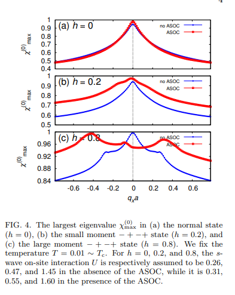

# Multipole Superconductivity in Nonsymmorphic Sr2IrO4

## 研究背景・問題意識
- 銅酸化物高温超伝導体と類似した物質にSr2IrO4が存在する。類似している点は以下の通りである。
1. Irイオンごとに1つのイオンを持ち、擬スピン1/2の反強磁性を示す。
2. 擬ギャップの出現や低温でのd波ギャップの出現
3. キャリアドープによるd波超伝導の出現

- 銅酸化物と異なる点は以下の通りである。
1. Sr2IrO4は大きなSOCを持つ。
2. 非対称な結晶構造を持つ。

これらの相違から、銅酸化物とは異なる超伝導特性が期待できる。

- Sr2IrO4は面内で傾斜した反強磁性モーメントのいくつかの積層パターンが報告されている。
1. 非ドープの場合は $-++-$
2. ドープ、外場の印加により、$++++$
3. 隠れた奇パリティの秩序である$-+-+$も観測されている。

大きなSOCの存在と八面体の回転によってa軸から傾いた磁気モーメントが生じ、b軸に沿っても小さな強磁性モーメントが誘導される。
またc軸に沿った磁気構造パターンも観測される。

- 非対称系では外部磁場印加でFFLOが出現するかもしれないが、FFLOの秩序パラメータは渦状態の中に紛れてうまく観測できないかもしれない。
渦による干渉を受けないFFLOを示す物質の探求も重要。

- 数学的なアプローチもなされている。非対称な超伝導体では、ラインノードを持つ超伝導が発現すると考えられている。これはSOCや磁気秩序の重要なウラン系の物質で現れうるとされている。

## 研究目的
- 非対称な結晶における多極子秩序と超伝導状態の共存を解明する。

## モデルと手法
### $-++-$状態
- 空間群に基づいてギャップを分類する。磁気空間群$M_{-+-+}$はPIccaに属する。
ここでは基底面$k_x, k_y, k_z = 0$、およびゾーンフェイス$k_z = \pm\frac{\pi}{a}, k_x, k_y = \pm\frac{\pi}{c}$上のクーパー対に着目する。
このような対称性の高い点では$\gamma_k^{-++-}$を計算することができる。そしてクーパー対波動関数の表現$P_k^{-++-}$は$\gamma_k^{-++-}$から計算することが可能。
- まず表現$P_k^{-++-}$の指標を計算する。次に$P_k^{-++-}$をもとの結晶対称性$D_{4h}$の既約表現に分解する。

$$
k_z = 0, \pm \frac{\pi}{c} \\
\text{BP}: A_{1g} + A_{2g} + B_{1g} + B_{2g} + 2A_{1u} + 2A_{2u} + 2B_{1u} + 2B_{2u} + 2E_u \\
\text{ZF}: 2E_g + A_{1u} + A_{2u} + B_{1u} + B_{2u} + 4E_u
$$

$$
k_{x,y} = 0, \pm \frac{\pi}{a} \\
\text{BP}: A_{1g} + B_{1g} + E_g + 2A_{1u} + A_{2u} + 2B_{1u} + B_{2u} + 3E_u \\
\text{ZF}: A_{2g} + B_{2g} + E_g + 3A_{1u} + 3B_{1u} + 3E_u
$$

- 群論による結果を、3次元単一軌道の強束縛模型を用いて実証する。
まず、点群D4hのA1g表現に属するs波秩序パラメータ
$$
\hat{\Delta}^{(s)}(k) = \Delta_0 \hat{1}_2 \otimes \hat{\sigma}_0^{(\text{layer})} \otimes \hat{\sigma}_0^{(\text{sl})} \otimes i\hat{\sigma}_y^{(\text{spin})}
$$

及びB2g表現に属する$d_{xy}$波秩序パラメータ
$$
\hat{\Delta}^{(d)}(k) = \Delta_0 \sin\left(\frac{k_x a}{2}\right) \sin\left(\frac{k_y a}{2}\right) \hat{1}_2 \otimes \hat{\sigma}_0^{(\text{layer})} \otimes \hat{\sigma}_x^{(\text{sl})} \otimes i\hat{\sigma}_y^{(\text{spin})}
$$
を定義する。

- 群論を用いた解析によるギャップの形状を表にまとめている。

- 準粒子のエネルギー分散は次のBdGハミルトニアン
$$
\hat{H}_{\text{BdG}}(k) =
\begin{pmatrix}
\hat{H}_n(k) & \Delta(\hat{k}) \\
\Delta(\hat{k})^\dagger & -\hat{H}_n(-k)^\top
\end{pmatrix}
$$
を対角化することで得られる。

- 以下の超伝導特性は電子密度には依存しない。

ノード点は黒でプロットされている。
2つの超伝導状態のギャップ構造は群論による結果を再現する。つまり、数値計算で示されたギャップノードは非対称的な空間群対称性によって保護されている。

### $-++-$状態
- この状態では、$k$と$-k$をむずびつける対称操作が存在しない。このときクーパー対は$k$と$-k$の状態の間で形成される必要がないので、FFLO SCが発現してもよいことになる。

- $-+-+$の秩序はある意味奇パリティの磁気四重極とみなすことができて、バンド構造の非対称性を引き起こしうる。

- 群論的な解析によれば、$-+-+$はD4hのEuに属する。これはトロイダル双極子も含むかもしれない。

- 超伝導状態の解析のため、超伝導感受率

$$
\hat{\chi}(q, i\Omega_n) = \left( \hat{1}_8 - U \hat{\chi}^{(0)}(q, i\Omega_n) \right)^{-1} \hat{\chi}^{(0)}(q, i\Omega_n)
$$

を定義する。$\hat{\chi}(q, i\Omega_n)$が発散する温度$T_c$で超伝導転移が起こっているとみなされる。
なお、バンドは$k_y, k_z$に対しては対称なので$q_x = q_y = \Omega_n = 0$で感受率は最大値をとる。

- $h \cdot \sigma$でオーダーパラメータを導入するとき、通常状態である$h = 0$では$q = 0$で感受率が最大になるが、$h = 0.2, 0.8$($-+-+$)では、ASOCの存在によって有限の$q_x$で最大値になる。
つまり、従来のFFLOに必要な巨視的磁化が存在しないにもかかわらず、$-+-+$ではASOCの存在でFFLOが好まれる。

さらに大きなモーメント$h > 0.8$では3つの局所的な最大値が観察される。これはFFLOというよりむしろPDWといった方がよく、一部のバンドが主に超伝導に寄与し、他のバンドの寄与は弱いことを示唆する。

## 結果
- ドープされたSr2IrO4における2つの磁気状態、$-++-$及び$-+-+$における超伝導を調査した。
1. $-++-$状態では、S波、$d_{xy}$波の超伝導の両方がBZ上で非対称的な対称性により保護された特異な線ノードを示すことが分かった。このほか予期しないギャップが開くことも分かった。
2. $-+-+$状態では、バンド構造が非対称に変形するため、反強磁性モーメントの大きさに関係なくFFLOが実現することが分かった。ASOCの存在によって、この状態には外部磁場が必要ない。すなわち、渦状態が存在しないFFLOになることを意味する。

## メモ・感想
- $-++-$状態と$-+-+$状態でアプローチの仕方がだいぶ異なるような気がしたが何か理由はあるのだろうか。
- 最近のLetterは付録に多くが凝縮されているのでじっくり勉強するならそれを参照するべきとはいえ、本文中に突然出てくるパラメータが出てきて理解に時間がかかった。
例えばオーダーパラメータ$h$の説明は本文中にはなく、いきなり登場していて最初驚いた。これは明らかに本文と同等かそれ以上に付録を読み込めというサインのようである。