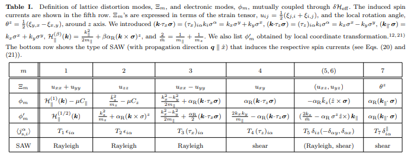
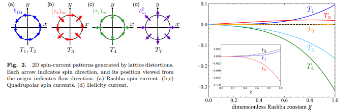

# Microscopic Analysis of Lattice Distortion Effects in Rashba Systems

著者 : Yuuki Ogawa, Takumi Funato, and Hiroshi Kohno

## アブスト
我々は、強結合モデルに基づいて、三次元ラシュバ系における動的格子歪みの効果を理論的に研究した。反転対称性の破れた四方格子上のsp電子系を考慮し、格子歪みはホッピング積分と結晶軸の変調を通じて組み込まれている。pzまたはsに由来するバンドに対する有効ハミルトニアンは、ラシュバ変調項を含むことが判明し、これによりラシュバ電流、四重極電流、垂直電流、螺旋性電流など、さまざまなタイプのスピン電流が誘導される。これらの結果は、局所座標変換法によって得られたものと比較されている。

## 研究背景・問題意識
- スピントロニクス応用において、スピンカレントは重要な役割を果たす。スピンカレントの実験的な生成方法はいくつかあるが、スピン軌道相互作用(SOI)を介したスピンカレント生成のメカニズムは依然として未解決の問題。

- 表面弾性波は(SAW)を用いたスピンカレント生成においては、空間反転対称性の破れがあるためにRashba SOIが主要なスピン軌道相互作用になりうる。Rashba SOIはスピンモーメントロッキングにより、効率的なスピンカレント生成を可能にする。

- パリティ混成を伴う多軌道特性を持つバンドにおいて、Rashba SOIが効果的なSOIとして現れる。これに着目して、多軌道強結合モデルから出発してラシュバ系における格子ゆがみの効果を調べられないか？

## 研究目的
- 3次元Rashba系における格子ひずみの効果を微視的に研究し、スピンカレント生成を調べる。

## モデル
c軸に沿って反転対称性が破れた正方格子上のs, p電子の強結合モデルから出発する。ハミルトニアンは

$$
H = H_{\text{kin}} + H_{\text{CF}} + H_{\text{odd}} + H_{\text{so}}
$$

となる。ここで

$$
\begin{align}
H_{\text{kin}} &= \sum_{\langle i,j \rangle} \sum_{m,n} \left( \left( E_{mn} + \delta E_{mn} \right) c_{im}^{\dagger} c_{jn} + \text{H.c.} \right), \\
H_{\text{CF}} &= \sum_i \left( \Delta \left( c_{ix}^{\dagger} c_{ix} + c_{iy}^{\dagger} c_{iy} \right) - E_s c_{is}^{\dagger} c_{is} \right), \\
H_{\text{odd}} &= V_0 \sum_i \left( c_{is}^{\dagger} c_{ic} + \text{H.c.} \right), \\
H_{\text{so}} &= \frac{\lambda}{2} \sum_i c_i^{\dagger} \left( \mathbf{l} \cdot \mathbf{\sigma} \right) c_i.
\end{align}
$$

である。$H_{kin}$の中に格子ゆがみの効果$\delta E_{mn}$が入っている。

- 無摂動ハミルトニアンは
$$
H(k) = \begin{pmatrix}
\epsilon_s - E_s & V_0 - iV_z & -iV_x & -iV_y \\
V_0 + iV_z & \epsilon_z & i\lambda' \sigma_y & -i\lambda' \sigma_x \\
iV_x & -i\lambda' \sigma_y & \epsilon_x + \Delta & i\lambda' \sigma_z \\
iV_y & i\lambda' \sigma_x & -i\lambda' \sigma_z & \epsilon_y + \Delta
\end{pmatrix}
$$

で与える。

- $H_{kin}$に対する変調は

$$
\delta H_{\text{kin}}(k; q) = 
\begin{pmatrix}
\delta \epsilon_s & -\delta V_z & -\delta V_x & -\delta V_y \\
\delta V_z & \delta \epsilon_z & \delta W_{zx} & \delta W_{yz} \\
\delta V_x & \delta W_{zx} & \delta \epsilon_x & \delta W_{xy} \\
\delta V_y & \delta W_{yz} & \delta W_{xy} & \delta \epsilon_y
\end{pmatrix},
\quad \\
\left( \delta \epsilon_m, \delta V_{m'}, \delta W_{m'n'} \right)
= \sum_R \left( E_{mm}^i, E_{sm'}^i, E_{m'n'}^i \right) \left( \frac{R_j}{a} \right) (\xi_{i,j})_{q, \omega} e^{i k \cdot R}
$$

で与えられる。

- また格子歪みにより結晶軸の局所回転が引き起こされることがある。この効果は

$$
\delta H_{\text{rot}}(k; q) = V_0
\begin{pmatrix}
0 & 0 & \theta_q^y & -\theta_q^x \\
0 & 0 & 0 & 0 \\
\theta_q^y & 0 & 0 & 0 \\
-\theta_q^x & 0 & 0 & 0
\end{pmatrix}.
$$

で取り入れられる。

- ここからさらにハミルトニアンの簡単化を行う。化学ポテンシャル$\mu$がpz、sレベル付近にあると仮定して、高エネルギー領域にある$p_x, p_y$を排除する。無摂動ハミルトニアンは
$$
H_{\text{eff}}(k) = \epsilon_z(k) + \alpha_R a \left( \sin(k_x a) \sigma_y - \sin(k_y a) \sigma_x \right) \\
\simeq E_Z + \frac{k_x^2 + k_y^2}{2m_\parallel} + \frac{\tilde{k}_z^2}{2m_z} + \alpha_R (k_x \sigma_y - k_y \sigma_x),
$$

と書くことができる。摂動ハミルトニアンも同様の方法で

$$
\delta H_{\text{eff}}(k; q) = - \sum_{m=1}^{7} \phi_m(k) \Xi_m(q) e^{-i\omega t}
$$

なお$\phi_1, \phi_2$に関する変調は化学ポテンシャルに吸収され
$$
\frac{\delta \mu}{\mu} = \left( C_{\parallel}^0 - \frac{n - n_1}{\mu \nu} \right) (u_{xx} + u_{yy}) + \left( C_z^0 - \frac{n}{\mu \nu} \right) u_{zz}
$$
となる。他の$\phi_m$に関しては表を参照。

- ハミルトニアンが設定出来たら、久保公式により、スピンカレントを計算する。

$$
j_{s,i}^\alpha \equiv \frac{1}{2} \left( \frac{\partial H_{\text{eff}}(k)}{\partial k_i}, \sigma^\alpha \right) + \tilde{k}_i \sigma^\alpha + \alpha_R \epsilon_{i\alpha},
$$

$$
\langle j_{s,i}^\alpha(q) \rangle_\omega \rangle = \frac{i\omega}{2\pi V} \sum_m \sum_k \text{tr} \left( j_{s,i}^\alpha G_k^R \phi_m G_k^A \right) \Xi_m(q),
$$

ボルン近似で散乱時間$\tau$を評価するためにδ関数不純物ポテンシャルを導入した。

$$
\frac{j_{s,i}^\alpha(r, t)}{j_{s0} \tau} = \epsilon_{i\alpha} \left[ T_1 (\dot{u}_{xx} + \dot{u}_{yy}) + T_2 \dot{u}_{zz} \right] + T_3 (\tau_x)_{i\alpha} (\dot{u}_{xx} - \dot{u}_{yy}) + T_4 (\tau_z)_{i\alpha} \dot{u}_{xy} + T_5 \delta_{iz} (\delta_{\alpha y} \dot{u}_{xz} - \delta_{\alpha x} \dot{u}_{yz}) + T_7 \delta_{\parallel i\alpha} \dot{\theta}_z
$$

で、スピンカレントの主要な寄与が与えられる。
- $T_1, T_2$はラシュバスピンカレントと呼ばれ、未変形のラシュバ系における平衡スピン電流と同じスピンカレントパターンを共有する。$T_3, T_4$は面談船団変形から生じ、四重極パターンを示す。$T_5$は垂直せん断変形によって生じ、垂直スピン電流と呼ばれる。

## 結果

- 上記の計算結果を2種類の表面弾性波に適用する。レイリー波

$$
\delta R = (\delta R_x, 0, \delta R_z) e^{i(qx - \omega t)} e^{q' z}
\end{align}
$$
に対しては

$$
j_{s,i}^\alpha = j_{s0} \tau \left[ \epsilon_{i\alpha} \left\{ (T_1 + \eta_i T_3) \dot{u}_{xx} + T_2 \dot{u}_{zz} \right\} + T_5 \delta_{iz} \delta_{\alpha y} \dot{u}_{xz} \right]
$$

- レイリー波

$$
\delta R \propto y e^{i(qx - \omega t)} e^{q' z}
$$

に対しては

$$
j_{s,i}^\alpha = \frac{1}{2} j_{s0} \tau \left[ (\eta_i T_4 + T_7) \delta_{\parallel i \alpha} \dot{\xi}_{y,x} - T_5 \delta_{iz} \delta_{\alpha x} \dot{\xi}_{y,z} \right]
$$

が得られる。ところで、これらの2つの場合で、スピンカレントパターンのすべてが包含されている。

- 垂直スピンカレントはスピン渦度結合によって誘導されるスピン電流と同じスピンカレントパターンを持っており、同様の方法で検出できる可能性がある。その条件は$\mu \tau \geq 1$である。

## 感想・メモ
- 「高エネルギー」バンドの順次除去という手順がよくわからなかったのだが、例えばフェルミエネルギー近傍のバンドだけ考える、ということだろうか。