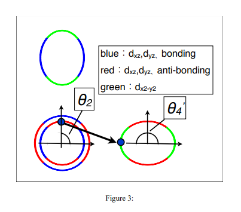

# Impurity effect in multi-orbital, sign-reversing s-wave superconductors

著者 : Y. Nagai, K. Kuroki, M. Machida, H. Aoki

## アブスト

私たちはT行列近似を用いて、不純物が遷移温度Tcに及ぼす影響を研究しました。不純物散乱に対して多軌道効果を特徴付ける混成関数を導入することで、多軌道効果を可視化する方法を提案します。この特徴付け関数は、超伝導ペアリングの対称性には依存せず、この関数は常伝導状態における固有ベクトルによって定義されます。この結果は、不純物に対して強靭な超伝導が必ずしも符号を保持するペアリングを意味しないことを示しています。LaFeAsOに対する有効な5バンドモデルにおいて混成効果を可視化することで、Tcに対する不純物の影響が単一バンドモデルの場合と比べて相対的に弱いことを示しました。

## 研究背景・問題意識
- 多軌道超伝導体としての鉄系超伝導体のペアリング対称性を決定したいが、特に不純物効果のテストにフォーカスする。LaFeAsO1−yFyにZnをドープしてもTcは低下しない実験報告がある一方、LaFeAsO0.85に最小限のZnドープを行うとTcが著しく低下する、という実験報告もある。理論的には、ギャップした符号反転s波状態は非磁性不純物に対して脆弱であるとされている一方で、LaFePOはギャップ関数に線状ノードを持ち、非磁性不純物に対して強靭であることが示されている。

## 研究目的
- 特に符号反転s波に対して、多軌道超伝導体におけるdirtyな系でTcを決定するうえで重要な要因は何か？

## モデルと手法
- 自己無撞着T行列近似を行う。まず軌道表示のグリーン関数は
$$
G_{\text{orbital}}^{\checkmark}(q, i\omega_n) \equiv \begin{pmatrix}
\hat{G}_{\text{orbital}}(q, i\omega_n) & -\hat{F}_{\text{orbital}}^\dagger(q, i\omega_n) \\
-\hat{F}_{\text{orbital}}(q, i\omega_n) & -\hat{G}_{\text{orbital}}(q, -i\omega_n)
\end{pmatrix}
$$
で表される。バンド表示での自己エネルギーは

$$
\Sigma_{\text{band}, k}^{\checkmark} = n_{\text{imp}} \left[1^{\checkmark} - V_{\text{band}}^{\checkmark}(k) G_{\text{band loc}}^{\checkmark}(k)\right]^{-1} V_{\text{band}}^{\checkmark}(k)
$$

である。さらに軌道非依存の不純物ポテンシャル$V = V_0 \sigma_z$を考慮すると、自己エネルギーは

$$
\Sigma_{\text{band}, k}^{\checkmark} = n_{\text{imp}} \left[1^{\checkmark} - V_0 \sigma_z^{\checkmark} G_{\text{band loc}}^{\checkmark}(k)\right]^{-1} V_0 \sigma_z^{\checkmark}
$$

となる。

-次に自己エネルギーの正規部分の対角成分は

$$
(\Sigma_{\text{band}, N, k}^{\hat{}})_{ii} = V_0 + V_0^2 (G_{\text{band loc}}^{\hat{}})_{ii}(k) + \cdots
$$

となる。ここで

$$
(G_{\text{band loc}}^{\hat{}})_{ii}(k) = \frac{1}{N} \sum_q \sum_l |C_{li}(q, k)|^2 G_{ll}^{\text{band}}(q)
$$

である。ここでユニタリ行列
$$
C_{ij}(q, k) = \vec{p}_{qi}^{\dagger} \vec{p}_{kj}
$$
を導入した。この絶対値の2乗が不純物散乱に対する多軌道効果を特徴づける(不純物散乱強度)。初期状態の運動量kと、最終状態の運動量qの固有ベクトルが互いに類似しているほどTcに対するバンド間不純物効果が強くなる。

## 結果
- LaFeAsOへの有効な5バンドモデルに対する混成効果が可視化できる。2番目及び3番目のバンド上のホールフェルミ面は$d_{xz}$と$d_{yz}$から構成される。4番目のバンド上の電子フェルミ面での固有ベクトルの主成分はフェルミ波数に依存する。とくに2番目と4番目のバンド間の不純物散乱の場合、初期状態$\theta_2$と最終状態の$\theta_4$の両方に強く依存することがわかる。

- 有効な5バンドモデルにおける$T_c$に対する不純物効果が、単一バンドモデルの場合よりは相対的に弱いことが示唆される。

- 自己無撞着T行列近似で不純物密度$n_{imp} = 0.01$の場合の計算を行うと、引力性の不純物ポテンシャルが$T_c$を大幅には低下させえないことが示される。

## 結論
- 軌道間の不純物効果は、常伝導状態における運動量kに対応するハミルトニアンの固有ベクトルのj番目の固有値$\vec{p}_{kj}$で表される行列$$
C_{ij}(q, k) = \vec{p}_{qi}^{\dagger} \vec{p}_{kj}
$$を見ることで分かる。これは多軌道混成効果であると解釈できる。