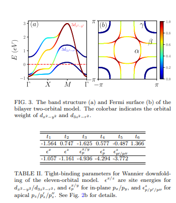

# Bilayer two-orbital model of La3Ni2O7 under pressure

著者 : Zhihui Luo, Xunwu Hu, Meng Wang, W´ei W´u and Dao-Xin Yao

## 研究背景・研究目的
- La3Ni2O7は14GPa以上で超伝導転移温度が$T_c = 80$Kに達する物質で、銅酸化物高温超伝導体、鉄系超伝導体、無限層ニッケル酸化物に次ぐ熱い研究対象となりうる。
- 圧力印加により構造相転移が起こるとみられる。また、$T_c$以上では、La3Ni2O7は弱い絶縁状態から金属相へと移行する。圧力印加のもっとも重要な効果は金属的転移を起こすことでもある。

- La3NiO7の低エネルギーでの物理を知るために有効模型を作りたい。

## モデルと手法
### モデルの作成
- DFT計算でバンド図とDOSの情報を得る。

- フェルミエネルギー近傍にNi_{dx^2 - y^2}とNi_{3z^2 - r^2}が存在する。T点でNi_{3z^2 - r^2}によるホールポケットが存在し、他のフェルミ面上のポケットからエネルギー1.3eVが分離されている。

- 二層二軌道モデルは
$$
\begin{align}
H &= H_0 + H_U, \tag{1} \\
H_0 &= \sum_{k\sigma} \Psi_{k\sigma}^{\dagger} H(k) \Psi_{k\sigma}, \\
H_U &= U \sum_i n_{is\uparrow} n_{is\downarrow} + \sum_{i\alpha\beta} (U' - J \delta_{\alpha\beta}) (n_{iAx\alpha} n_{iAz\beta} + n_{iBx\alpha} n_{iBz\beta}).
\end{align}
$$
で与えられる。$H_0$はDFTのWannierダウンフォールディングで決定されたタイトバインディング。A, Bはレイヤーを、x, zはそれぞれdの別々の軌道を表している。行列$H(k)$は
$$
H(k) = \begin{pmatrix}
H_A(k) & H_{AB}(k) \\
H_{AB}(k) & H_A(k)
\end{pmatrix}
$$
と表される。各成分は

$$
\begin{align}
H_A(k) &= \begin{pmatrix}
T^x_k & V_k \\
V_k & T^z_k
\end{pmatrix}, \\
H_{AB}(k) &= \begin{pmatrix}
t^x_\perp & V'_k \\
V'_k & t^z_\perp
\end{pmatrix}.
\end{align}
$$

であり、
$$
\begin{align}
T^{x/z}_k &= 2t^{x/z}_1 (\cos k_x + \cos k_y) + 4t^{x/z}_2 \cos k_x \cos k_y + \epsilon^{x/z}, \\
V_k &= 2t^{xz}_3 (\cos k_x - \cos k_y), \\
V'_k &= 2t^{xz}_4 (\cos k_x - \cos k_y).
\end{align}
$$
である。$Tx/zk$は層内の軌道内ホッピングを表し、$V_k$と$V_k'$は$d_{x^2 - y^2}$軌道と$d_{3z^2 - r^2}$軌道の間の層間(層内)混成を表している。

ホッピングパラメータを以下に示す。

ハミルトニアンは次のようにブロック対角化される。

$$
\begin{align}
H_0 &= \sum_{k\sigma} \left( \Phi^{\dagger}_{+k\sigma} H_+(k) \Phi_{+k\sigma} + \Phi^{\dagger}_{-k\sigma} H_-(k) \Phi_{-k\sigma} \right), \\
H_{\pm}(k) &= \begin{pmatrix}
T^x_k \pm t^x_{\perp} & V_k \pm V'_k \\
V_k \pm V'_k & T^z_k \pm t^z_{\perp}
\end{pmatrix}. \tag{3}
\end{align}
$$

- 得られたバンド構造とフェルミ面は次のようになり、DFTバンド構造をよく再現している。電子ポケット$\alpha$, $\beta$と1つのホールポケット$\gamma$が確認できる。

$\alpha$と$\beta$のポケットは軌道成分の混合を示す一方で、$\gamma$ポケットは$d_{3z^2 - r^2}$状態が特徴的である。

- 層間最近接ホッピングの大きさは層内最近接ホッピングの値より1.3倍大きく、CuO2とは異なる状況を示唆している。ただし層間結合がNiO2面に影響を与えるのは混成項を介した場合だけであり、この状況で対形成の対称性がどのように影響を受けるかは興味深い点である。

- 酸素のp軌道の物理も考慮したい。基底は
$$
\Psi = \begin{pmatrix}
d_{Ax} \\
d_{Az} \\
d_{Bx} \\
d_{Bz} \\
p_{Ax} \\
p_{Ay} \\
p_{Bx} \\
p_{By} \\
p_z \\
p'_z \\
p''_z
\end{pmatrix}
$$
である。ここから。pdやppのかさなりを含む6つのホッピングパラメータが必要とされる。これらの値は図の下半分に示されている。

### スピン感受率
スピン感受率は以下のように定義される。
$$
\begin{align}
S^{st}(q, i\omega_n) &= \frac{1}{3} \int_0^{\beta} d\tau e^{i\omega_n \tau} \langle S^s(q, \tau) \cdot S^t(-q, 0) \rangle, \tag{4}
\end{align}
$$
ここで、$s, t = A_x, A_z, B_x, B_z$ は軌道を表し、スピン演算子は次のように定義される。
$$
\begin{align}
S^s_q = \frac{1}{2} \sum_{k\alpha\beta} d^\dagger_{ks\alpha} \sigma_{\alpha\beta} d_{k+qs\beta},
\end{align}
$$
ここで、$\sigma$ はパウリ行列。Wickの定理を用いて、式(4)を展開すると、非相互作用（裸）の感受率は次のように導出される。
$$
\begin{align}
\chi^{st}_S(q, i\omega_n) = -\frac{1}{2N} \sum_{mn} \frac{f(\epsilon^n_k) - f(\epsilon^m_{k+q})}{i\omega_n + \epsilon^n_k - \epsilon^m_{k+q}} \langle m | k+q t \rangle \langle k+q s | m \rangle \langle n | k s \rangle \langle k t | n \rangle,
\end{align}
$$
ここで、$m, n$ はバンドインデックス、$f(\epsilon) = \frac{1}{e^{\epsilon/T} + 1}$ はフェルミ・ディラック分布です。$\langle ks | m \rangle$ は波数ベクトル$k$における状態$s, m$の固有ベクトルを表します。

乱雑位相近似（RPA）の下では、スピン感受率は次のように計算される。
$$
\begin{align}
\chi^{st, \mathrm{RPA}}_S(q, i\omega_n) = [I - \chi^{st}_S(q, i\omega_n) \Gamma]^{-1} \chi^{st}_S(q, i\omega_n), \tag{5}
\end{align}
$$
ここで、相互作用頂点$\Gamma$は以下のように定義される。
$$
\begin{align}
\Gamma = \begin{pmatrix}
1 & 1 \\
1 & 1
\end{pmatrix} \otimes \begin{pmatrix}
U & \frac{J}{2} \\
\frac{J}{2} & U
\end{pmatrix}.
\end{align}
$$

- $(U = 3$eV, $J = 0.4)$eVを、温度$T = 0$を適用したstaticなスピン感受率の計算結果は以下の通り。

軌道分解すると、$d_{3r^2-z^2}$からの寄与が最も強いことがわかる。これは$\gamma$ポケットのフェルミ面ネスティングを反映している。

## 議論
- La3NiO7はLa-5dのバンドがフェルミ順位から排除されており、Niのd軌道との混成が減少している。さらにNiの$d_{x^2-y^2}$軌道と$O$のp軌道のサイトエネルギーの差は3.88eVと推定されており、RNiO2よりも小さい。これは高い超伝導転移温度に寄与する可能性がある。

- フェルミ順位に複数の軌道が存在することは、$d$波ペアリングと拡張s波形成の競合など異なる対称性を持つ対形成との間で競合を引き起こす可能性がある。

- 実際の材料における酸素欠損がNiのeg軌道とのホールドーピングレベルを低下させ、超伝導を強化する可能性がある。

## 感想・メモ
- 昔Sc研から出たMATBGの論文もそうだったが、スピン感受率の形はモデルに応じてかなり異なっている気がする。どのように計算されているのだろうか？

- 手法自体はかなり基礎的である意味読みやすかった。多軌道RPAで磁気感受率を計算し、軌道分解してどの成分が大きいかを見るのは常套手段のようだ。ここでd波と拡張s波の議論を非弾性中性子散乱の結果に委ねたということか。UTe2でも同様の論法が使えそう。