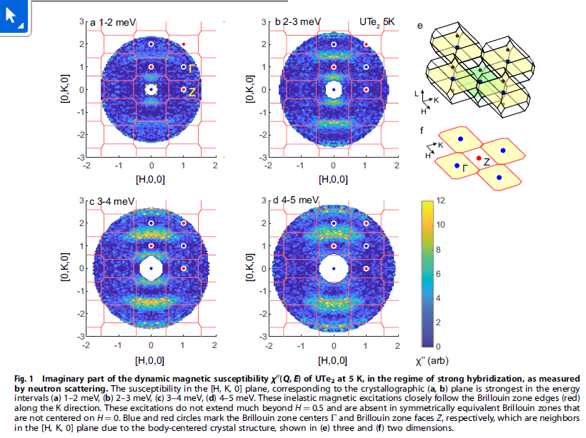
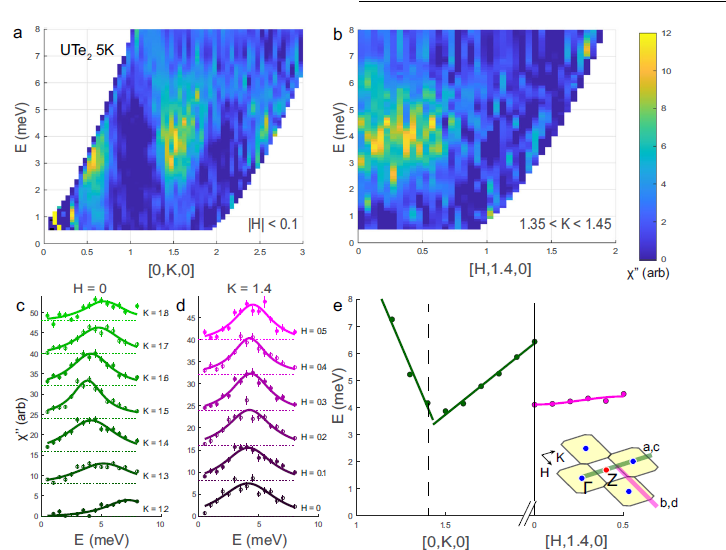
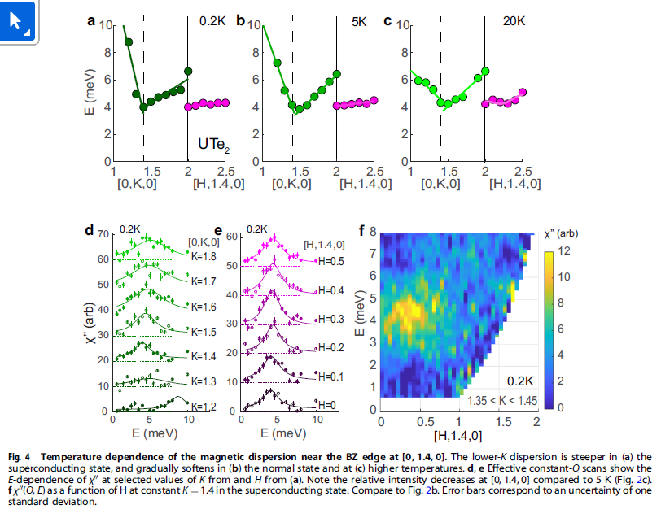

# Symmetry of magnetic correlations in spin-triplet superconductor UTe2

著者 : Nicholas P. Butch, Sheng Ran, Shanta R. Saha, Paul M. Neves, Mark P. Zic, Johnpierre Paglione ,
Sergiy Gladchenko, Qiang Ye and Jose A. Rodriguez-Rivera

## アブスト
- スピントリプレット超伝導体UTe2における低エネルギー磁気励起の温度依存性が、通常状態および超伝導状態において非弾性中性子散乱を用いて測定されました。これらの励起は4 meVでピーク強度を持ち、結晶学的b軸に近いブリルアンゾーンの端に沿い、常磁性の構造対称性に従い、重いフェルミオンのバルク磁化率の温度変化を追跡します。したがって、動的磁化率の虚部は、適切な特徴的エネルギーを持つハイブリッド化した近藤格子におけるバンド間相関の挙動に従います。これらの励起は、他の近藤格子材料で観察される現象の低次元類似体であり、その存在は必ずしも強磁性または反強磁性相関が支配的であることによるものではありません。超伝導の発現は、同じエネルギースケールで磁気励起に顕著な変化をもたらし、これらの変化がさらなる電子構造の修正に起因することを示唆しています。

## 問題意識
- UTe2に対するINSによれば、不整合な波数ベクトル$Q_{AFM}$の揺らぎが観測されている。考えられる可能性は
1. RKKY相互作用
2. フェルミ面ネスティング
3. スピンラダー相互作用における棒状の励起
がある。

- 超伝導状態では1meV付近のエネルギーで現れ、これは一種の超伝導共鳴であるとされている。

## 研究目的
INSをa-b面で行い、磁気励起の詳細なエネルギー依存性と異方性を明らかにしたい。

## 結果

強く混成した領域における中性子散乱測定の結果。磁気励起は、K方向に沿ったBZの端に従っている。

- H = 0でKの関数としてみた結果とは対照的に、K = 1.4でHの関数としての感受率を見ると、H方向ではピーク位置があまり変化しないことがわかる。
- エネルギーピークのK依存性を見ると、1.4以下の領域と1.4以上の領域とでかなり非対称。
- BZの端に沿った強度分布が低エネルギー領域でKに依存していることは、f電子の形状因子では説明できないらしい。
- ピークエネルギー幅がかなり大きい。

- 温度依存性はb軸方向低磁場磁化率の傾向と密接に一致している。超伝導状態でも5Kでも励起スペクトルはほぼ変わらないが、5Kから20Kに加熱すると強度が減少し、ピーク位置もわずかにシフトする。
- スペクトル重みが20Kや60Kで低エネルギー側にシフトするふるまいは観測されていない。
- 複数の混成化の兆候は, 4meVのエネルギースケールを共有しており、かなり確実にとらえられている。

- 実はBZ端の似たような非弾性磁気励起構造はURU2Si2でも観測されている。どちらも電気抵抗や磁化率の温度依存性から重いフェルミオン挙動が確認されており、スペクトルギャップも同様である。両者の主な違いは結晶構造で、URu2Si2は正方晶だが、UTe2は長方形の一辺に沿った励起のみが観測されている。つまり異方性がハイブリッド化に重要であるといえる。

- ここで、URu2Si2にみられる励起の持続がUTe2だと見られない場合がある。例えば反強磁性に関連する追加の励起がない。つまりUTe2における不整合な励起が存在しているからといって、staticな磁気秩序の発生に関する結論を引き出すには不十分。フェルミ面ネスティングやRKKY交換などの電子構造に起因する可能性が考えられているが、測定された$\chi''(q.\omega)$が有限なエネルギーでピークを持っている事実を説明できずにいる。

- 磁気励起スペクトルは0.2K(超伝導状態)と5Kで類似している。したがって、超伝導状態における1meVのピークは、超伝導状態における非常に大きなエネルギー励起か、既存のスピン揺らぎに関する議論の修正の必要を示唆しているかもしれない。

- (ここらへんの議論がよくわからないのだが)磁気励起スペクトルの変化挙動が広範なので、超伝導スピン共鳴とは考えにくいのではないかという。

## 結論
今回観測した磁気励起は近藤効果によるもので、発現する磁気秩序状態との直接の関連はない。

## 感想・メモ
- 不整合なQが磁気揺らぎ由来でないとすると、ネスティングやRKKYで有限のエネルギーでピークを持つことを説明するのが難しくなる？
- 自分の計算でも、H固定、K固定での分散の結果を図2と比較するのはどうだろうか。
- 非常に示唆に富んだ論文ではあるのだが、なぜか非常に読みにくい。単なる前提知識不足だろうか？例えばURu2Si2との比較で混成に異方性が重要であることの論理性がわからなかった。URu2Si2に混成はないのか？それは書かれていないように見える。