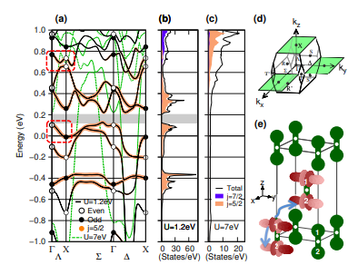
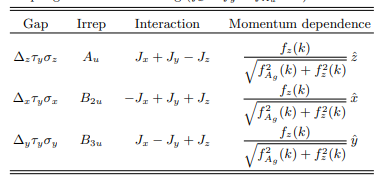

# Topological band and superconductivity in UTe2

## アブスト
UTe2はスピン三重項超伝導体である可能性が高く、キラル・マヨラナ端状態の証拠も示しています。UTe2の特徴的な構造として、反転対称性に関連したU原子の対があり、これらがはしごの段を形成しています。本論文では、各段の2つの副格子自由度が、電子構造および超伝導性の起源を理解する上で重要な役割を果たしていることを示します。特に、DFT+U計算により、これらの段に位置する5f電子に関連するバンド反転によって化学ポテンシャル付近にトポロジカルバンドが生成されることが明らかになり、これらの段の自由度を含む微視的な記述が必要であることが示されています。さらに、以前に特定されたU-U段内の強い強磁性相互作用が、非ゼロのポーラーケール角、観測された磁場-温度相図、およびノードを持つワイル・フェルミオンを説明する擬似スピン三重項超伝導状態を引き起こすことを示します。我々の解析は、他のUベースの超伝導体にも関連している可能性があります。

## 研究背景・問題意識
- 非従来型超伝導体UTe2の奇パリティ超伝導の起源がよくわからない。UGe2やUCoGe, URhGeは強磁性揺らぎが対形成の原因であるというコンセンサスがあるが、ゆらぎの性質はどうなっているか議論が続いている。UTe2についても同様。

- UTe2に関するDFT+U計算の再検討を行い、トポロジカルバンドの特定を行う。またそこから対称性に基づいてモデルを構築し、実験結果の説明を目指す。

## モデルの構築

### トポロジカルバンド
- DFT+U計算を行うと、広範なUの範囲にわたって、化学ポテンシャル付近にトポロジカルバンドが存在することを確認した。

- バンド構造は3つの主要k軸に沿って大きく異なる。準1次元的なバンドがU6dの二量体から生じ、kx方向に強く分散する。またTe5pの直線さ状態がky方向に分散する。Uの5f状態がこれらのバンドと混成して、$\Gamma$方向に複雑な分散をもたらす。一方でkzに沿った5fの分散は単純である。以下の4つの特徴がある。

1. 6つのクラマース縮退バンドのうち、2つはトポロジカルに日自明、4つはトポロジカルに自明。トポロジカルに非自明なバンドは、バンドパリティが高対称パスに沿った経路$\Gamma \rightarrow X$の間で反転する一方、自明なバンドにはそのようなパリティ変化は見られない。

2. この2つのバンドはエネルギー的に十分に分離されている。

3. 化学ポテンシャル付近に位置する低エネルギーバンドは$\Gamma$点で偶パリティ、X点で奇パリティを持つ。

4. 残りの4つの自明なバンドのうちｒ、奇パリティと偶パリティのバンドが占有されている。

- これらの特徴はUに依存せず持続するものの、バンド構造と状態密度がUの範囲を制約する。特に($1.1 \sim 2.0$)では下部の非自明なバンドのすぐ上にバンドギャップが現れる。このギャップより下に位置するヒルベルト空間は$Z_2$トポロジカル不変量により特徴づけられる。指標$\nu_0$は$\Gamma$点とX点でのパリティ積から決定される。

- トポロジカルバンドがX点に中心を持つフェルミ面を生成する。

### 対称性から許容されるタイトバインディング
- ワニエ関数の2つの原子への局在を考慮しても、副格子自由度の存在が重要。この副格子自由度の役割をミニマルモデルの構築を通じて考察する。

- 副格子自由度、スピン自由度を含む対称性許容項を含む最も一般的な非相互作用ハミルトニアンは次のように表される。

$$
H_N = \varepsilon_0(k) - \mu + f_{Ag}(k)\tau_x + f_z(k)\tau_y + f_y(k)\sigma_x\tau_z + f_x(k)\sigma_y\tau_z + f_{Au}(k)\sigma_z\tau_z
$$

ここで関数$f_i$の対称性はラベルによって決定され、

$$
f_{Ag}(k) \sim \text{const.}, \quad f_z(k) \sim k_z, \quad f_y(k) \sim k_y, \quad f_x(k) \sim k_x, \quad f_{Au}(k) \sim k_x k_y k_z
$$

である。各$f_i$の具体的な関数形は以下のようである。

$$
f_{Ag}(k) = m_0 + t_3 \cos\left(\frac{k_x}{2}\right) \cos\left(\frac{k_y}{2}\right) \cos\left(\frac{k_z}{2}\right)
$$

$$
f_z(k) = t_z \sin\left(\frac{k_z}{2}\right) \cos\left(\frac{k_x}{2}\right) \cos\left(\frac{k_y}{2}\right)
$$

$$
f_y(k) = t_y \sin(k_y)
$$

$$
f_x(k) = t_x \sin(k_x)
$$

$$
f_{Au}(k) = t_u \sin\left(\frac{k_x}{2}\right) \sin\left(\frac{k_y}{2}\right) \sin\left(\frac{k_z}{2}\right)
$$

となる。

### 準粒子相互作用

- スピン揺らぎの理論に従って、準粒子の間の磁気層間が超伝導を駆動すると仮定する。実験結果をと最近のDFT+Uの結果を援用し、支配的な重粒子相互作用をハイゼンベルク的な記述、すなわち

$$
H_{\text{int}} = -i \sum \left( J_x S_x^{i,1} S_x^{i,2} + J_y S_y^{i,1} S_y^{i,2} + J_z S_z^{i,1} S_z^{i,2} \right)
$$

と記述する。ここでは$J_x = J_y = J_z$とする。

## 実験との比較

### $H_N$の役割
- 転移温度は対形成ポテンシャルとギャップ関数$\sigma_i \tau_y$との可換性によって影響を受ける。可換であれば、$H_N$の該当項は$T_c$を高める一方、反可換なら抑制する。この結果$f_{Ag}$は$T_{c, i}$を抑制し、$f_{z}は高める。したがって、等方的なハイゼンベルグモデルの場合はスピン軌道結合項がどの$T_{c,i}$が最も高くなるかを決定する。さらにこれらは圧力印加で変化し、異なる超伝導状態の出現を説明する可能性がある。

- $H_N$はフェルミ免状の擬スピン三十項$d$ベクトルの形状も決定する。

## 実験との関係
- 弱いスピン軌道結合の限界を考えると、圧力に対するa軸及びb軸方向の磁場に対する相図の磁場依存性と一致sるう。この限界では$B3u$ギャップではb軸方向に、$B2u$ギャップはa軸法王に存在するために、それぞれの方向に応じてそれぞれのギャップがパラ磁性りみてぃんぐを受ける可能性がある。
- もし$f_x = f_y = f_{Au} = 0$であれば、すべてのギャップ関数は$k_z$において偶発的なラインノードを持つ。これがノード的な熱伝導率挙動を引き起こすともいえる。

## 感想・メモ
- 時間反転対称性の破れに関する議論は今回スキップして読んだ。すなわち、例えば今自分が研究に用いているモデルがどの軌道に着目してどのようなモチベーションで構築されたかを把握するのに第一原理的情報が必要であり、その参考にはした。最近出ていて時間反転対称性の破れに言及している論文は今ほとんど見かけないし、TRSBの否定も（クリーンな結晶による測定で）だいぶ前にされていたと思う。
- $H_N$は対称性は根本的にどのように選択されているか気になる。