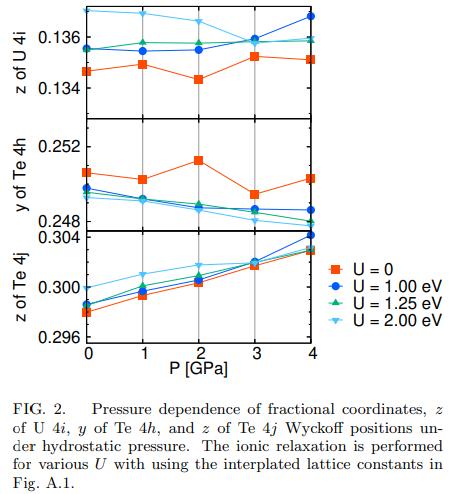
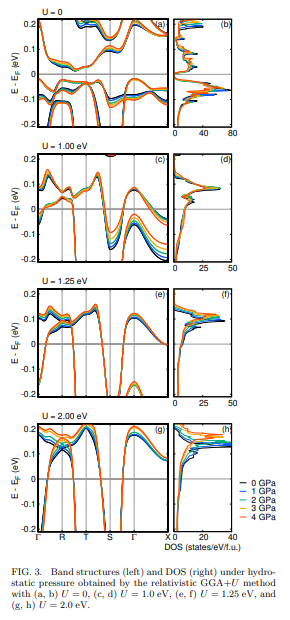
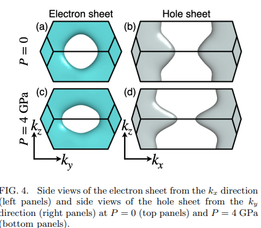
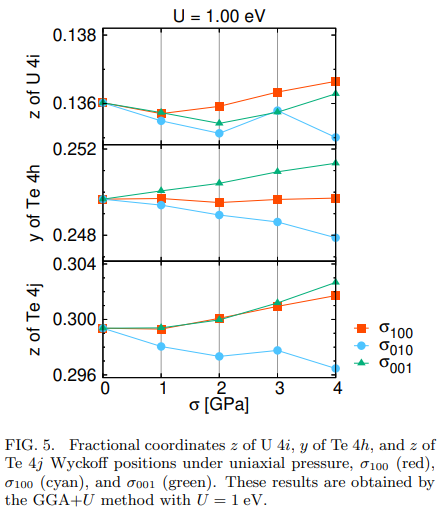
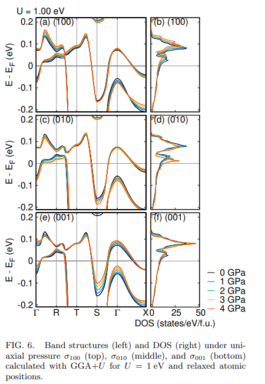
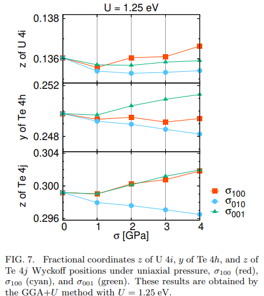
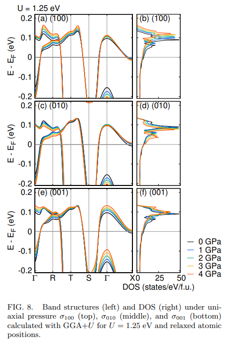

# Electronic structure of UTe2 under pressure

著者 Makoto Shimizu, Youichi Yanase

## アブストの翻訳
重いフェルミオン系の常磁性物質UTe₂は、スピン三重項超伝導体の有力な候補とされている。UTe₂に対する圧力下での実験は活発に行われており、豊富な相図が提案されている。0 ≤ P < 1.8 GPaの圧力領域には複数の超伝導相が存在し、P > 1.8 GPaの高圧領域では反強磁性秩序状態が観測されている。しかし、圧力下において、通常状態での基底電子構造はまだ解明されておらず、電子構造の知識は磁気状態や超伝導状態を研究するために不可欠である。UTe₂の相図を理解するための必須のステップとして、我々は密度汎関数理論に基づいて静水圧および一軸圧下での電子構造を、構造最適化を用いる場合と用いない場合の両方で研究した。その結果、遍歴的なf電子が重要でない場合、低エネルギーバンド構造やフェルミ面は圧力に対して感度が低いことが示された。しかし、GGA+U計算における特定のクーロン相互作用Uについては、フェルミ準位上にf電子の大きな寄与が現れる場合、圧力依存性が顕著であることがわかった。また、圧力誘起によるLifshitz転移とそれに伴うトポロジカル超伝導転移の可能性についても議論した。電子構造は、[010]軸および[001]軸に沿った一軸圧下で三次元から二次元に変化する可能性がある。

## 問題意識
圧力印加は物質の本質的な側面を明らかにする有望な方法の一つ。

### わかっていること
- 静水圧下での実験による電子相図。低圧では3つの異なる超伝導相が観測され、高圧では反強磁性相が観測される。
### わかっていないこと
- クーパー対形成の微視的な起源や秩序パラメータの対称性、トポロジカル超伝導の可能性といった超伝導の性質は不明。
- 圧力印加での電子構造の情報が不足している。
- 一軸圧がUTe2の電子構造、磁気特性、超伝導の異方性に関する情報を提供する可能性がある。

## 研究目的
- 静水圧、一軸圧下でのUTe2の電子構造に関する第一原理計算を行い、圧力下でのUTe2の電子構造をみる。

## 手法
- GGA+U

## 結果
### 常圧における電子構造
- 先行研究通り、U = 0の場合は絶縁状態で、U = 0.5eVでは金属的になる。特にU = 1.1eVではO字型電子シートとH字型ホールシートからなる三次元フェルミ面が形成される。Uが1.5eV以上になると円筒型の二次元的な構造が得られる。

### 静水圧での電子構造

- 圧力印加に伴うU, Teの分数座標は以下のようになる。

圧力印加の下でのバンドは以下のようになる。

- 電子シート、ホールシートは以下のようになる。

- 圧力印加により格子定数が0.1, 0.5%変化する。常圧下での原子座標はU = 1.0, 1.25eVでは実験値をよく再現する。この格子定数をもとにU=0で電子構造を計算すると、やはり近藤絶縁状態が得られる。フェルミ順位周辺のバンド分散は圧力依存せず、この状態は頑強。つまり結晶構造のわずかな変化では絶縁体金属転移は起こらない。U=0での結果は実験結果を説明しないので、クーロン相互作用が重要であることが示唆されている。

- U = 1.0eVでの場合、金属状態が得られ、バンド分散は3次元的になる。低エネルギーバンド分散、フェルミ面に対する圧力の影響はU = 1.0eVの場合が最も顕著。これはU, Te,イオンの分数座標を固定した計算により、原子変位に敏感であることに由来することが分かった。

- U = 1.25eVの場合、バンド構造の変化がU = 1.0eVほど顕著ではなく、フェルミ面は3次元的なまま。

- U = 2.0eVの場合、矩形型のフェルミシートが出来ているが、圧力印加に伴ってバンド幅が広がり、フェルミ順位での状態密度(DOS)が減少する。しかしフェルミ面自体はほとんど変化しない。

### 一軸圧下での電子構造
- [100],[010],[001]の結晶方向に沿った一軸圧について考察する。まず結晶構造の変化の大きかったU = 1.0eVの場合に焦点を当てる。圧力印加に伴うU, Teの分数座標の変化は以下のようになる。

バンド構造を下に示す。

- [100]に沿った一軸圧$\sigma_{100}$について。$\sigma_{100}$が増加すると、価電子帯が広がってDOSが減少する。X点周辺のフェルミ面が膨らむ。

- [010]軸に沿った一軸圧$\sigma_{010}$では、価電子帯のシフトが質的に異なる。ここで$\Gamma - R$線に沿った低エネルギーの非占有バンドの分散が著しく小さくなり、平坦なバンドが4GPaで現れる。

- [001]軸に沿った一軸圧$\sigma_{001}$ではバンド構造がより3次元的になる。これは静水圧でのバンド構造の変化を定性的に再現する。

- $\sigma_{010}$,$\sigma_{001}$がフェルミ面の変形において重要な役割を果たしそう。

- 次にU = 1.25eVの場合を見る。
圧力印加に伴うU, Teの分数座標の変化は以下のようになる。

- バンド構造は以下のように変化する。

$\sigma_{010}$のもとでのDOSの増加はU  =1.0eVの場合と比べても著しく小さい。これはバンドからU=1.0の場合と比べてフェルミ準位が離れているからと予想できる。

- U=1.25のとき、$\sigma_{010}$、$\sigma_{001}$の下ではLifshitz転移が発生する。これもU=1.0eVの場合とは異なるものである。これによりフェルミ面は二次元的になる。

## 議論
- 絶縁体金属転移、3Dフェルミ面から2次元フェルミ面へのリフシッツ転移はUの増加により発生する。

- 次の可能性がある。

1. U = 1.0eVという中程度のクーロン相互作用がUTe2に適している

2. 圧力下でLifshitz転移が発生する

3. Uの値は圧力依存する

## 感想・メモ
- $U  =1.0$eVという中程度のクーロン相互作用がUTe2に適しているとのことで、この周辺でRPAをやってみるのがいいかもしれない。
- 今回外場の影響に関する議論はなかった。物理学会では話があったので、このpreprintより後に新しくわかったのだろう。