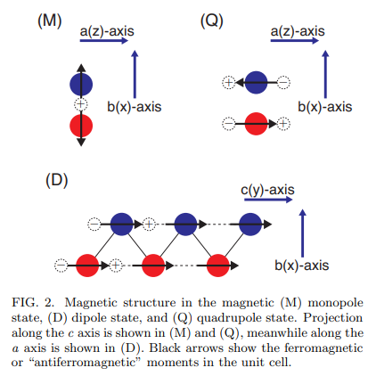
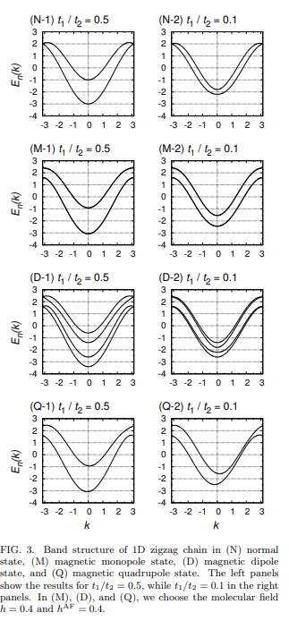
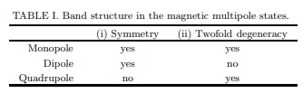
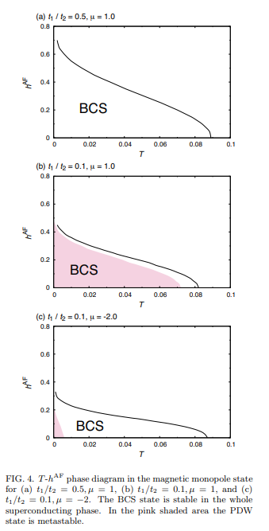
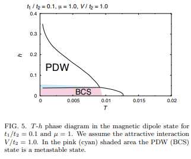
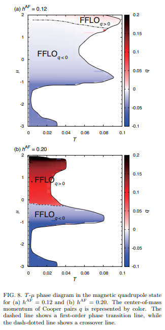
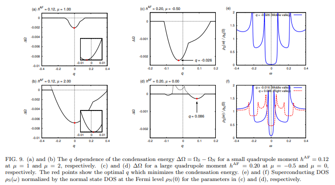

# Superconductivity in magnetic multipole states

著者 : Shuntaro Sumita and Youichi Yanase

## アブストの翻訳
最近の局所および全体の反転対称性の破れを伴う超伝導と磁性に関する研究に刺激され、局所的に反転対称性を持たない金属における磁気多重極状態の超伝導を調査した。亜格子依存の反対称スピン軌道相互作用を持つ一次元のジグザグ鎖を考え、単極秩序、双極秩序、四極秩序の3つの磁気多重極秩序を仮定した。これらの多重極秩序によって、それぞれバーディーン・クーパー・シュリーファー（BCS）状態、ペア密度波（PDW）状態、およびフルデ・フェレル・ラルキン・オブチンニコフ（FFLO）状態が安定化されることを示した。PDW状態は、非自明なZ2数と巻数によって特徴付けられるトポロジカル超伝導状態であることがわかった。マクロ的な磁気モーメントを持たないFFLO状態の起源は、磁気四極秩序とスピン軌道相互作用によって引き起こされる非対称的なバンド構造に起因している。

## 研究背景・問題意識
- 様々な内部自由度を含む**反転対称性の欠如した系**の超伝導が注目されている。

- 特に磁気多重極状態と超伝導の関係を調べることは興味深い。以下の例が存在する。
1. 単位胞内の反強磁性モーメントが磁気四重極モーメントを誘発し、二層ラシュバ系における局所的な電気四重モーメントのスタックが電気八極秩序としてみなされる。
2. 自発的な反転対称性の破れの結果として、フェロ的な気パリティ多重極状態では興味深い磁気電気応答が生じる。
3. Sr2IrO4における奇パリティ多重極の兆候が検出されている。

- 奇パリティ・偶パリティ多重極によってどのような超伝導が誘導されるか。特に、様々な磁気多重極と副格子依存する反対称スピン軌道相互作用の協力により引き起こされる超伝導を調査したい。

## モデルと定式化

- 1次元ジグザグ鎖において、磁気秩序と共存する超伝導モデルを導入する。

$$
\begin{align*}
H &= \sum_{k,s} \left[ \epsilon(k) a_{ks}^\dagger b_{ks} + \text{h.c.} \right] \\
&\quad + \sum_{k,s} \left[ \epsilon'(k) - \mu \right] \left( a_{ks}^\dagger a_{ks} + b_{ks}^\dagger b_{ks} \right) \\
&\quad + \alpha \sum_{k,s,s'} \mathbf{g}(k) \cdot \hat{\sigma}_{ss'} \left( a_{ks}^\dagger a_{ks'} - b_{ks}^\dagger b_{ks'} \right) \\
&\quad - \sum_{k,s,s'} \left( \mathbf{h}_a \cdot \hat{\sigma}_{ss'} a_{ks}^\dagger a_{ks'} + \mathbf{h}_b \cdot \hat{\sigma}_{ss'} b_{ks}^\dagger b_{ks'} \right) \\
&\quad + \frac{1}{N} \sum_{k,k',q} V_a(k,k') a_{k+\frac{q}{2},\uparrow}^\dagger a_{-k+\frac{q}{2},\downarrow}^\dagger a_{-k'+\frac{q}{2},\downarrow} a_{k'+\frac{q}{2},\uparrow} \\
&\quad + \frac{1}{N} \sum_{k,k',q} V_b(k,k') b_{k+\frac{q}{2},\uparrow}^\dagger b_{-k+\frac{q}{2},\downarrow}^\dagger b_{-k'+\frac{q}{2},\downarrow} b_{k'+\frac{q}{2},\uparrow}.
\end{align*}
$$

$a_{ks}$および$b_{ks}$は副格子aおよびb状のスピンをもつ電子の消滅演算子。波数ベクトルkは結晶学的c軸に向かう。

$\epsilon(k) = -2t_1 cos(k/2)$, $\epsilon'(k) = -2t_2 cos(k)$

は最近接及び次近接ホッピングを考慮して得られる。

3番目の項はASOCを表し、$g(k) = sin(k)\hat{z}$と近似される。4番目の項は分子場で、磁気単極子、磁気双極子、四極子秩序の分子場を表す。引力相互作用は$V_a(k, k') = V_a(k', k) = -V$である。スピン三重項のp波秩序パラメータは無視する。

## 手法
- 平均場理論(MF)を用いる。MFによって相互作用項は
$$
\begin{align*}
-\frac{V}{N} \sum_{k,k',q} &a_{k+\frac{q}{2},\uparrow}^\dagger a_{-k+\frac{q}{2},\downarrow}^\dagger a_{-k'+\frac{q}{2},\downarrow} a_{k'+\frac{q}{2},\uparrow} + (a \to b) \\
&\simeq \sum_{k} \left[ \Delta_a^* a_{-k+\frac{q}{2},\downarrow} a_{k+\frac{q}{2},\uparrow} + \text{h.c.} \right] + \frac{V}{N} |\Delta_a|^2 + (a \to b),
\tag{5}
\end{align*}
$$
で書かれる。ここで秩序パラメータは
$$
\begin{align*}
\Delta_a &= -\frac{V}{N} \sum_{k'} \langle a_{-k'+\frac{q}{2}, \downarrow} a_{k'+\frac{q}{2}, \uparrow} \rangle, \\
\Delta_b &= -\frac{V}{N} \sum_{k'} \langle b_{-k'+\frac{q}{2}, \downarrow} b_{k'+\frac{q}{2}, \uparrow} \rangle.
\end{align*}
$$
のように表される。ここでは単一のq状態のみ仮定する。

- $k_+ = k+q/2, k_- = k-q/2$と定義して、ベクトル演算子を次のように定義する。
すると次のハミルトニアンを得る。

$$
\begin{align}
H_{\text{MF}} &= \frac{1}{2} \sum_k \hat{C}_k^\dagger \hat{H}_8(k) \hat{C}_k + W_0,
\end{align}
$$

ここで

$$
\begin{align}
W_0 &= - \sum_k 2[\epsilon'(k_-) - \mu] + \frac{N}{V} |\Delta_a|^2 + \frac{N}{V} |\Delta_b|^2,
\end{align}
$$

である。$8 \times 8$行列$\hat{H}_8(k)$の明示的な形は次のとおりである。

$$
\begin{align}
\hat{H}_8(k) &= \begin{pmatrix}
\hat{H}_4(k_+) & \hat{\Delta}_4 \\
\hat{\Delta}_4^\dagger & -\hat{H}_4^T(k_-)
\end{pmatrix},
\end{align}
$$

$$
\begin{align}
\hat{H}_4(k_\pm) &= \begin{pmatrix}
\hat{H}_2^{(a)}(k_\pm) - \mu \sigma^0 & \epsilon(k_\pm) \sigma^0 \\
\epsilon(k_\pm) \sigma^0 & \hat{H}_2^{(b)}(k_\pm) - \mu \sigma^0
\end{pmatrix},
\end{align}
$$

$$
\begin{align}
\hat{\Delta}_4 &= \begin{pmatrix}
0 & \Delta_a & 0 & 0 \\
-\Delta_a & 0 & 0 & 0 \\
0 & 0 & 0 & \Delta_b \\
0 & 0 & -\Delta_b & 0
\end{pmatrix},
\end{align}
$$

$$
\begin{align}
\hat{H}_2^{(l)}(k_\pm) &= \epsilon'(k_\pm) \sigma^0 + \alpha \sin(k_\pm) \sigma^z - h_a \cdot \sigma \quad (l = a), \\
\hat{H}_2^{(l)}(k_\pm) &= \epsilon'(k_\pm) \sigma^0 - \alpha \sin(k_\pm) \sigma^z - h_b \cdot \sigma \quad (l = b).
\end{align}
$$

- 平均場のハミルトニアンを対角化する。

$$
\begin{align}
H_{\text{MF}} &= \frac{1}{2} \sum_k \hat{C}_k^\dagger \hat{U}_8(k) \hat{E}_8(k) \hat{U}_8^\dagger(k) \hat{H}_8(k) \hat{U}_8(k) \hat{U}_8^\dagger(k) \hat{C}_k + W_0 \\
&= \frac{1}{2} \sum_k \hat{\Gamma}_k^\dagger \hat{E}_8(k) \hat{\Gamma}_k + W_0,
\end{align}
$$

$$
\begin{align}
\hat{E}_8(k) &= \begin{pmatrix}
\hat{E}_4(k) & 0 \\
0 & -\hat{E}_4(k)
\end{pmatrix}.
\end{align}
$$

秩序パラメータは以下のようにして得られる。

$$
\begin{align}
\Delta_a &= -\frac{V_a}{N} \sum_{k'} \left\langle \left[\hat{\Gamma}_{k'}^\dagger \hat{U}_8^\dagger(k') \right]_6 \left[\hat{U}_8(k') \hat{\Gamma}_{k'} \right]_1 \right\rangle \\
&= -\frac{V_a}{N} \sum_{k'} \sum_{n=1}^{8} \left[\hat{U}_8^\dagger(k') \right]_{n6} \left[\hat{U}_8(k') \right]_{1n} f\left( \left[\hat{E}_8(k') \right]_{nn} \right),
\end{align}
$$

$$
\begin{align}
\Delta_b &= -\frac{V_a}{N} \sum_{k'} \sum_{n=1}^{8} \left[\hat{U}_8^\dagger(k') \right]_{n8} \left[\hat{U}_8(k') \right]_{3n} f\left( \left[\hat{E}_8(k') \right]_{nn} \right).
\end{align}
$$

このようにして平均場のハミルトニアンは
$$
\mathcal{H}_{\text{MF}} = \sum_{k,s,l} E_{ksl} \left( \gamma_{ksl}^{\dagger} \gamma_{ksl} - \frac{1}{2} \right) + W_0, 
$$

$$
\Omega = -\frac{1}{\beta} \sum_{k,s,l} \left\{ \ln \left( 1 + e^{-\beta E_{ksl}} \right) + \frac{\beta E_{ksl}}{2} \right\} + W_0,
$$

のように書かれる。

## 結果
### 磁気多重極秩序とエキゾチックな超伝導
- 単極子、双極子、四重極子の3つの磁気多重極状態について調査する。まず磁気構造は図にまとめられている。

- 磁気単極子、双極子、四重極子状態における分子場$h_a$, $h_b$は次のように考慮される。

$$
(h_a, h_b) = 
\begin{cases}
(h_{\text{AF}x}, -h_{\text{AF}x}) & \text{単極子秩序 (M)} \\
(h_y, h_y) & \text{双極子秩序 (D)} \\
(h_{\text{AF}z}, -h_{\text{AF}z}) & \text{四極子秩序 (Q)}
\end{cases}
$$

エネルギーバンドは下図のように与えられる。

なお
$$
E_n(k) = 
\begin{cases}
\epsilon'(k) \pm \sqrt{\epsilon(k)^2 + \alpha^2 \sin^2 k + (h_{\text{AF}})^2} & \text{(M) 単極子状態} \\
\epsilon'(k) \pm \sqrt{[\epsilon(k) \pm h]^2 + \alpha^2 \sin^2 k} & \text{(D) 双極子状態} \\
\epsilon'(k) \pm \sqrt{\epsilon(k)^2 + (\alpha \sin k - h_{\text{AF}})^2} & \text{(Q) 四極子状態}
\end{cases}
$$

- バンド構造の対称性と縮退に関する情報は以下の通り。

- 今考えているモデルで安定化されうる3つの超伝導状態、BCS, PDW, FFLOの秩序パラメータについてまとめる。

1. BCS : $(\Delta_a, \Delta_b) = (\Delta, \Delta)$

2. PDW : $(\Delta_a, \Delta_b) = (\Delta, -\Delta)$

3. FFLO : $(\Delta_a, \Delta_b) = (\Delta, \Delta)$だが、クーパー対の重心運動量が有限になり、実空間での秩序パラメータが$\Delta(y) = \Delta e^{iqy}$のようになる。

### 磁気単極子秩序に対して安定なBCS状態
- まず**単極子**の場合を考える。いくつかのパラメータセットに対する$T- h_{AF}$フェーズ図を示す。フェルミ面の数に関わらずBCS状態委は単極子状態で安定する。

### 磁気双極子秩序によるPDW状態
- 次に**双極子**の場合。この状況は強磁性金属で超伝導が発生した場合に実現され、$UGe2, URhGe, UCoGe$で発生すると考えられる。相図は以下のようになる。

ここでBCS状態とPDW状態の相境界は一次相転移線になる。

- スピン軌道相互作用により、ふつうPDW状態では常磁性の分離効果が抑制されるため、大きなhでは常磁性効果に対して脆弱なBCS状態よりもPDW状態が安定化する可能性がある。

- 副格子の間のホッピング$t_1$が小さく、適度なASOCを持つ場合、PDWは広範なパラメータ範囲で安定化される。

- PDW状態は巻き数、Z2不変量により特徴づけられる1次元トポロジカル超伝導状態である可能性が高い。

### 磁気四極子秩序によるFFLO状態
- 磁気四重極子の非対称なエネルギーバンドから、エキゾチックな超伝導状態が安定化される可能性がある。二つの$h_{AF}$に対する$T - \mu$相図を示す。

- クーパー対は非対称なバンド構造のために超伝導相全体で有限の重心運動量を持つ。

- 大きな状態密度により、臨界温度が高くなることは両者で共通している。また小さな四重極子モーメント領域では重心運動量qが連続的に変化する一方で、大きな四重極子モーメントではFFLO状態が$q>0$, $q<0$の場合で一時相転移線で区切られる。重心運動量$q$はリフシッツ転移を通じて$\mu$の増加に従い増加する。

- 凝縮エネルギー$\Delta \Omega = \Omega_s - \Omega_N$を考える。

- 凝縮エネルギーを最小化するqが、小さな四重極子モーメントでは連続的に変化するものの、大きな四重極モーメントでは3つの谷構造が存在して、最小化するqが$\mu$の変化により不連続に変わる。特に右側の谷が上部バンド、左側の谷が下部バンドの超伝導誘導を示唆している。そして右側の谷の重心運動量が上部バンドのフェルミ運動量の和とほぼ一致している。これよりバンド依存FFLO状態は大きな磁気四重極子モーメントにより安定化されることがわかる。

- FFLO状態を確認するための実験手法として、FFLO超伝導体とBCS超伝導体を接合するジョセフソン電流測定がある。

## まとめ
- 単位胞内部に反強磁性モーメントがあってもBCS状態が安定するが、双極子秩序では奇パリティスピン一重項のPDWが、磁気四重極秩序ではFFLOが安定化しうる。特に磁気四重極子でのFFLOは、小さな四重極子モーメントのとき連続的に変化するが、大きな四重極子モーメントのときは不連続に変化する。これはバンド依存FFLO超伝導に由来する。
バンド依存のFFLO超伝導は磁気四重極秩序をっ持つ様々な非対称結晶で実現される可能性がある。

## 感想・メモ
- 相転移境界の一次・二次はどうやって判定しているのだろう？
- 磁気双極子状態で発現する超伝導は2次元2相ラシュバ型超伝導体で得られた相図に類似しているというが、モデルに何か類似性があるということだろうか。またやはり平均場近似で求めているのだろうか。