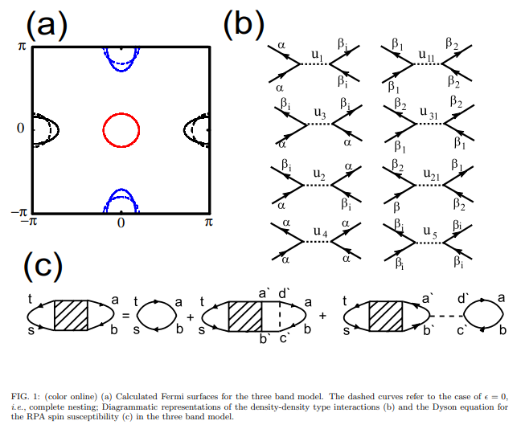
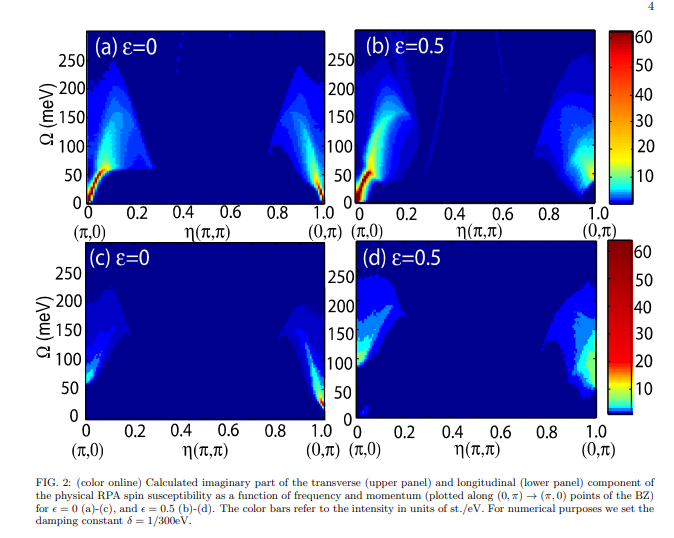

# Theory of itinerant magnetic excitations in the SDW phase of iron-based superconductors

## アブストの翻訳
我々は、鉄系超伝導体のSDW相における磁気励起の顕著な実験的特徴が、遍歴模型の枠組みで理解できると主張する。最小限の模型を特定し、動的スピン感受率の多バンドRPA（ランダム位相近似）処理を用いる。秩序する運動量近傍では弱減衰のスピン波が観測され、それらが粒子-ホール連続体に溶け込む様子が示されている。電子バンドの楕円性が異なる結晶方向に沿ったスピン波の異方性と、秩序する運動量と共役な運動量でのギャップを説明することを示す。我々の理論は中性子散乱データと良く一致すると主張している。

## 問題意識・研究背景
- 鉄系超伝導体で磁性が遍歴しているか、局在しているかは議論が続いている。磁性が遍歴しているとして、ネスティングで反強磁性の起源を説明する立場もあるが、磁性が局在しているとして$J_1-J_2$モデルを用いた解析を行うといくつかの実験データを説明できるとされているが、異常に大きな面内異方性を仮定しなければならなくなる。

- 中性子による磁気励起測定が遍歴模型の枠組みで説明できるだろうか？

## モデルと手法
- 4バンドモデルから出発し、$\Gamma$点付近にある2つのホールフェルミ面のうち一方がほかのバンドと比べて電子バンドとの相互作用が弱く、磁性にとって重要でないと仮定する。

$$
H_2 = \sum_{p, \sigma} \left( \epsilon_{\alpha p} \alpha_{p\sigma}^{\dagger} \alpha_{p\sigma} + \epsilon_{\beta1 p} \beta_{1p\sigma}^{\dagger} \beta_{1p\sigma} + \epsilon_{\beta2 p} \beta_{2p\sigma}^{\dagger} \beta_{2p\sigma} \right).
$$

分散は次のようになる。

$$
\epsilon_{\alpha p} = t_{\alpha} (\cos p_x + \cos p_y) - \mu,

\epsilon_{\beta1 p} = \epsilon_0 + t_{\beta} \left( [1 + \epsilon] \cos(p_x + \pi) + [1 - \epsilon] \cos(p_y) \right) - \mu,

\epsilon_{\beta2 p} = \epsilon_0 + t_{\beta} \left( [1 - \epsilon] \cos(p_x) + [1 + \epsilon] \cos(p_y + \pi) \right) - \mu.
$$

- ハミルトニアンの相互作用は
$$
H_4 = \sum U_1 \alpha_{p3\sigma}^{\dagger} \beta_{jp4\sigma'}^{\dagger} \beta_{jp2\sigma'} \alpha_{p1\sigma} 
+ \frac{U_3}{2} \left( \beta_{jp3\sigma}^{\dagger} \beta_{jp4\sigma'}^{\dagger} \alpha_{p2\sigma'} \alpha_{p1\sigma} + \text{h.c.} \right).
$$

で表現できる。SDWのオーダーパラメータは
$$
\Delta_1 \propto \sum_p \langle \alpha_{p\delta}^{\dagger} \beta_{1, p+Q1, \gamma} \sigma_{\delta\gamma} \rangle,

\Delta_2 \propto \sum_p \langle \alpha_{p\delta}^{\dagger} \beta_{2, p+Q2, \gamma} \sigma_{\delta\gamma} \rangle,
$$

で仮定する。

- $\Delta_1$をz軸に沿うようにすると、平均場のハミルトニアンは標準的なボゴリューボフ変換により対角化され
$$
H_{\text{diag}}^{\text{SDW}} = \sum_{p, \sigma} \left( E_c^p c_{p\sigma}^{\dagger} c_{p\sigma} + E_d^p d_{p\sigma}^{\dagger} d_{p\sigma} + \epsilon_{\beta2 p} \beta_{2p\sigma}^{\dagger} \beta_{2p\sigma} \right),
$$
となる。ここで
$$
E_c^p, E_d^p = \frac{1}{2} \left( \epsilon_{\alpha p} + \epsilon_{\beta1 p+Q1} \pm \sqrt{(\epsilon_{\alpha p} - \epsilon_{\beta1 p+Q1})^2 + 4\Delta_1^2} \right)
$$
である。SDWの式は
$$
\Delta_1 = -U_{\text{SDW}} \sum_p u_p v_p \left( f(E_c^p) - f(E_d^p) \right),
$$, $U_1 + U_3$の式で自己無撞着に決定できる。

- RPAのアプローチを採用する。

$$
\chi_{st, ab}^{zz}(q, i\Omega) = -\frac{1}{2\beta} \sum_{\omega_n} \sum_{p, \sigma} G_{bs}^{p\sigma}(i\omega_n) G_{ta}^{p+q\sigma}(i\omega_n + i\Omega),

\chi_{st, ab}^{\pm}(q, i\Omega) = -\frac{1}{\beta} \sum_{\omega_n} \sum_{p} G_{bs}^{p\uparrow}(i\omega_n) G_{ta}^{p+q\downarrow}(i\omega_n + i\Omega).
$$

磁気感受率は
$$
[\hat{\chi}_{lm}]_{\text{RPA}} = \hat{\chi}_{lm} \left( 1 - \hat{U}_{lm} \hat{\chi}_{lm} \right)^{-1}.
$$
で与えられる。

## 結果
- $U_{SDW}$をおよそ0.52eVに設定する。これにより$T = 0$における値は$\Delta_1 \sim 31$meVとなる。

1. 円形ポケットの場合。横感受率$\chi_{st, ab}^{\pm}(q, i\Omega) $を見ると、対応する基底状態は縮退しているため、
励起スペクトルは$Q_1$にゴールドストンモードがあり、ギャップレスモードが$Q_2$にある。$Q_1$での励起は60meVまで伝播している。$Q_2$の励起も伝播するが、大体$\Delta_1$ほど。

2. 有限楕円ポケットの場合、縮退が解消されて$Q_2$近傍の励起が有限のギャップを持つようになる。ギャップが開けば$\chi_{st, ab}^{\pm}(q, i\Omega)$の部分は検出されなくなる。また$Q_1$の近傍のスピン波励起は$\Omega = 0$までランダウ減衰を示す。これはSDWがもはやホールと電子のフェルミ面を完全にはギャップ化しなくなるため。

## 結論
- 鉄系の5バンドモデルを簡略化したモデルを採用したが、磁気励起に関する実験データをうまく再現する。まず
1. 運動量$Q_2$近傍の励起は50meVまでギャップがある。
2. $Q_1$で測定された励起は100meVまで伝播するスピン波で、減衰は有限だが小さいもの。
3. スピン波が連続体に入っても励起が依然として見える。

## 感想・メモ
- かなり簡略化したモデルでも実験値が再現できるとのことだったが、磁気秩序下での磁気分散に限っての話ではないのか？
- 縦感受率に関する図はあるものの、詳細な議論がない。実験は縦感受率ではなく横感受率を検出しているということか？
- 感受率やモードの見方等、超伝導状態に関する議論とは少し趣が異なっている気がする。
- モードの消失でギャップの存在をいう議論は飯田さんの授業で聞いた気がするな。