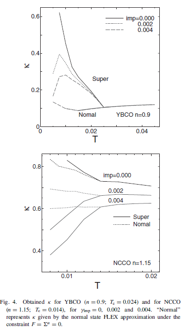
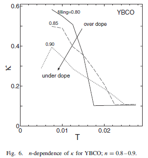

# Theory of Thermal Conductivity in High-Tc Superconductors below Tc: Comparison between Hole- and Electron-Doped Systems

## アブストの翻訳
ホールドープされた高温超伝導体では、熱伝導率 
𝜅
が 
𝑇
𝑐の直下で急激に増加し、これがノードギャップの特徴と考えられてきました。これに対して、電子ドープされた化合物では、熱伝導率におけるこのようなコヒーレンスピークは見られず、これは 
𝑑
+
𝑖
𝑠
-波のようなフルギャップ状態を示唆している可能性があります。この問題を解決するために、我々はハバードモデルにおける熱伝導率 
𝜅をフラクチュエーション・エクスチェンジ（FLEX）近似を用いて研究しました。この近似は、ホールドープおよび電子ドープされた化合物の両方で、ノーダル 
𝑑-波状態が実現されることを予測しています。両化合物における熱伝導率 
𝜅
の対照的な振る舞いは、ホットスポット／コールドスポットの構造の違いに起因しています。一般的に、顕著なコヒーレンスピークは、コールドスポットがノードライン上に存在する場合にのみ、ラインノード超伝導体で現れます。

## 研究背景・問題意識
- 熱伝導度は超伝導転移温度$T_c$以下で有限の値を持つ唯一の輸送係数で、超伝導状態に対する重要な情報を持っている。例えば磁場中の角度分解測定によるギャップの$k$依存性などが測定できる。低温での熱伝導度測定により、フルギャップやラインノード・ポイントノードなどのギャップ構造の種類の検出を行うこともできる。

- 輸送現象は、準粒子の緩和時間$\tau_k$が最大値をとるフェルミ面上の領域である**コールドスポット**と深いかかわりがある。

- $\kappa$の**コヒーレンスピーク**の挙動が非従来型超伝導体で見られる。

- d波ペアリング相互作用を持つBCSモデルに基づいてYBCOにおけるコヒーレンスピークが$T_c$以下での$\tau$の急激な減少に起因すると議論されていたものの、最近のARPES測定では$d_{x^2 - y^2}$波が実現していることが示唆される超伝導体でコヒーレンスピークが観測されていなかった。

- $\kappa$にコヒーレンスピークが存在しないことは、フルギャップ超伝導状態の重要な特徴なのか？それともノードギャップ超伝導体においても起こりうるのか？

## モデル
斥力ハバードから出発する。
$$
H = \sum_{k,\sigma} \epsilon_k c_{k\sigma}^\dagger c_{k\sigma} + \frac{U}{N} \sum_{k,k',q} c_{k+q\uparrow}^\dagger c_{k'\downarrow}^\dagger c_{k'\downarrow} c_{k\uparrow}
$$
$$
\epsilon_k = -2t_0 (\cos(k_x) + \cos(k_y)) + 4t_1 \cos(k_x) \cos(k_y) - 2t_2 (\cos(2k_x) + \cos(2k_y))
$$

$$
t_0 = -1.0, 
t_1 = 0.167, 
t_2 = -0.22, 
U = 8.0, 
U = 5.4, 
$$

FLEX近似を用いて正常状態・異常状態の自己エネルギーを決定する。

$$
\Sigma_n(k, i\omega_n) = \frac{U^2 T}{N} \sum_{k,l} G_{q+k}(i\omega_n + i\nu_l) \left( \frac{3}{2} \chi_s + \frac{1}{2} \chi_c - \chi_0 \right)_{q,\nu_l}
$$

$$
\Sigma_a(k, i\omega_n) = -\frac{U^2 T}{N} \sum_{k,l} F_{q+k}^\dagger(i\omega_n + i\nu_l) \left( \frac{3}{2} \chi_s - \frac{1}{2} \chi_c - \chi_0 \right)_{q,\nu_l}
$$

ここで松原振動数は
$$
\omega_n = \pi T (2n + 1)
$$

$$
\nu_l = 2\pi T l
$$

のように与えられる。

スピン感受率や電化感受率は以下のように計算される。

$$
\chi_s(q, i\nu_l) = \frac{\chi_0 + \phi_0}{1 - U(\chi_0 + \phi_0)}
$$
$$
\chi_c(q, i\nu_l) = \frac{\chi_0 - \phi_0}{1 - U(\chi_0 - \phi_0)}
$$
$$
\chi_0(q, i\nu_l) = -\frac{T}{N} \sum_{k,n} G_{k+q}(i\omega_n + i\nu_l) G_k(i\omega_n)
$$
$$
\phi_0(q, i\nu_l) = -\frac{T}{N} \sum_{k,n} F_{k+q}^\dagger(i\omega_n + i\nu_l) F_k(i\omega_n)
$$
$$
G(i\omega_n) = \frac{i\omega_n + \tilde{\epsilon}_k + \Sigma_n(-i\omega_n)}{D(\omega_n)}^{-1}$$
$$
F(i\omega_n) = \frac{\Sigma_a(-i\omega_n)}{D(i\omega_n)}^{-1}
$$
$$
D(i\omega_n) = \left( -\omega_n - \tilde{\epsilon}_k + \Sigma_n(-i\omega_n) \right)\left( -\omega_n + \tilde{\epsilon}_k + \Sigma_n(i\omega_n) \right) - \left( \Sigma_a(-i\omega_n) \right)^2
$$
$$
\tilde{\epsilon}_k = \epsilon_k - \mu
$$
$$
\rho(\omega) = \frac{1}{N} \sum_k G_k^A(\omega) / \pi
$$

これらを自己無撞着に解いて自己エネルギーを決める。

輸送現象はコールドスポット付近の準粒子により支配される。コールドスポットでは準粒子の減衰率
$$\gamma_k = \text{Im} \, \Sigma_n(k, -i\omega)$$
が最小値を取る。FLEX近似によると、ホールドープ系のコールドスポットは$(\pi/2, \pi/2)$にある。また電子ドープ系のコールドスポットは$(\pi, 0)$にある。このコールドスポットの位置は、理論予測の後にARPES測定によって確認された。

- 熱伝導率$\kappa$を算出する。線形応答理論によると
$$
\kappa = \frac{1}{T} \int_0^\infty d\tau \sum_{k_1, k_2} \frac{1}{i\omega} \langle Q_{k_1}(\tau) Q_{k_2}(0) \rangle e^{i\omega\tau} \Big|_{\omega \to 0}
$$
である。

$$
Q_{k_x} = q_{k_x}^\uparrow + q_{k_x}^\downarrow + q_{k_x}^a + q_{k_x}^{a\dagger}
$$

$$
q_{k_x}^\sigma = \omega v_{k_x}^\sigma, \quad q_{k_x}^a = \omega v_{k_x}^a
$$

$$
v_{k_x}^\sigma = v_{k_x} c_{k\sigma}^\dagger c_{k\sigma}, \quad v_{k_x}^a = v_{k_x}^a c_{k\uparrow}^\dagger c_{-k\downarrow}^\dagger
$$

$$
v_{k_x} = v_{0 k_x} + \frac{\partial \Sigma_n(k)}{\partial k_x}, \quad v_{k_x}^a = \frac{\partial \Sigma_a(k)}{\partial k_x}
$$

$$
f(z) = (e^{z/T} + 1)^{-1}
$$

電流頂点補正(CVC)を無視した場合の超伝導状態における熱伝導率は次の式で与えられる。

$$
\begin{align}
\kappa = \frac{1}{2T} \sum_k \int dz \left( -\frac{\partial f(z)}{\partial z} \right) \left[ f^2 q_{k_x}^2 (G_k^R(z) G_k^A(z) - F_k^R(z) F_k^A(z)) \right.\\ + q_{k_x}^{a2} (G_k^R(-z) G_k^R(z) - G_k^A(-z) G_k^A(z) + 2 F_k^R(z) F_k^A(z))\\ + 4 q_{k_x} q_{k_x}^a (G_k^R(z) F_k^A(z) - F_k^R(z) G_k^A(z)) \Big]
\end{align}
$$

- 常伝導状態ではCVCが小さく無視できるが、この事実が$T_c$以下で成り立つと考え、本研究では超伝導状態でも無視して考える。

- 不純物散乱による準粒子の減衰$\gamma_{imp}$を、自己エネルギー部分を$\Sigma^R_n(k,\omega) - i\gamma_{imp}$に置き換えることで考慮する。ここで

$$
\begin{align}
\gamma_{\text{imp}} = n_{\text{imp}} \ \text{Im}\left[ -1 / (I^{-1} - g_0) \right]_{\omega=0}
\end{align}
$$

であり、$n_{imp}$は不純物濃度、$I$は不純物ポテンシャル。局所グリーン関数は
$$
g_0 = \frac{1}{N} \sum_k G_k^R
$$
で与える。ここではユニタリ極限と呼ばれる$I \sim 1$の場合を考える。また$\gamma_{imp}(T = 0)$は一定値を取るとする。

## 結果
- $\kappa$の温度依存性を下図に示す。

- YBCOでは反強磁性揺らぎが超伝導ギャップにより抑制され、これが非弾性散乱の原因となるために$T_c$以下で熱伝導度が急激に増加する。$T \geq T_c$では$\gamma_k$は$\gamma_{imp}$よりはるかに大きいため、常伝導状態での$\kappa$は$\gamma_{imp}$の影響をほとんど受けないが、転移温度近傍では$\gamma_{k} \sim \gamma_{imp}$がノード点で成立するときに最大値を示す。この結果は実験と一致している。

- 一方でNCCOの場合の$\kappa$のコヒーレンスピークは非常に小さい。これも実験結果と一致する。

- $\gamma_{cold}$を$T_c$以上のコールドスポットでの$\gamma_k$、$\gamma_{node}$を$T_c$以下での点での$\gamma_k$とする。だいたい
$$
\kappa_n \propto \frac{T}{\gamma_{\text{cold}}}, 
\kappa_s \propto \frac{T^2}{\gamma_{\text{node}}}
$$
の関係がある。

- YBCOでは超伝導ギャップによる抑制で$\gamma_{\text{node}}$が急激にゼロに近づくため、$\kappa$が$T_c$以下で顕著なコヒーレンスピークを示す。

- NCCOでは$\gamma_{\text{cold}}$がノード点とは異なる。$T  =T_c$でのNCCOでの$\gamma_{node}$は$\gamma_{cold}$よりはるかに大きいため、$\kappa$の増加はない。

- つまりコールドスポットとノード点が異なる場合、ノードを持つ超伝導体であっても$\kappa$におけるコヒーレンスピークは現れない。

 

- 上図はYBCOにおける$\kappa$のドーピング依存性を示している。オーバードープの場合$\kappa$の増大が最大で、最適ドープ、アンダードープの場合には減少する。これはドーピング率$n$が1に近づくにつれてコールドスポットが反強磁性ブリルアンゾーン境界に接近するため。

- 普通のFLEX近似では擬ギャップ現象を記述できないが、強い超伝導揺らぎによる自己エネルギー補正を含めたFLEX近似(FLEX + T行列)近似を用いることでよく記述される。

- アンダードープ系ではGVI法を用いた計算をするのが適切。

## メモ・感想
- 自己エネルギーの虚部をプロットすることで、コールドスポット・ホットスポットの議論をしている論文はたまに見かけたが、コールドスポットを議論する理由がようやくわかった。自己エネルギーの計算の重要性が分かった。
- スピン軌道相互作用の強いような系でも計算は可能なのだろうか。