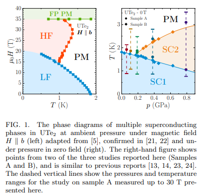
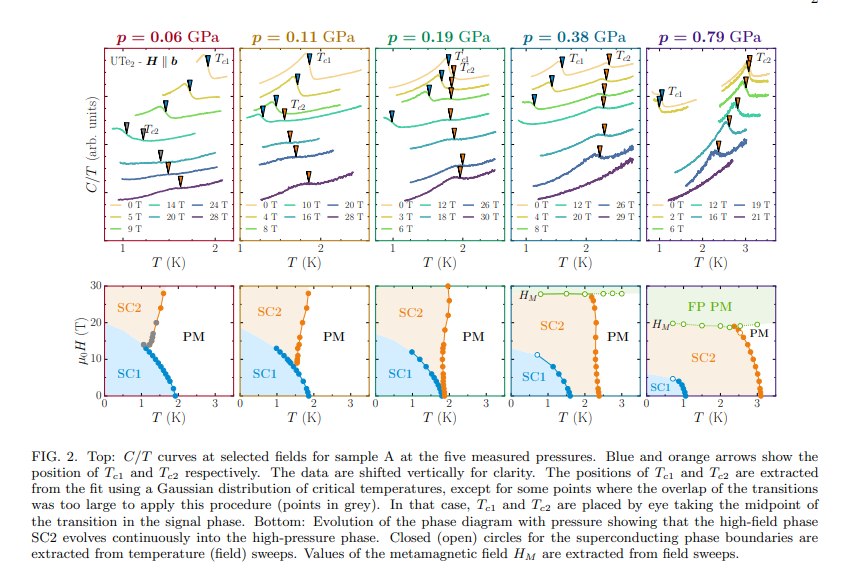
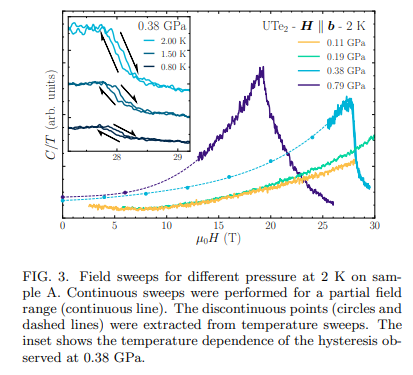
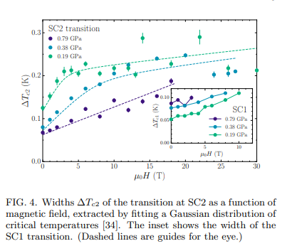
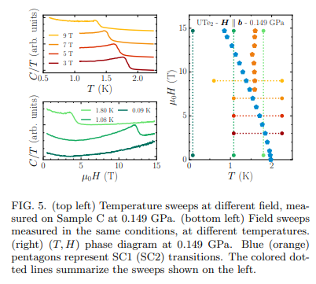

# Connecting High-Field and High-Pressure Superconductivity in UTe2

著者 : T. Vasina, D. Aoki, A. Miyake, G. Seyfarth, A. Pourret, C. Marcenat, M. Amano
Patino, G. Lapertot, J. Flouquet, J.-P. Brison, D. Braithwaite, and G. Knebel

## アブストの翻訳
UTe₂の超伝導の中でも、圧力や磁場によって誘起される複数の超伝導相の存在は、最も顕著な特徴の一つです。本研究では、圧力と最大30テスラまでの磁場を組み合わせた超伝導相図の熱力学的測定結果を報告します。周囲圧力における高磁場超伝導相が、圧力の増加とともに連続的に発展し、高圧下でのゼロ磁場超伝導相に繋がることを示します。これは、これら二つの相が同一であり、同じ秩序パラメータを持たなければならないことを証明します。

## 研究背景・問題意識
- UTe2は圧力印加、磁場印加でともに少なくとも二つの超伝導相を示す。
- 小さな静水圧を加えた際、温度に対して二つの異なる超伝導相が発生する
- 磁化困難b軸に磁場をかけると、35Tまで超伝導が持続する。磁場印加で生じる二つの超伝導相はそれぞれLF, HFとして区別される。

相図を下に示す。左が磁場印加の下での圧力相図、右が圧力印加の下での超伝導相図。

- 異なる超伝導相を特定し、特徴づけることがUTe2における優先課題の一つ。相の一部、またはすべてがスピントリプレットの秩序パラメータを示すのではないかと期待されている。特に、圧力下でのSC1相とLF相が同一のものであることは明らかだが、HF相とSC2相との関連はどうなっているのだろうか？

## 研究目的
- 圧力、H軸に平行な高磁場下で熱量測定を行い、異なる相の熱力学的決定と圧力と磁場の組み合わせによる変化を明らかにする。

- C/T対Tの測定を行う。圧力$p = 0.11GPa$では低磁場相がわずかに縮小し、高磁場相が高温、低磁場にまで拡張している。$0.19GPa$では両方の転移がゼロ磁場で観測され始める。高磁場相はさらに拡張し、低磁場相を完全に包含するようになっている。$p = 0.38, 0.79GPa$では、低磁場相が低温、低磁場に向かってさらに縮小し続ける。$$0.38GPaでは上部臨界磁場がs字状になる（リエントラント）が、$0.79GPa$では通常の曲率を示してメタ磁性転移点まで達する。

- 低圧で相図が連続的に変化することは、周囲圧力・高磁場及び高圧・ゼロ磁場の超伝導相が同一であり、同じ対称性を持つオーダーパラメータで特徴づけられるべきことを示している。

- メタ磁性転移点におけるヒステリシスは、転移が一次であることを示している(上図)。なお(C/T)nが磁場とともにメタ磁性転移点まで増加することは、電子の有効質量mが増加することに対応している可能性が高い。

- SC相の特徴は、転移が幅広いこと(上図)で、超伝導相駆動のメカニズムに深く関連している。

- SC1とSC2の相境界が一点で交わることは熱力学的には許容されていない。特別な条件として、「二つの線が同じ購買を持ち、三つ目の線が臨界点に向かって比熱ジャンプが消失する」必要がある。今回の実験ではSC1相内での第四の相転移の兆候は検出されなかった(上図)。

- 最近の理論では、反強磁性揺らぎとウラン鎖に沿った強磁性相関が協力してスピントリプレットが促進される可能性が示されている。

- 現時点ではSC2相の秩序パラメータの対称性まではわからないが、SC2相を特徴づけるメカニズムと対称性の問題に対するアプローチを開拓することには成功している。

## 感想・メモ
- ミニ研究会に参加した際も、二次相転移が交わる三重点は不安定なので第四の相転移境界を探す必要があるが、青木さんの行った熱量測定では見えないという結論があった。ここを石田先生やその他の研究者が頑張って兆候を見出していたのが印象的だったのを思い出した。
- しばらく研究を追っていて、サンプルのクオリティも上がり、相図や超伝導のふるまいに関する情報の精度も上がって、リアルタイムで進展がみられるのが楽しい。