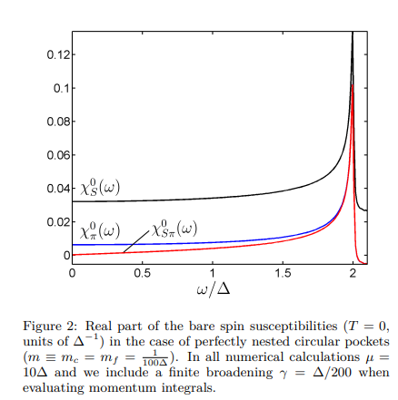
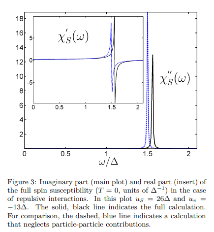
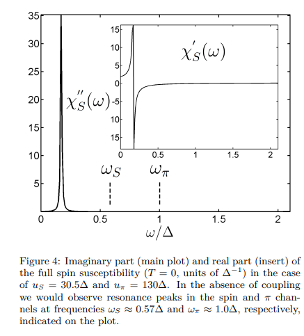

# Effect of pairing fluctuations on the spin resonance in Fe-based superconductors

著者 : Alberto Hinojosa, Andrey V. Chubukov, and Peter W¨olfle

## アブストの翻訳

Fe系超伝導体における非弾性中性子散乱データで観測されるスピン共鳴は、これらの化合物における秩序パラメータの対称性を解明するための重要な手がかりとなってきた。共鳴に関するほとんどの理論研究は、粒子-ホールチャネルにおけるRPA型のアプローチを用い、スピン感受率 𝜒𝑆(q,ω) の運動量 Q=(π,π) における共鳴を、スピン励起子（s++-−−
型超伝導体におけるギャップが反転するフェルミ点間の残留引力により2
Δ よりも低く引き寄せられる）と関連付けている。ここでは、スピン共鳴に対する粒子-粒子チャネルのゆらぎの効果を検討する。超伝導体では粒子-粒子チャネルと粒子-ホールチャネルが結合しており、スピン共鳴がどの程度粒子-ホール励起子と見なせるかは議論を要する。純粋に斥力的な相互作用の場合、全運動量 Q πチャネル）における粒子-粒子チャネルが共鳴にほとんど寄与しないことが分かった。しかし、バンド間密度-密度相互作用が引力的であり、スピン励起子とともにπ共鳴が単独で存在可能な場合には、スピン励起子共鳴の位置から共鳴周波数が大きくシフトすることが見出された。また、この場合に予想される二重ピーク構造は、粒子-ホールチャネルと粒子-粒子チャネル間の強い結合により現れず、ImχS(Q,ω)には単一のピークのみが現れることを示している。

## 研究背景
- スピン共鳴は非従来型超伝導体においてたびたび研究される対象であり、この共鳴の理論的な解釈は2つに分類される。

1. スピン共鳴は、normal stateでは低エネルギーでの粒子-ホール対への強い崩壊によりオーバーダンプされる一方で、超伝導状態では低エネルギーでの散乱が抑制されるためにマグノンが顕著に表れる。この場合ギャップの対称性は特に重要な役割を果たさないが、ギャップ運動量$Q$で接続された点で超伝導ギャップが有限であることが関連している。

2. normal stateで共鳴は存在せず、超伝導状態で超伝導からのフィードバック効果として共鳴が出現するという理論がある。
例 : 電荷的に中性なアンダーソン-ボゴリューボフモードや、複数のギャップ成分が存在する場合のレゲットモード、スピントリプレット秩序パラメータの波のような励起、あるいは内部構造をもつギャップパラメータの場合の対振動モードなど。

2つめの理論はさらに3つの立場に分類される。
1. 共鳴はスピンエキシトンであり、動的スピン感受率$\chi^s(q,\omega)$における極である。この$\chi(q, \omega)$はRPAで計算される。超伝導ギャップが$Q$で接続されたフェルミ面の間で符号が反転する場合、残留引力により共鳴周波数が$\omega_{res} < 2\Delta$に引き寄せられ、p-h対への崩壊が$T_c$以下で抑制される。しかし$T = 0$では消失するため、絶対零度で$\chi_s$はδ関数的ピークを持つことがわかる。この点で共鳴が励起子である場合、異なるフェルミ面の間で符号が反転していなければならない。

2. 超伝導体内部でp-hチャネルとp-pチャネルが混合され、最も強い共鳴は粒子粒子チャネルに存在し、スピン感受率の測定はこの共鳴がp-hホールチャネルに漏れ出るという理論。これは$\pi$-励起子と呼ばれる。

3. 最後に、p-hチャネルとp-pチャネルの間の揺らぎによって共鳴が生じる可能性もある。RPAでは、このような共鳴はp-h、p-pバブルを含む一般化されたRPAの非対角項に起因する。これはプラズモンと呼ばれる（電子液体における集団励起との類似性を強調）。

そして、ここ10年来の研究によれば、最適・それ以上のドーピングでは共鳴はスピン励起子として最もよく説明される。なおテイドープ領域では、スピン励起、スピン波の両方のシナリオで中性子共鳴が説明できるとされている。

今回は、鉄系超伝導体におけるスピンエキシトン、$\pi$-共鳴、およびプラズモンシナリオの相互作用について議論する。

鉄系超伝導体では、$s+-$対称性を持つ場合に共鳴が表れるということでコンセンサスが取れている。代替シナリオとして、$s++$では観測される中性子ピークが共鳴ではなく非弾性準粒子減衰由来の隆起に過ぎないという意見もある。

## モデルと手法

ミニマルな3バンドモデルを考える。
鉄系超伝導体は、$\Gamma$点を中心とするホールFSポケットと、$(\pi,pi)$を中心とする2つの楕円形電子ポケットを持つ多バンド金属

ホールポケットは$c$フェルミオンで、電子ポケットは$f$フェルミオンで表す。

$$
H_0 = \sum_{k,\sigma} \left( \xi^c_k c^\dagger_{k\sigma} c_{k\sigma} + \xi^f_{k+Q} f^\dagger_{k+Q\sigma} f_{k+Q\sigma} \right)
$$

ハミルトニアンの自由項は以下のようになる。

$$
\xi^c_k = \mu_c - \frac{k_x^2 + k_y^2}{2m_c}
$$

$$
\xi^f_{k+Q} = -\mu_f + \frac{k_x^2 + k_y^2}{2m_f}
$$

超伝導状態のハミルトニアンは以下。

$$
H^{\text{SC}}_0 = \sum_{k,\sigma} \left( E^c_k c^\dagger_{k\sigma} c_{k\sigma} + E^f_{k+Q} f^\dagger_{k+Q\sigma} f_{k+Q\sigma} \right)
$$

$u_1$, $u_3$の符号は軌道内・軌道間相互作用の関係によって決まる。$u_1$の符号について、最初は特定の仮定はしない。

$$
H_{\text{int}} = u_1 \sum_{[1234], \sigma \neq \sigma'} c^\dagger_{p_1 \sigma} f^\dagger_{p_2 \sigma'} f_{p_3 \sigma'} c_{p_4 \sigma} + u_3 \sum_{[1234], \sigma \neq \sigma'} \left( c^\dagger_{p_1 \sigma} c^\dagger_{p_2 \sigma'} f_{p_3 \sigma'} f_{p_4 \sigma} + \text{h.c.} \right)
$$

- 次に、反強磁性運動量$Q_{AFM}$における感受率に焦点を当てる。スピン及びπ演算子を
$$
S^z(Q) = \frac{1}{\sqrt{N}} \sum_k \left( c^\dagger_{k\alpha} \sigma^z_{\alpha \beta} f_{k+Q, \beta} + f^\dagger_{k+Q, \alpha} \sigma^z_{\alpha \beta} c_{k \beta} \right)
$$

$$
\pi(Q) = \frac{1}{\sqrt{N}} \sum_k \left( c_{k \alpha} \sigma^x_{\alpha \beta} f_{Q - k, \beta} \right)
$$

のように定義する。

- 感受率は以下のように定義される。

$$
\chi_{ab}(\Omega_m) = \int_0^{1/T} d\tau' e^{i\Omega_m \tau'} \langle T_\tau A_a(\tau') A^\dagger_b(0) \rangle
$$

なお$A_a = (S^c, S^f, \pi, \pi^\dagger)_a
$である。ここで

$$
\chi_S = \chi_{11} + \chi_{12} + \chi_{21} + \chi_{22}
$$

のように和で表される。

裸の感受率は通常の方法を用いてグリーン関数で計算でき、異なるパウリ行列を頂点に持つc, fフェルミオンからなるバブルとして表すことができる。
遅延感受率は以下のようになる。

$$
\chi^0_{ab}(\omega) = \frac{2}{N} \sum_k \left[ \frac{-A_{ab}(k)}{\omega - E^c_k - E^f_{k+Q} + i\gamma} + \frac{B_{ab}(k)}{\omega + E^c_k + E^f_{k+Q} + i\gamma} \right]
$$

ここでコヒーレンス因子は
$$
u^c_k = \sqrt{\frac{1}{2} \left(1 + \frac{\xi^c_k}{E^c_k}\right)}
$$
,
$$
v^c_k = \sqrt{\frac{1}{2} \left(1 - \frac{\xi^c_k}{E^c_k}\right)} \, \text{sgn} \, \Delta^c
$$

である。RPAにより、感受率は
$$
\chi_{ab} = \left(1 - \chi^0 V \right)^{-1}_{ac} \chi^0_{cb}
$$
で表される。ここで相互作用行列は
$$
V = \frac{1}{2} \begin{pmatrix} u_1 & u_3 & 0 & 0 \\ u_3 & u_1 & 0 & 0 \\ 0 & 0 & -u_1 & 0 \\ 0 & 0 & 0 & -u_1 \end{pmatrix}
$$
となる。

演算子の規定をブロック対角化すると、感受率の部分集合に対する解は以下のようになる。
$$
\chi_S = \frac{\chi^0_S + \delta \chi^0_S}{1 - u_S(\chi^0_S + \delta \chi^0_S)}
$$

$$
\chi_\pi = \frac{\chi^0_\pi + \delta \chi^0_\pi}{1 - u_\pi (\chi^0_\pi + \delta \chi^0_\pi)}
$$

ここで

$$
\delta \chi^0_S = \frac{u_\pi}{1 - u_\pi \chi^0_\pi}
$$

- ベアの感受率の実部に対する表式は運動量の和を積分に変えることで得られる。
$$
\text{Re} \, \chi^0_S (\omega) = L + \frac{\omega^2}{4\Delta^2} \text{Re} \, \chi^0_\pi (\omega)
$$

$$
\text{Re} \, \chi^0_\pi (\omega) = \frac{m}{\pi} \frac{\omega}{4\Delta^2} \frac{\sqrt{4\Delta^2 - \omega^2}}{\omega} \arctan \left( \frac{\omega}{\sqrt{4\Delta^2 - \omega^2}} \right)
$$

$$
\text{Re} \, \chi^0_{S\pi} (\omega) = \frac{\omega}{2\Delta} \text{Re} \, \chi^0_\pi (\omega)
$$

$$
L = \frac{m}{\pi} \log(2\Lambda/\Delta)
$$

- まず、パーフェクトネスティングでのフェルミ面のベアの感受率の数値計算結果を示す。

- 超伝導がない場合の$\chi^s$は$\omega = 0$で発散するが、有限の$\Delta$があると有限値になる。
$\chi^{\pi}$は超伝導状態で有限になる。3つとも$0 \leq \omega \leq 2\Delta$で発散する。
両方$\omega = 2\Delta$で発散する。これは通常のグリーン関数と異常グリーン関数の積で構成されるため。

- p-hチャネルとp-pチャネルの間の交差感受率はラマン散乱の文脈でも解析されている。

- 二つのチャンネルの結合効果は以下の表式で得られる。
$$
\chi_S = \frac{\chi^0_S (1 - u_\pi \chi^0_\pi) + u_\pi (\chi^0_{S\pi})^2}{(1 - u_S \chi^0_S)(1 - u_\pi \chi^0_\pi) - u_S u_\pi (\chi^0_{S\pi})^2}
$$

共鳴ピークの位置はこの方程式の分母がゼロになる位置で与えられ、p-hチャネルとp-pチャネルが混合チャネル感受率を通じて結合していることがわかる。

## 結果
###純粋な斥力相互作用$u_1 > 0, u_3 > 0$の場合。

斥力相互作用があるおｔ、$u_s > |u_{\pi}| > 0$かつ$u_{\pi} < 0$となる。
裸の感受率は$\omega = 2\Delta$で発散するため、共鳴は任意の$u_s$に対して存在する。
したがって方程式$1 - us Re(\chi^s(^omega)) = 0$はこの範囲でχを持つ。

- p-pチャネルの効果により感受率の虚部のピークが高い周波数にシフトする。

## 部分的な引力相互作用の場合。
密度-密度相互作用が引力的である場合を考察する。$u_{pi}$が正の場合、$\pi$チャネルはそれ自体で共鳴を得ることができる。

この時、系はクーパー対の全運動量が$Q$である$\pi$超伝導、磁気秩序に対して不安定になる。

- s+-が安定するすべての$u_s及び$u_{\pi}の値について、スピン感受率には$\omega_S$と$\omega_{\pi}$の両方より低い周波数で単一のピークしか存在しないことがわかった。

## 結論
- 鉄系超伝導体の$Q_{AFM}$におけるスピン共鳴を超伝導状態でp-h. p-pチャネルの寄与を含めて研究した。
- 純粋な斥力相互作用の場合だと、スピン共鳴に対してp-pチャネルの寄与は小さく、周波数がわずかに高い方向にシフトするのみ。
- 密度密度が引力的で、p-hチャネルにおけるスピン励起子の共鳴とp-pチャネルにおける$\pi$共鳴が許容される場合、単一のピークのみが残る。
- 粒子-ホールチャネルと粒子-粒子チャネルの間の強い結合はスピン感受率に特有。
## 感想・メモ
- 複合的な感受率を用いていて計算のイメージがつかめるようでつかめない。$\pi - $共鳴はPDWの感受率のことだろうか？
- p-pチャネルを$\pi$共鳴と言っているだけなのでそれ以上何か解釈しない方が無難だろう。