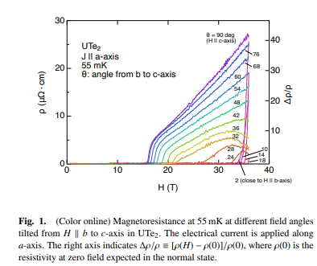
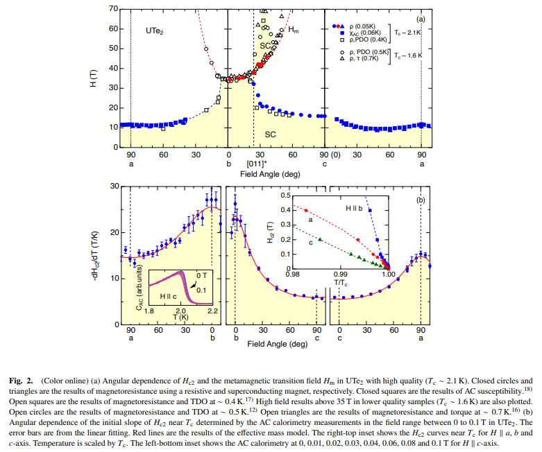
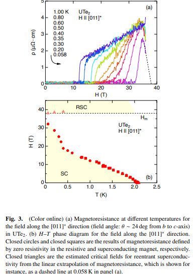
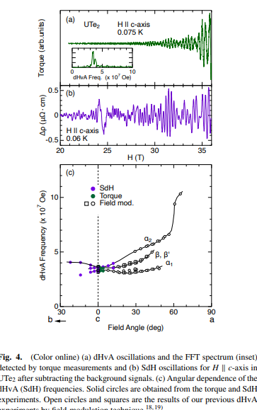

# High Field Superconducting Phases of Ultra Clean Single Crystal UTe2

著者 : Dai Aoki, Ilya Sheikin, Nils Marquardt, Gerard Lapertot, Jacques Flouquet, and Georg Knebel

## アブストの翻訳
高品質な単結晶UTe₂（臨界温度 
T 
c
=2.1K）の磁気抵抗を、b軸とc軸の間の方向に36 Tまでの高磁場で測定しました。上部臨界磁場 
H 
c2
の角度依存性から、b軸平行の磁場再入超伝導相がb軸からc軸方向に約24度の角度（θ ≈ 24度）まで拡張し、転移磁場 
H 
m
を超えた位置で新たな磁場再入超伝導相が現れることが判明しました。我々の結果は、b軸近傍の
H 
m
以下の磁場再入超伝導と、c軸方向に傾けた磁場に対する 
H 
m
以上での超伝導が密接に関連していることを示唆しています。磁場方向が磁化の容易軸に垂直に保たれる場合、超伝導が強固であるように見え、超伝導を促進するゆらぎが持続している可能性があります。

これらの結果は一見、フェロ磁性超伝導体である URhGe や UCoGe において観測された、アイジング型のフェロ磁性ゆらぎが重要な役割を果たす磁場再入（強化）超伝導と類似しています。しかし、UTe₂ではゆらぎがより複雑です。上部臨界磁場
H 
c2の角度依存性は、 
T 
c近傍の
H 
c2
​の初期傾きの角度依存性と異なり、ゆらぎの異方的な磁場応答を明らかにしています。高品質の試料により、磁気抵抗（シュブニコフ・ド・ハース効果）およびトルク（ド・ハース・ファン・アルフェン効果）を用いた測定により、c軸に近い磁場方向で量子振動が検出されました。頻度の角度依存性は、以前の磁場変調技術を用いた観測とよく一致しており、準2次元フェルミ面を確認しました。

## 研究背景-問題意識
- 上部臨界磁場$H_2$、一次メタ磁気転移磁場$H_m$の角度依存性が注目されている。
- $T_c = 2.1K$の高品質試料を使って、これらの臨界磁場の角度依存性をより精密に測定できないか？

## 手法
- 磁気抵抗測定。磁場角をb軸からc軸に回転させて磁気抵抗測定を行い、臨界磁場を確定させる。
- ド・ハース・ファン・アルフェン効果のトルク測定を実施し、量子振動、ひいてはフェルミ面に関する情報を得る。
- $H_{c2}$の角度依存性は$T_c$近傍の$H_{c2}$初期傾きの角度依存性と比較され、明確なコントラストがあることが明らかになった。

## 結果
- 下図は、a軸に沿った電流の、$b$軸から$c$軸にかけてのさまざまな磁場方向における55mKでの磁気抵抗を示す。b軸に近い磁場方向では超伝導が$H_{c2} = 34T$まで維持される。
$\theta$を増加させると、$H_m$の増加に従って磁気抵抗の開始磁場も上昇する。
$\theta = 24弩では$リエントラントが見える。

- c軸方向の磁場印加ではSdH振動が観測され、試料の品質が高いことが確認される。c軸方向の円筒形フェルミ面と一致している。

- 下図は上部臨界磁場とメタ磁気転移磁場の完全な角度依存性を示している。この磁気抵抗の結果はAC磁化率と磁気抵抗、トルク測定、PDOの結果と組み合わされている。この角度依存性は低品質試料で観測されたリエントラントの角度領域の孤立とは異なり、$\theta \sim 24$°以上でリエントラント超伝導が出現しはじめ、50°まで持続する。また$H_{m}$以上の磁場再突入超伝導の兆候が観測されている。

- 上部臨界磁場の角度依存性の異常性は通常の有効質量モデルでは説明できず、ゆらぎの異方的磁場応答や秩序変数の多成分性を示唆している。

- 下図(b)はH-T相図。$\theta \sim 24$°での磁気抵抗を様々な温度で観測すると、最低温度0.058Kでは磁気抵抗が32T以上で有限の値を示すものの、35T以上で再び減少し、リエントラント挙動を示している。この現象を線形外挿すると、$38$Tで磁気抵抗がゼロになると予測される。

- 18T以下の低磁場では$H_{c2}$曲線がわずかに突上の曲率を示すが、そこを超えると勾配が急増して最終的に超伝導は32Tで抑制される。

- 抵抗の現象が始まる点で超伝導相を定義した場合、$H_m$以下、$H_m$以上の超伝導相が連結することになる。

- [011]方向は超伝導に特異的な方向であることに注意。この方向ではCDWやPDWが検出されている。

- c軸方向の磁場の初期傾きは有効質量モデルで記述されるべき。これは異方的有効質量を持つ楕円上のフェルミ面を仮定している。

- c軸近傍の量子振動が観測されており、c軸方向に開いたフェルミ面の存在が示唆される(下図)。

## まとめ
- 上部臨界磁場の$H_{c2}$の角度依存性は、転移温度が高いことに対応しより大きな値をとる。
- b軸近傍では超伝導はメタ磁性転移により遮断され、これは試料の品質には影響されない。しかしリエントラントは$\theta \sim 24$まで拡張し、リエントラントが$H_m$以上で現れる。
- $H_{c2}$の初期傾きの角度依存性を見ることでフェルミ面が準2次元的であることもわかる。
## 感想・メモ
- $H_m$以上でリエントラントが現れはじめるとはどういうことだろう。新しくわかった$\theta \sim 24$°での超伝導は、b軸近傍のメタ磁性転移磁場よりも高い磁場で持続し、それがリエントラントを示すということでいいのだろうか。
