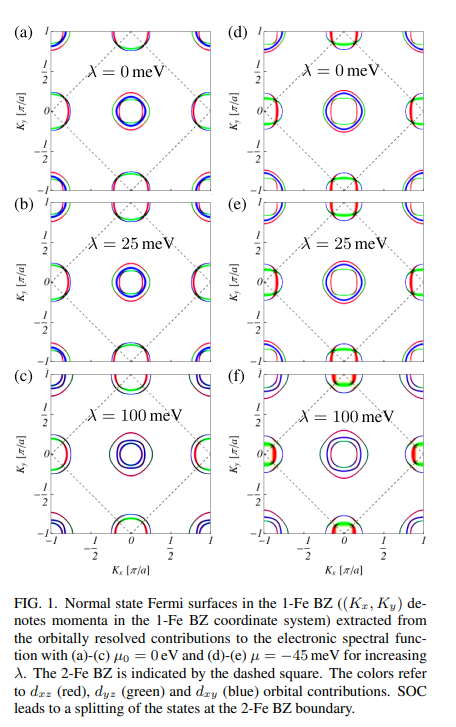
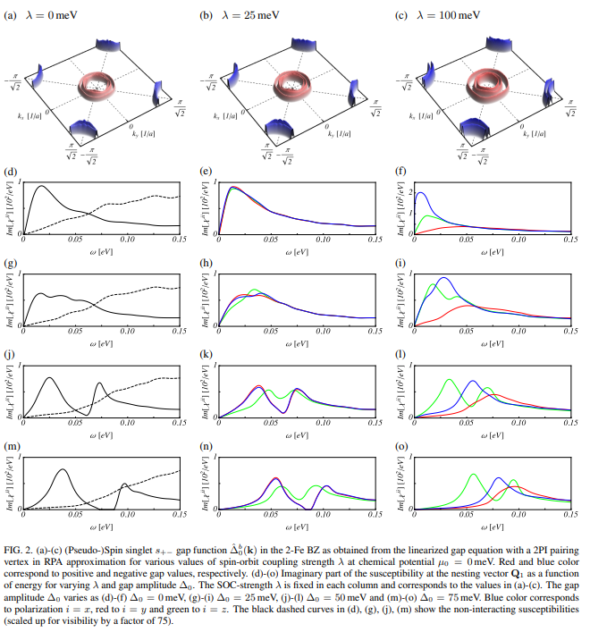
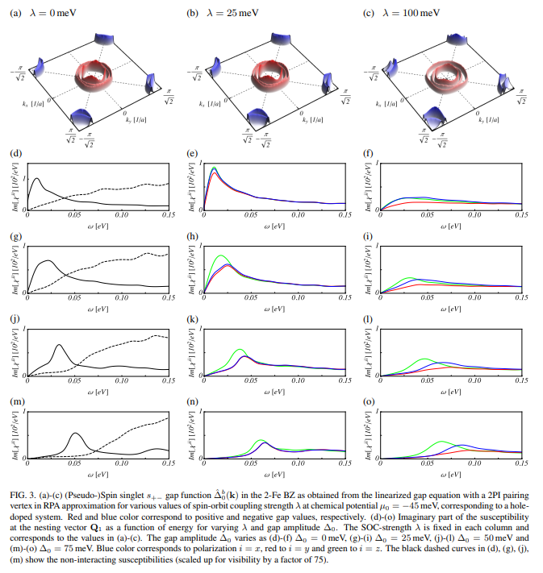

# Effects of spin-orbit coupling on the neutron spin resonance in iron-based superconductors

著者 : Daniel D. Scherer and Brian M. Andersen

## アブストの翻訳
いわゆる中性子スピン共鳴は、非従来型超伝導体の超伝導状態に入る際に、特定のエネルギーおよび運動量移動で磁気応答が著しく増強する現象です。鉄系超伝導体の場合、中性子共鳴は実験的に広く研究されており、偏極非弾性中性子散乱実験によって特異なスピンスペース異方性が確認されています。本研究では、鉄系ニッケライトおよび鉄系カルコゲナイド超伝導体に関連するs±波秩序パラメータを持つ超伝導状態におけるエネルギーおよびスピン分解磁気感受率の理論的研究を行います。我々のモデルは、スピン軌道結合を含む現実的なバンド構造に基づき、電子ハバード-ハンド相互作用をRPAレベルで取り入れています。スピン軌道結合は、スピン揺らぎ媒介ペアリングの生成と、超伝導状態におけるスピン感受率の数値計算の両方に考慮されています。我々は、スピン軌道結合と超伝導が連携することで、中性子共鳴の磁気異方性における実験的に観測された顕著な特徴を再現できることを発見しました。これには、二重共鳴の可能性、c軸偏極共鳴の傾向、および超伝導相に入る際の磁気異方性の増強が含まれます。

## 研究背景・問題意識
- 鉄系超伝導体の中性子散乱ピークに関する自然な説明は、超伝導体のギャップを含むparticle-hole励起によって許可されるスピン1の集合励起と解釈すること。このシナリオでは、ギャップが符号反転を伴うときに共鳴が顕在化することになる。つまり、超伝導が磁気励起に及ぼすフィードバック効果として解釈される。

- 反強磁性波数ベクトルで接続されたフェルミポケットの間で符号反転が起こる$s+-$の強力な証拠して中性子共鳴が提案されていたが、別のシナリオも提案されている。スピン異方性を含む特性も含めて、追加研究がいろいろ行われている。

- 鉄系超伝導体におけるSOCも顕著なスピン異方性に与しているとされている。またドープにより、常伝導状態における面内の低エネルギー磁気揺らぎが面外へ移行し、超伝導状態でさらに強化されることがわかっている。スピン異方性は過剰ドープ領域では消失する傾向がある。

- 二重共鳴・超伝導状態に入る際のスピン異方性の増強も確認されている。

- 遍歴的弱結合RPAの観点から超伝導相における磁気励起の理論研究を行う。鉄系材料に関連するスピン軌道結合を含む現実的な10バンドモデルを適用し、多軌道RPAを介して電子相互作用を組み込む。

## モデルと手法
ハミルトニアンを$H = H_0 - \mu N + H_{SOC} + H_{int}$でモデル化する。
$$
H_0 = \sum_{\sigma} \sum_{l, l'} \sum_{i, j} \sum_{\mu, \nu} c_{li\mu\sigma}^{\dagger} t_{li; l' j}^{\mu \nu} c_{l' j \nu \sigma}
$$

スピン軌道結合は以下のように与えられる。

$$
H_{\text{SOC}} = \frac{\lambda}{2} \sum_{l, i} \sum_{\mu, \nu} \sum_{\sigma, \sigma'} c_{li\mu\sigma}^{\dagger} \left[ L_l \right]_{\mu \nu} \cdot \sigma_{\sigma \sigma'} c_{li\nu\sigma'}
$$

ここで、SOCを組み込むには非局所的な角運動量演算子か、2-サブ格子表現を用いる必要がある。

スピン軌道相互作用を考慮したフェルミ面の図が上に示されている。SOCによって2-Fe ブリルアンゾーン境界で状態の分裂が生じることが明らか。またSOCにより電子ポケットの軌道特性は混合し均質化する。ホールポケットでも同様。

- $\lambda$がすごく大きいようだが、バンド構造の帯域幅が5eVであることが強調される。

相互作用は

$$\begin{align*}
H_{\text{int}} = U \sum_{l,i,\mu} n_{li\mu\uparrow} n_{li\mu\downarrow} \\ + \left( U' - \frac{J}{2} \right) \sum_{l,i,\mu<\nu, \sigma, \sigma'}  n_{li\mu\sigma} n_{li\nu\sigma'} - 2J \sum_{l,i,\mu<\nu} \mathbf{S}_{li\mu} \cdot \mathbf{S}_{li\nu} \\ + \frac{J'}{2} \sum_{l,i,\mu \neq \nu, \sigma} \left( c_{li\mu\sigma}^{\dagger} c_{li\mu\bar{\sigma}}^{\dagger} c_{li\nu\bar{\sigma}} c_{li\nu\sigma} + \text{h.c.} \right)
\end{align*}
$$ 

によってモデル化されている。

## 中性子散乱振幅
次の手順で研究する。
1. SOCの効果を含むp-h vertex及び常伝導グリーン関数を用いてRPAを行い、p-pチャネルにおける頂点を構成する。
2. SOCが存在する状態でフェルミ面に投影された線形化ギャップ方程式の主要解を決定する。

- SOCの存在により、スピンはもはや良い量子数ではなくなる。しかし擬スピン自由度の定義は可能である。

- 擬スピン一重項ギャップ関数を$\hat{\Delta}_0^b(k) = \Delta_0g^b(k)$で定義する。$g$は正規化されている。

これによりRPAを近似することで、最終的に超伝導状態のRPAスピン感受率を決定する。以下この近似をBCS+RPAと呼ぶ。
超伝導状態におけるスピンスピン相関関数は
$$
\begin{align*}
\chi_{ij}(i\omega_n, q) = g^2 \int_{0}^{\beta} d\tau \, e^{i\omega_n \tau} \langle T_{\tau} S_i^q(\tau) S_j^{-q}(0) \rangle _{c, \text{BCS+RPA}} 
\end{align*}
$$
と表される。この松原振動数に対して$i\omega_n \rightarrow \omega + i\eta$を行うことで、異なるスピン空間偏極を持つ磁気励起の運動量及び周波数分解スペクトル密度にアクセスすることができる。

## 結果

- 系の充填が$n = 6$のとき、クーパー対の不安定性は常に偶対称のs+-であることが確認された。常伝導状態から超伝導状態に移行する際の磁気励起を見ると、中性子共鳴の特徴が明確に観察される。ここで超伝導状態の相互作用パラメータを大きく設定しているが、定性的にはLGEで使用した相互作用値を用いた場合と比較しても変わらない。$\omega < 2\Delta_0$の範囲で中性子共鳴モードの形で束縛状態が出現する。

- 常伝導状態でSOCを増加させると、偏極ごとに散乱振幅が分裂する。この分裂はSOCの増加とともに顕著になる。超伝導状態に移ると、、SOCの大小に応じて散乱振幅のエネルギー依存性に質的な違いがみられる。

- 小さいSOC側では、ギャップ振幅を25meV以上に増加させると最終的にいくつかの分裂したピークが表れる。この時期異方性はs+-とSOCの相互作用から生じるように見える。 

- 化学ポテンシャル$-\mu = -0.45$meVの場合に進むと、常伝導状態でz偏極が支配的なホールドープに似たシステムとなり、相互作用パラメータ$U = 0.70$eVに対してLGEの会を得た。内側でのホールポケットでのギャップは電子ポケットでのギャップよりも大きくなる。

- SOCを増加させると、
1. ホールポケットでは最終的にポケット間の異方性が減少する。
2. 1.の一方で、外側電子ポケットでのギャップ振幅がより顕著な増大を示すようになる。

## 議論
- 相互作用$H_{int}$は、軌道・スピン空間の回転対称性を尊重しているため、それ自体では異方性を生成できない。つまり、中性子散乱振幅の異方性に影響を与える要因には次の2つが絡んでいると思われる。
1. 超伝導体におけるバンド興亜応とSOCの相互作用
2. 超伝導解のスピン構造

- 追加の計算により、スピントリプレットの成分は超伝導状態の時期異方性の決定には重要な役割を果たさないことがわかった。つまり、SOCとs+-状態のバンド構造の微妙な相互作用が、s+-が低エネルギーでz軸偏極励起を好む傾向を内在的に引き起こす要因であるといえる。

## 感想・メモ
- 3d電子系ではスピン軌道相互作用はそれほど大きくないという話ではなかったか。