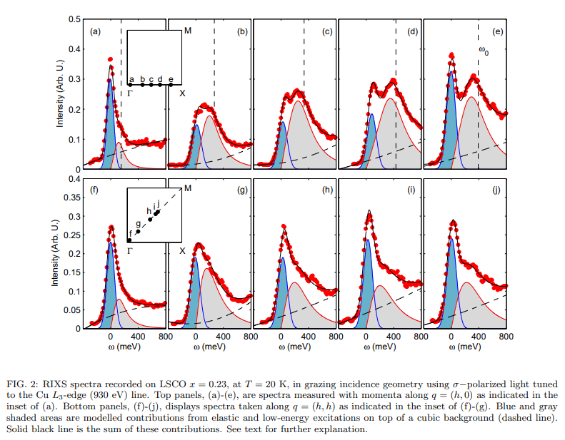

# A resonant inelastic x-ray scattering study of the spin and charge excitations in the overdoped superconductor La1.77Sr0.23CuO4

著者 : C. Monney,  T. Schmitt, C. E. Matt,  J. Mesot,　V. N. Strocov, O. J. Lipscombe, S. M. Hayden, and J. Chang

## アブストの翻訳

私たちは、過剰ドープされた La
1.77
1.77
​
 Sr
0.23
0.23
​
 CuO
4
4
​
のスピンおよび電荷励起に関する共鳴非弾性X線散乱（RIXS）研究を、2つの高対称性方向に沿って行いました。これらの励起の線形形状を解析し、それらが著しくオーバーダンピングされていることが示されました。そのスペクトル強度とダンピングは、運動量に依存して強く変化することが判明しました。この観測結果とRPA（ランダム位相近似）による計算された感受率には質的な一致が見られ、この過剰ドープ系におけるRIXS信号には電荷励起の連続体からの寄与が重要であることが示唆されます。さらに、過剰ドープ状態のスピン励起は、遍歴電子の視点から質的に記述できることが示されています。我々の計算はまた、低エネルギーの新しいスピン励起分支がゾーン中心付近の節方向に沿って存在することを予測しています。現在の実験のエネルギー分解能ではこの分支は解像できませんが、次世代の高分解能分光器によってこの予測が検証可能になることを示しています。

## 研究背景・問題意識
- 磁性超伝導体においてはスピン励起の情報が重要だが、高エネルギー領域のスピン励起の研究は中性子散乱の断面積が小さいために困難が伴う。

- RIXSは上記の困難を解決しうる技術で、中性子散乱を補完しうる。

- オーバードープされたLa2-xSr2CuO4のスピン、電荷励起に関するRIXSを行い、スピン励起に関する情報を引き出したい。

## 手法
RIXS

## 結果
- RIXSスペクトルを以下に示す。

スペクトルは以下の3つの要素から構成されている。

1. $\omega \sim 0$付近の弾性および準弾性散乱
2. 約300meV付近の低エネルギー励起。これが母物質においてスピン励起と解釈されているもの。
3. 1700meVの「dd励起」と呼ばれる励起。

- $q = (0,0)$付近で顕著な弾性散乱が観測されている。またグレージング入射条件と言われる$q \sim (0.4,0)$での弾性散乱はフォノン分枝の結果として解釈されている。

- (h, 0)および(h, h)方向に沿って取得したRIXSスペクトルの一覧が図に示される。

1. 強度は弱い者のゾーン中心$$q = (0,0)でもスペクトル強度は有限。
2. スペクトル強度は弱く、励起は(h, h)方向ではより広がり、分散性が低い。このノード(h, h)と反ノード(h, 0)の二分性は、最適ドープ、アンダードープのBSCCOでも報告されている。

## 結果の解析
- 弾性及び低エネルギー散乱からのスペクトル強度をモデリングするために以下の式を用いる。
$$
\frac{I}{I_{\text{dd}}}(\omega) = G(\omega) + n_B \chi''(\omega)
$$

ここで
$$
n_B = \left(1 - \exp\left(\frac{\hbar \omega}{k_B T}\right)\right)^{-1}
$$
はボース因子を表す。$G(\omega)$は弾性線にフィットさせるためのガウス関数。応答関数は減衰調和振動子のもので、
$$\chi''(\omega) = \frac{\chi''_0 \, \gamma \, \omega}{(\omega^2 - \omega_0^2)^2 + \omega^2 \gamma^2}
= \frac{\chi''_0}{2 \omega_1} \left( \frac{\gamma/2}{(\omega - \omega_1)^2 + (\gamma/2)^2} - \frac{\gamma/2}{(\omega + \omega_1)^2 + (\gamma/2)^2} \right)
$$
として定義される。ここで減衰係数は
$$
\frac{\gamma}{2} = \sqrt{\omega_0^2 - \omega_1^2}
$$
で定義される。特に磁気励起に着目すると、この応答は異なる2つの領域をカバーしている。

- RPAのアプローチで、常磁性状態の低エネルギー励起を解析する。

$$
\chi^s(q, \omega) = \frac{\chi_0(q, \omega)}{1 - U\chi_0(q, \omega)}
$$

入力として、電子分散の単一バンドタイトバインディングパラメータを用いた。正規化されたバンド幅$4t = 490$meVを使用し、$U = 1.2t$としている。

- $(\pi, 0)$方向ではparticle-holeの連続体の分散が低エネルギーに正規化され、二つ目の分枝を発展させ、$(0.15, 0)$付近に第二の極小値を形成する。これはスピン励起と解釈する。$(\pi, \pi)$の励起では、M得tン付近でのスピン励起が変化を示し、以前の感受率計算と一致する結果が得られている。

- $(0,0) \rightarrow (0.2, 0.2)$のは二で弱い分散を示す分枝が確認されている。Uが増加すると強くなるため、スピン励起分枝と解釈される。

## 考察
- 計算されたRPAには、励起された粒子-正孔連続体とスピン励起の両方の寄与が含まれている。RIXSはこれら両方の成分に対して感度を持つと考えられる。

- 感受率計算は強度の異方性もとらえているが、他のドープ銅酸化物のRIXS研究ではこれまで観測されていなかった。

- 装置の改善により検証可能な予測がいくつかある。例えば$(0,0) \rightarrow (\pi, \pi)$に沿った低エネルギー励起分枝。このような低エネルギー分散は、他の銅酸化物ではぼんやりとしか見えていなかった。

- RIXSは$\Gamma$点中心の領域の研究に限定されており、INSと直接スペクトルの比較を行うのは難しい。

## 結論
- オーバードープLSCOのスピン電荷励起に関するRIXS研究によれば、(h,h)に沿ったスピン励起が強く減衰し、その減衰は運動量依存する。運動量が大きいと減衰も大きくなる。
- スペクトルも運動量依存性を持ち、反ノード領域ではゾーン境界付近で多くのスペクトル強度が観測され、反ノード方向はノード方向に比べて強度が大きいことが分かった。
- RPA感受率の計算と突き合わせると、これらの実験結果を再現している。

## 感想・メモ
- Uの増加に伴いピークが大きくなったらスピン励起だといわれるのか。
- あまりに高エネルギーで見られるのはdd励起と言われるらしい。
- セミナーで指摘があったが、連続体とは何のことを指しているのか、今一度教員に確認してみるか。
- RIXSと中性子散乱が補完的と言われるのは、得意とするエネルギー領域、運動量領域の違いだろうか。