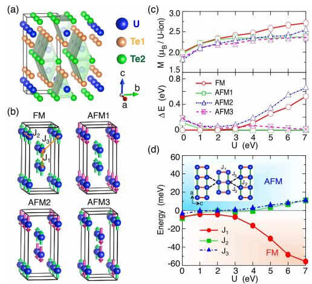
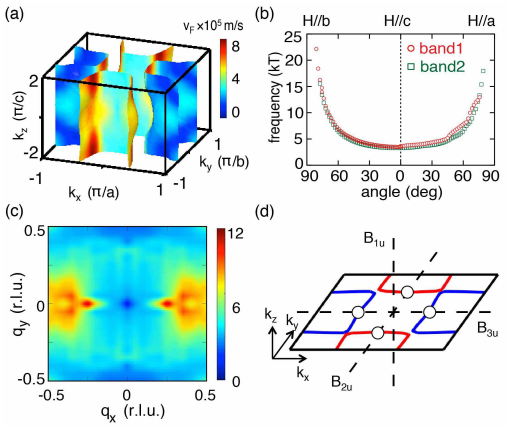

# Quasi-two-dimensional Fermi surfaces and unitary spin-triplet pairing　in the heavy fermion superconductor UTe2

著者 : Yuanji Xu, Yutao Sheng, and Yi-feng Yang

## アブストの翻訳
新たに発見された重い電子系超伝導体UTe₂に対し、第一原理計算と強相関計算を報告する。我々の解析から、磁気的・電子的・超伝導的性質に関して以下の3つの重要な側面が明らかになった。(1) 強い磁気的フラストレーションを伴う「二本脚のはしご型」構造をもち、長距離秩序が存在しないことや観測される磁気・輸送特性の異方性を説明する可能性がある。(2) UGe₂と類似したネスティング特性を示す2つの独立した電子およびホールの円筒状フェルミ面からなる準2次元的なフェルミ面構造をもち、これが磁気ゆらぎを促進し、スピン三重項対形成を強化する助けになる可能性がある。(3) 先行研究では非ユニタリ対形成が主張されてきた一方で、我々はゼロ磁場において強いスピン軌道相互作用を伴うユニタリなスピン三重項対形成状態が実現していると示唆し、kx方向に沿ったより重いホールフェルミ面上に点ノードが存在すると考えている。提案したシナリオは最新の熱伝導度測定とも非常に良い一致を示しており、UTe₂の特異な磁気的および超伝導的性質を理解する上での基盤を提供する。

## 研究背景・問題意識
- UTe2の磁気的・電子的構造に関しては理論的に未解明の部分が多い。バンド計算と実験は合わない。超伝導対形成やノード構造の理解にはフェルミ面のトポロジーが極めて重要となる。特に提案されているノンユニタリスピントリプレｔットが、実験で観測されたポイントノードを本当に説明できるのかは興味が持たれている。

## 手法
- DFT+DMFTで電子構造を研究する。

## 議論
- 磁気計算からはtwo-leg ladder-typeの構造が見いだされる。

- クーロン相互作用Uを変化させてJを計算する。4種類の磁気配置のうち、強磁性が最もエネルギー的に安定となるのは小さなエネルギー領域Uのみ。Uが大きいとAFM1, AFM3がほぼ同じエネルギーになる。 
- フェルミ面は準2次元的であり、二つの独立した電子円筒とホール円筒から構成される(UGe2と似た電子構造を持つ)。
- ネスティングは磁気揺らぎを促進し、スピントリプレット対形成を強化し得る。

- バンド計算をする。まず、10Kではフェルミ順位近傍に鋭い準粒子ピークが存在する。200Kではそれが消失している。また自己エネルギーの虚部は低温領域での抵抗率と整合している。50Kあたりにコヒーレンス温度が存在する。

- 次にスペクトルを計算すると、高温ではf電子が局在している一方で10Kではフェルミ順位近傍に極めてフラットなバンドが表れ、伝導バンドと混成している。

- フェルミ面を計算する。kz方向にわずかに波打った2本の円筒状フェルミ面が表れている。準二次元的なフェルミ面となっている。スピン感受率の計算により(0,π,0)方向にネスティングを持っていることがわかる。

- フェルミ面のトポロジーは超伝導対称性の議論における出発点を提供する。スピン軌道相互作用が弱い場合の対形成状態での対形成状態が提案されているが、これは超伝導ギャップが半分のスピン成分にしか開いていない。

- SOCが強い場合は、B2u, B3uのみがポイントノードを許容することがわかる。本研究で計算されたフェルミ面構造は、B2uかB3u表現に属するユニタリなスピントリプレット対形成状態を要求していることになる

- この対形成状態はequalスピン対形成ではないため、フェルミ面が半分だけギャップを持つといった現象は起こらない。

## 感想・メモ
- 既約表現が強いSOC, 弱いSOCの場合にまとめられていて安心した。

