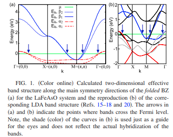
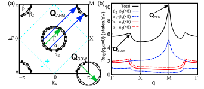
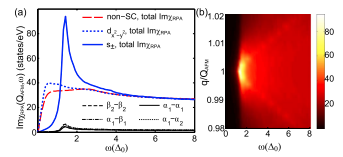

# Theory of magnetic excitations in iron-based layered superconductors

著者 : M. M. Korshunov, and I. Eremin

## アブストの翻訳

有効な4バンドモデルに基づいて、鉄系超伝導体における常伝導状態および超伝導状態でのスピン応答を解析する。我々の結果によれば、常伝導状態のスピン励起は、軌道間の反強磁性的揺らぎの連続体およびバンド内のスピン密度波揺らぎによって支配されている。一方、非従来型超伝導状態では、それとは異なるフィードバックが現れる。

明瞭なスピン・エキシトンとしての共鳴ピークは、拡張された 
𝑠±波（extended s-wave）超伝導秩序パラメータにおいて、反強磁性波数ベクトル𝑄AFMにおけるバンド間散乱のみによって生じる。この共鳴は、波数ベクトル q=Q AFMとなると急速に消失する。
一方で、𝑑x2−𝑦2​波の秩序パラメータに対しては、これらの化合物特有のフェルミ面トポロジーのために、共鳴の特徴は非常に弱い。
磁気励起に対する𝑠±波対称性と 𝑑𝑥2−𝑦2波対称性の本質的な違いは、超伝導波動関数の対称性を実験的に決定するための有力な手がかりとなり得る。

## 問題意識
- 超伝導転移温度以下ではクーパー対の形成によりスピン励起が抑制されるのに対し、非従来型超伝導体では転移温度以下で強度の大きなスピン共鳴が形成されることが知られている。

- スピン共鳴の出現の背景は、フェルミ面の異なる部分で超伝導ギャップが符号反転すること・強い電子相関が存在することがある。特に興味深いのは、この共鳴ピークの観測が、超伝導発現に磁気揺らぎが重要な役割をはたしていることも示す点となる。

- フェルミ面は、2つのホールポケット、ならびに2つの電子ポケットから構成されている。また、これらのバンドから得られる磁気スピン感受ｒつは、波数$q=0$付近の揺らぎと、反強磁性整合型のスピン密度波の両方を示している。

- 本稿では、4バンドタイトバインディングモデルを用いて、鉄系ニクタイド超伝導体における常伝導状態及び超伝導状態におけるスピン応答を理論的に解析する。

- RPAに基づいて計算された磁気揺らぎのスペクトルは、バンド間散乱によって生じる反強磁性スピン揺らぎと、バンド内散乱に起因する小さな運動量でのスピン密度波揺らぎのブロードなcontinuumとして現れる。

- 非従来型超伝導が磁気励起スペクトルに対して特有のフィードバックをもたらすことを示す。特にスピンエキシトンとしての共鳴ピークは、反強磁性波数ベクトルにおけるバンド間散乱において$s+-$波の超伝導秩序パラメータのときにのみ出現する。この共鳴ピークは反強磁性波数ベクトルに局在している。

- この結果から、超伝導の性質は$s+-$波であり、反発的な相互作用によって駆動されている可能性が高い。

## 結晶構造の説明
- 鉄系において、鉄イオンは正方格子を形成しており、それに交差する形でヒ素イオンもまた第二の正方格子を形成している。

- バンド構造計算によれば、鉄の3d軌道のうち3つがフェルミ順位近傍の状態密度に寄与している。これらの状態はz方向には弱く分散することが示されている。

- この結果として、得られるフェルミ面は
1. 2つのホールポケット
2. 2つの電子ポケット
で構成される。

- ハミルトニアンは
$$
H_0 = - \sum_{k, \sigma, i} \varepsilon_i \, d^{\dagger}_{ki\sigma} d_{ki\sigma} 
      - \sum_{k, i, \sigma} t^i_k \, d^{\dagger}_{ki\sigma} d_{ki\sigma}
$$
で表される。

ここで、$i = (\alpha_1, \alpha_2, \beta_1, \beta_2 )$ はバンドのインデックスを表し、  
$( \varepsilon_i )$ はオンサイトエネルギー、$( t^i_k)$ は波数依存の分散項となる。

- ホールポケットの分散は
$$
t^{\alpha_{1,2}}_k = t^{\alpha_{1,2}}_1 (\cos k_x + \cos k_y) + t^{\alpha_{1,2}}_2 \cos k_x \cos k_y
$$

- 電子ポケットの分散は
$$
t^{\beta_{1,2}}_k = t^{\beta_{1,2}}_1 (\cos k_x + \cos k_y) 
+ t^{\beta_{1,2}}_2 \cos\left(\frac{k_x}{2}\right) \cos\left(\frac{k_y}{2}\right)
$$

となる。それぞれパラメータは
$$
\alpha_1 : (\varepsilon, t_1, t_2) = (-0.60,\ 0.30,\ 0.24) \\
\alpha_2 : (-0.40,\ 0.20,\ 0.24) \\
\beta_1  : (1.70,\ 1.14,\ 0.74) \\
\beta_2  : (1.70,\ 1.14,\ -0.64) \\
$$
である。

未ドープの場合のバンドとフェルミ面はこのようになっている。

## 手法
- スピン感受率に対する1ループの寄与を考える。これはバンド内、バンド間の両方の寄与を含む。

$\chi^{(0)}_{ij}(\mathbf{q}, i\omega_m) = -\frac{T}{2N} \sum_{\mathbf{k}, i\nu_n} 
\mathrm{Tr} \left[
G_i(\mathbf{k} + \mathbf{q}, i\nu_n + i\omega_m) G_j(\mathbf{k}, i\nu_n) 
+ F_i(\mathbf{k} + \mathbf{q}, i\nu_n + i\omega_m) F_j(\mathbf{k}, i\nu_n)
\right]$

- 超伝導秩序パラメータは以下のようになる。
$$
\Delta_{\mathbf{k}} = \frac{\Delta_0}{2} \left( \cos k_x - \cos k_y \right)
$$

$$
\Delta_{\mathbf{k}} = \frac{\Delta_0}{2} \left( \cos k_x + \cos k_y \right)
$$

- RPAを考える際、有効相互作用として、オンサイトのハバード型バンド内クーロンU, Hund結合J, バンド間ハバード斥力$U'$を考える。

$\hat{\chi}^{\mathrm{RPA}}(\mathbf{q}, i\omega_m) = 
\left[ \hat{I} - \hat{\chi}^{(0)}(\mathbf{q}, i\omega_m) \cdot \hat{\Gamma} \right]^{-1}
\cdot \hat{\chi}^{(0)}(\mathbf{q}, i\omega_m)
$

- staticな感受率を計算すると、バンド間散乱の寄与が大きい。異なる軌道間のAFMの揺らぎが$\alpha$および$\beta$バンド内での超伝導を駆動すると期待される。

- 斥力相互作用を前提とすると、超伝導ギャップは符号反転する必要がある。
- この条件を満たす秩序パラメータの対称性としてd波、$s+-$波を仮定する。どちらも反強磁性条件を満たしており、超伝導状態におけるスピン感受率の比較のために用いられる。

## 結果
動的感受率を見ると、裸の感受率がバンドごとにわずかに異なるため、RPAでの極は形成されず、continuumとして残る。

- 超伝導状態では事情が変わる。まず、秩序変数に対して$\Delta_k = -\Delta_{k+Q}$なる条件が成立しているとき、臨界エネルギー$\Omega_c = min(|\Delta_k| + |\Delta_{k+Q}|)$で不連続なジャンプが現れる。

- 対応する実部はクラマースクローニッヒの関係により対数的に発散する。

- AFM波数ベクトルでのバンド内遷移は直接ギャップにより抑制されているため、バンド間の効果のみが顕著になる。

- すべてのRPAスピン感受率成分に対して単一の共鳴極が生じ、スピンエキシトンが形成される。

- d波の場合、状況はより複雑となる。反強磁性ベクトルは$d_{x^2-y^2}$型超伝導秩序パラメータのノードに非常に近い状態を結びつけるため、ベアの感受率の臨界エネルギーが非常に小さい。共鳴条件は成立するが、RPAのスピン感受率の増大は抑制される。したがって共鳴ピークは$s+-$波の秩序パラメータに対してのみ顕著に表れる。

- このような秩序パラメータの対称性による明確な振る舞いの違いは、非弾性中性子散乱実験により明瞭に識別可能で、本系における超伝導秩序パラメータの対称性を明らかにするための直接的な手段となりうる。

- d_{x^2-y^2}型の場合と同様に、$d_{xy}$波や$d_{x^2-y^2}+id_{xy}$波に対してもスピン共鳴は現れないことがわかっている。

## 感想・メモ
- バンド間だと反強磁性揺らぎ、バンド内だとスピン密度波揺らぎと区別されるのはなぜだろう？

- 共鳴ピークの局在は鉄系超伝導体に特有らしい。銅酸化物の場合は分散型の共鳴が見られるとのこと。でも2次元正方格子で研究したときはそうはなっていなかったと思いますが……。狭いq空間でみればいいのか？

- ルテネイトの先行研究をあさるべきなのではないか？