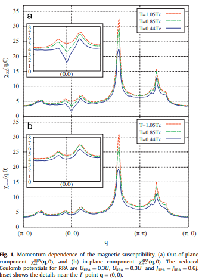
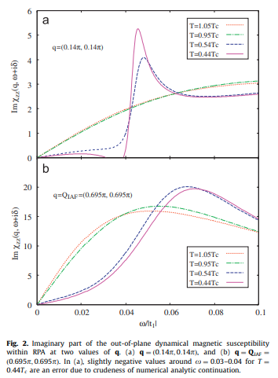
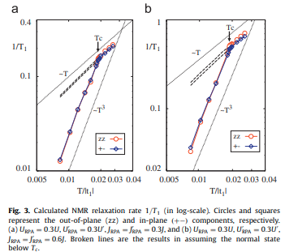
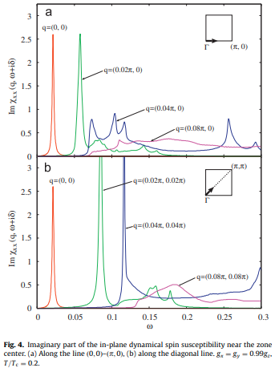

# Theory of magnetic properties in the spin-triplet superconducting state of Sr2RuO4

著者 : Takuji Nomura, Hiroaki Ikeda, Dai S. Hirashima

# アブストの翻訳
我々は、Sr₂RuO₄の三重項対形成状態における磁化率を解析する。具体的には、キラルp波状態 𝑑(𝑘)=(𝑘𝑥+𝑖𝑘𝑦)𝑧^を仮定している。本論文は二つの独立した部分から構成されている。
前半では、三バンドの斥力ハバードモデルを出発点とし、ランダム位相近似（RPA）を用いて、NMR緩和率(1/𝑇1)を温度の関数として計算する。
後半では、有効な三重項ペアリング相互作用を含む別のモデルを用い、長波長領域におけるスピンの集団励起（collective spin excitation）の可能性について議論する。

いずれの解析においても、Sr₂RuO₄の現実的なマルチバンド電子構造を完全に考慮しており、電子相関効果からミクロ的に決定された超伝導ギャップを使用している。

## 問題意識
- スピントリプレット超伝導体の最有力候補の一つにSr2RuO4がある。

- Sr2RuO4における最有力な秩序変数は$d(k) = (k_x + i k_y)\hat{z}$である。この応対で、クーパー対のスピンは基底面内に揃い、きどうぶぶんにおいてはカイラルp波状態が実現される。トリプレット超伝導体では転移温度以下でもすぴんかいてんじゆうどが完全には失われず、磁気的性質において異常な振る舞いが現れることがある。

- 本論文では、スピントリプレット対形成状態における磁気的性質を、現実的な多バンド電子構造と超伝導ギャップを用いて解析する。

## モデルと手法
- Ru 4d軌道に基づく3バンド模型を考える。
$$
H_0 = \sum_{\bm{k}, \ell, s} \xi_\ell(\bm{k}) c^\dagger_{\ell \bm{k} s} c_{\ell \bm{k} s} + \sum_{\bm{k}, s} \lambda(\bm{k}) \left( c^\dagger_{yz\,\bm{k}s} c_{xz\,\bm{k}s} + \text{h.c.} \right)
$$

各軌道の分散は以下のようである。
$$
\xi_{xy}(\bm{k}) &= -2t_1(\cos k_x + \cos k_y) - 4t_2 \cos k_x \cos k_y - \mu_{xy} \\
\xi_{yz}(\bm{k}) &= -2t_3 \cos k_y - 2t_4 \cos k_x - \mu_{yz} \\
\xi_{xz}(\bm{k}) &= -2t_3 \cos k_x - 2t_4 \cos k_y - \mu_{xz} \\
\lambda(\bm{k}) &= -4t_5 \sin k_x \sin k_y
$$

これらのパラメータは実験で得られたフェルミ面の構造を再現するように調整されている。

相互作用は以下を仮定する。

$$
H_{\mathrm{Coulomb}} = \frac{1}{2} \sum_{i} \sum_{z_j} I_{z_1 z_2; z_3 z_4} \, 
c^{\dagger}_{i z_1} c^{\dagger}_{i z_2} c_{i z_3} c_{i z_4}
$$

ここで$I_{z_1 z_2; z_3 z_4}$はクーロン相互作用の行列要素である。具体的にはintra-orbitalの斥力U, inter-orbitalの斥力$U'$, Hund結合$J$, ペアホッピング$J'$が含まれる。

スピン軌道相互作用は

$H_{\mathrm{SO}} = \xi_{\mathrm{SO}} \sum_{\bm{k}} \sum_{\ell,\ell',s,s'} \left[ \bm{l} \cdot \bm{s} \right]^{\ell s, \ell' s'} c^\dagger_{\ell \bm{k} s} c_{\ell' \bm{k} s'}$

で導入する。

グリーン関数と異常グリーン関数は
$$
G_{a s s'}(\bm{k}, i\omega_n) &= -\frac{i\omega_n + \xi_a(\bm{k})}{Z_a(\bm{k})} \delta_{s s'} \\
F_{a s s'}(\bm{k}, i\omega_n) &= \frac{\Delta_{a s s'}(\bm{k})}{Z_a(\bm{k})} \\
Z_a(\bm{k}) &= \omega_n^2 + \xi_a(\bm{k})^2 + |\bm{d}_a(\bm{k})|^2
$$
で与える。dベクトルの波数依存性はエリアシュベルグ方程式の解によって決めることができる。

ベアの感受率は
$$
\chi^{(0)}_{z_1 z_2; z_3 z_4}(\bm{q}) = -T \sum_{\bm{k}} \left[ G_{z_4 z_1}(\bm{k}) G_{z_2 z_3}(\bm{k} + \bm{q}) - F_{z_4 z_2}(\bm{k}) F^{\dagger}_{z_1 z_3}(\bm{k} + \bm{q}) \right]
$$
で定義される。これを用いて繰りこまれた磁化率は行列表記で

$$
\hat{\chi}^{\mathrm{RPA}}(\bm{q}) = \left[ \hat{1} - \hat{\chi}^{(0)}(\bm{q}) \hat{G}^{\mathrm{RPA}} \right]^{-1} \hat{\chi}^{(0)}(\bm{q})
$$
と表すことができる。

$$
[\hat{1}]_{z_1 z_2; z_3 z_4} &= \delta_{z_1 z_3} \delta_{z_2 z_4} \\
[\hat{G}^{\mathrm{RPA}}]_{z_1 z_2; z_3 z_4} &= I^{\mathrm{RPA}}_{z_1 z_3; z_2 z_4} - I^{\mathrm{RPA}}_{z_1 z_3; z_4 z_2}
$$

$$
\chi^{\mathrm{RPA}}_{mn}(\bm{q}) = \sum_{z_1 \dots z_4} [m_m]_{z_1 z_2} [m_n]_{z_3 z_4} \chi^{\mathrm{RPA}}_{z_1 z_2; z_3 z_4}(\bm{q})
$$

NMRの緩和率は以下の式で計算される。
$$
\left( \frac{1}{T_1} \right)_{mn} = T \sum_{\bm{q}} \frac{\operatorname{Im} \chi^{\mathrm{RPA}}_{mn}(\bm{q}, \omega + i0)}{\omega} \bigg|_{\omega \to 0}
$$
転移温度は$T_c = 0.019$程度である。

計算結果は以下のようになる。

まずブリルアンゾーン中心付近で$\chi_{zz}$の抑制が見られる。これは基底面内でクーパー対のスピンが基底面内にそろうため。
対角線方向に沿って反強磁性的な非整合ピークが現れる。特に$q = Q_{1AF} = (0.695\pi,0.695\pi)$付近で顕著である。これは中性子散乱実験で観測されたもので、小さなギャップを持つa,b バンド間のフェルミ面ネスティングによるとされている。

次に2種類の波数で$\chi_{zz}^{RPA}$の虚部を示す。転移温度以下で周波数に対する顕著な変化がみられる。これはゾーン中心付近の磁気特性が最大のギャップを開く$\gamma$バンドによって支配されていることを示す。

- 一方で、a,bバンドのギャップはネスティング領域ではノード状構造を持つと考えられている。

以下にNMR緩和率の数値計算結果を示す。転移温度より上ではコリンハ側が満たされているが、$T_c$直下ではHebel-Slichterピークは現れず、代わりに$T^3$依存性が現れる。これはノード状のギャップ構造を反映している。

いくつか問題点もある。

- 本研究には問題点もあり、実験で観測されているNMR緩和率の異方性を本研究の結果は定量的には再現できていない。

- 反強磁性波数におけるRPA磁化率の異方性も中性子散乱実験の値を説明するには小さすぎる。

集団スピン励起について、これまでいくつかの著者によって単一バンドモデルを用いて研究されてきた。これを他バンドに拡張したい。

- 本来ペアリング相互作用は、オンサイトクーロン相互作用に対する高次の散乱過程により誘起されるが、その構造は複雑であるためミクロの理論の範囲でトリプレット対のプロパゲーターを直接計算することは現実的ではない。そこでミクロ理論と同じギャップ構造を与える有効な三重項ペアリング相互作用を導入する。

$$
H_{\mathrm{eff}} = -\frac{1}{2} \sum_{n=x,y,z} g_n \sum_{a,a'} \sum_{\bm{k},\bm{k}',\bm{q}} \sum_{s_j} \sum_{l = x, y}
&f_a^l(\bm{k}) f_{a'}^l(\bm{k}') \nonumber \\
&\times (\sigma_n \sigma_y)_{s_1 s_2} (\sigma_y \sigma_n)_{s_3 s_4}
\, c^\dagger_{a,\bm{k}+\bm{q}/2,s_1} c^\dagger_{a,-\bm{k}+\bm{q}/2,s_2}
c_{a',-\bm{k}'+\bm{q}/2,s_3} c_{a',\bm{k}'+\bm{q}/2,s_4}
$$

平均場の範囲では$g_z>g_x=g_y$なら秩序パラメータ$d(k) || \hat{z}$が実現する。このようなdベクトルの向きでは対応するゴールドストンモードがスピン波モードとして現れる。ペアリング相互作用が異邦的である場合、このスピン励起モードはギャップを持つ。

上が数値計算結果で、多バンド計算においても単一バンドと同様に、面内動的スピン感受率のポールとして集団スピン励起モードが現れることが確認できた。

## 感想・メモ
- 集団励起モードの計算では、超伝導転移温度を$T_c = 0.05$とやや高めに設定しているらしい。