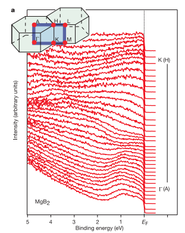
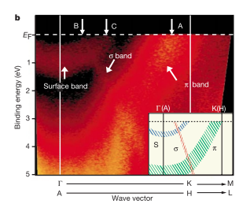
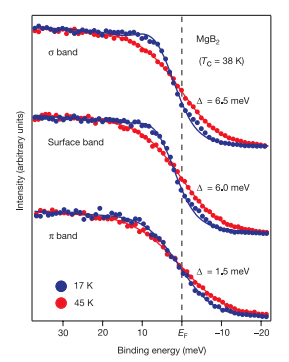

# The origin of multiple superconducting gaps in MgB2

著者 : 

## アブストの翻訳
マグネシウム・ジボライド (MgB₂) は、既知の金属超伝導体の中で最も高い転移温度（
𝑇
𝑐
=39 K）を持つことが知られている1。この異常に高い 
𝑇
𝑐
​
が、従来のBCS（Bardeen–Cooper–Schrieffer）理論2の枠組みで説明できるかどうかについては議論が続いている。超伝導の理解の鍵となるのは、超伝導対の形成に関連する「超伝導エネルギーギャップ」である。最近のいくつかの実験3により、MgB₂において2種類の超伝導ギャップが存在する可能性が示唆されている。これは従来の超伝導体および高温超伝導体とは異なる特徴である。しかし、これまでの実験では超伝導電子の運動量を分解する能力が不足していたため、2つのギャップの存在を明確に示すことはできていなかった。

本研究では、MgB₂の二バンド超伝導の直接的な実験的証拠を報告する。具体的には、
σ バンドと 
π バンド（および表面バンド）の超伝導ギャップを個別に観測することに成功した。それぞれのギャップの大きさは明確に異なっており、MgB₂が二ギャップ超伝導体であることを明白に確立する結果となった。

## 問題意識
- 純度の高いMgB2の試料では、その超伝導状態がBCS理論から逸脱するような実験結果がいくつか得られている。その一つが「マルチギャップ」と呼ばれるもので、転移温度T_cで異なる大きさの2つ以上のギャップが同時に発達することが示されている。
- これはいくつかのモデルにおいて解析されているが、特に2バンドモデルについては以下のような説明ができる。シグマバンドの電子はBに局在したフォノンと強く結合して大きなギャップを生じる一方で、パイバンドでは電子-フォノン結合が弱いために比較的小さなギャップが開く。このため二つの異なる超伝導ギャップが生じることになる。
- ただし、異なるバンドを分離して観測することはできていなかった。

## 実験
- ARPES実験

## 結果

- フェルミ順位を横切る複数のバンド分散が観測されている。特に
1. K点付近でEfを横切る大きな電子型バンド
2. $\Gamma$点を中心にEfを横切るホール型バンド
3. $\Gamma$点を中心とする小さな電子型ポケット

運動量パスに沿った分散

- フェルミ面上の3つの点で超伝導転移温度の上下でARPESスペクトルを測定した。

- $E_f$

- 17Kにおけるスペクトルのリーディングエッジの中点は2meV高い結合エネルギー側へシフトしていたが、45Kでは中点がEf上に位置していた。これはシグマバンドにおいて17Kで超伝導ギャップが開いていることを示している。
- パイバンドは対照的で、ギャップの開口があまりみられない。

- パイバンドにも一応ギャップの開口はあるが、それぞれ

- $\sigma$ バンド: $\Delta = 6.5 \pm 0.5$ meV
- 表面バンド: $\Delta = 6.0 \pm 0.5$ meV
- $\pi$ バンド: $\Delta = 1.5 \pm 0.5$ meV

のように見積もられる。これにより、異なるバンド間で二つのギャップが観測されたことになる。

## 議論
- シグマバンドでは大きなギャップ(6-7meV)、パイバンドでは小さなギャップ(1-2meV)が飽くことが分かった。これは2バンドモデルによるMgB2の記述が最も適切であることを示している。

## 感想
- 私には「7から15meVの範囲でわずかなスペクトル強度の蓄積があること」が全くわからないのだが、実験家の目にはちゃんと認識できるのだろうか。すごい。しかもこれがコヒーレントピークになるのか。