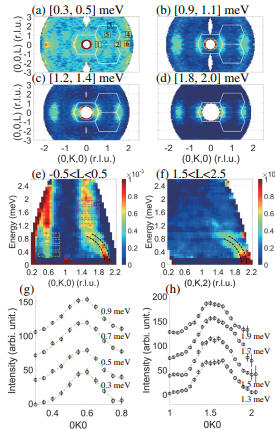
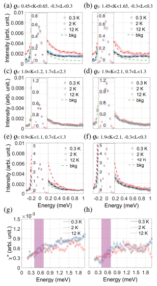

# Incommensurate Spin Fluctuations in the Spin-Triplet Superconductor Candidate UTe2

著者 : Chunruo Duan, Kalyan Sasmal, M. Brian Maple,Andrey Podlesnyak ,Jian-Xin Zhu , Qimiao Si, and Pengcheng Dai

## アブストの翻訳
スピン三重項超伝導体は、トポロジカル状態や量子計算において重要なマヨラナフェルミオンをホストできることから、近年広く関心を集めている。ウラン系重いフェルミオン系超伝導体UTe₂は、UGe₂、URhGe、UCoGeと同様にスピン三重項超伝導体であると考えられており、超伝導相が強磁性（FM）不安定性の近傍にある（または共存する）ことで、FMスピン揺らぎによってスピン三重項電子対が形成されるとされている。本研究では、中性子散乱を用いて、UTe₂が0.3 Kまで静的な磁気秩序を示さない一方で、[0, K, L] 平面における磁性は、反強磁性秩序波数ベクトル近傍における非整合スピン揺らぎによって支配され、少なくとも2.6 meVにわたって存在することを示した。我々は、UTe₂の主要な非整合スピン揺らぎを、密度汎関数理論と動的平均場理論を組み合わせた電子構造計算の枠組みで理解することができた。

## 問題意識
- スピントリプレット超伝導体は通常縦方向の強磁性スピン揺らぎにより生じるとされている。URhGeやUCoGeではFMゆらぎの明確な証拠が得られている。なおスピントリプレットでもSr2RuO4やUPt3ではAF秩序と関連していた李非整合スピン揺らぎが磁性を支配していたりすることもある。
- UTe2は常磁性であるが、このあたりの揺らぎの情報は重要。非弾性散乱実験でそれを特定したい。

## 結果

- 有限エネルギーでは$(0,\pm0.57, 0)$に明確な励起が観測されている。このとき一応強磁性波数ベクトルにも信号がみられるが、エネルギーを増加させるとインコメの揺らぎは残るが強磁性揺らぎは観測されなくなる。

- 低エネルギーの音響フォノンは必ず分散を持つが、$E = 0.2meV$から始まる励起は分散を持たず、スピン揺らぎであると考えられる。

- 0.57は、整合的なAF波数ベクトル(0, 0.5, 0)に近く、UTe2の揺らぎがAF的であることを示している。

- 動的感受率の温度依存性もみた。スピン一重項型の比従来型超伝導体ではスピン感受率の虚部の大幅な増強が見られるはずだが、今回はそうはなっておらず、$T_c$をまたぐ温度変化で顕著な変化は見られない。

## 解釈
- DFT+DMFTで電子構造を計算し、スピン揺らぎの波数ベクトルの起源をsグル。一つは近藤格子模型における5fモーメント間のRKKY相互作用、もう一つはUの5fバンドのフェルミ面ネスティングによるもの。
- 2つの場合で揺らぎの位置を計算すると、前者のほうがもっともらしいが後者の可能性も完全には排除できない。

- 大きなSOCによるスピン空間異方性やフント結合の競合の結果、スピン揺らぎがAF的であってもキラルp波が実現する可能性がある。

## まとめの翻訳
まとめると、本研究では UTe₂ において、主要なスピン揺らぎが AF 波数ベクトル近傍の非整合スピン揺らぎであり、少なくとも 2.6 meV まで広がっていることを明らかにした。これらの結果は、DFT + DMFT 計算と整合的であり、UTe₂ における非整合スピン揺らぎが U の 5f モーメント間の RKKY 相互作用の波数依存性に由来する可能性を示唆している。これらの非整合スピン揺らぎは、非従来型超伝導の発現において重要な役割を果たすと期待される。

## 感想
0.3Kまで静的なFM,AFがないという話だったが、その温度は超伝導状態に突入していないだろうか。staticな場合に対応しているということか。